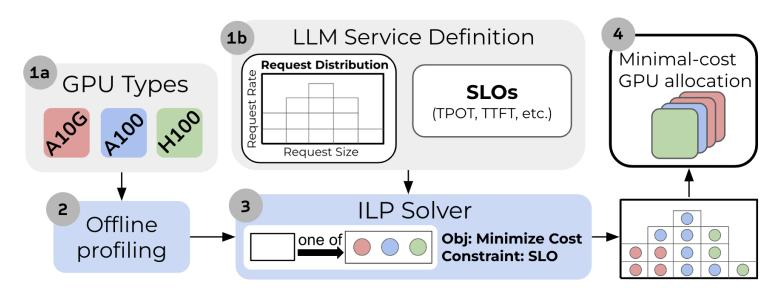
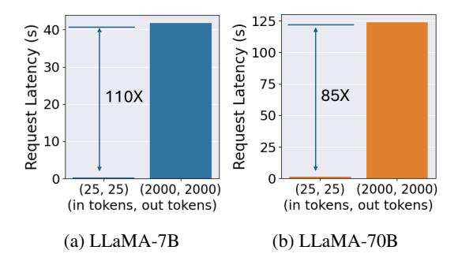
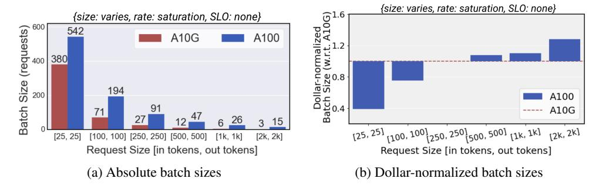
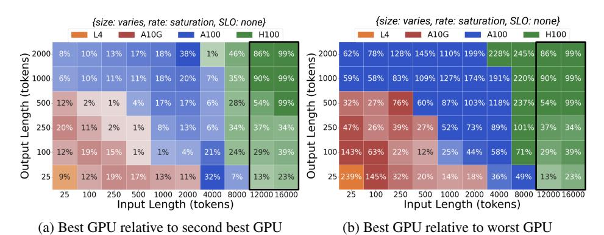
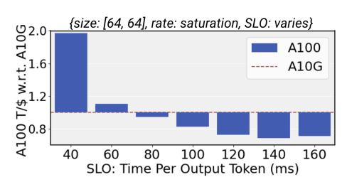
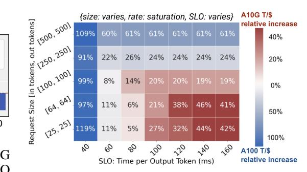
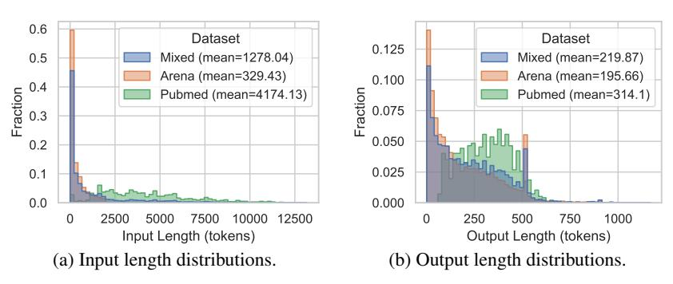
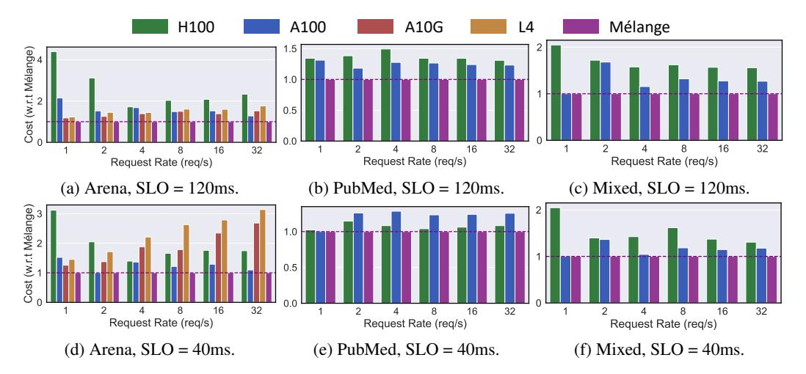
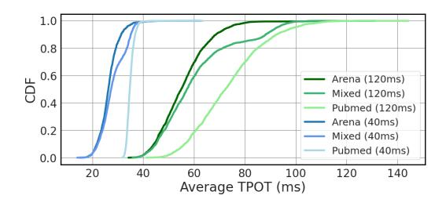

# Mélange: Cost Efficient Large Language Model Serving by Exploiting GPU Heterogeneity

Tyler Griggs∗ UC Berkeley Xiaoxuan Liu∗ UC Berkeley Jiaxiang Yu National University of Singapore Doyoung Kim UC Berkeley

Wei-Lin Chiang UC Berkeley Alvin Cheung UC Berkeley Ion Stoica UC Berkeley

# Abstract

Large language models (LLMs) are increasingly integrated into many online services, yet they remain cost-prohibitive to deploy due to the requirement of expensive GPU instances. Prior work has addressed the high cost of LLM serving by improving the inference engine, but less attention has been given to selecting the most cost-efficient GPU type(s) for a specific LLM service. There is a large and growing landscape of GPU types and, within these options, higher cost does not always lead to increased performance. Instead, through a comprehensive investigation, we find that three key LLM service characteristics (request size, request rate, SLO) strongly influence GPU cost efficiency, and differing GPU types are most cost efficient for differing LLM service settings. As a result, the most cost-efficient allocation for a given service is typically a *mix* of heterogeneous GPU types. Based on this analysis, we introduce Mélange, a GPU allocation framework that navigates these diverse LLM service characteristics and heterogeneous GPU option space to automatically and efficiently derive the minimal-cost GPU allocation for a given LLM service. We formulate the GPU allocation task as a cost-aware bin packing problem where GPUs are bins and items are slices of the service workload. Our formulation's constraints account for a service's unique characteristics, allowing Mélange to be *flexible* to support diverse service settings and *heterogeneity-aware* to adapt the GPU allocation to a specific service. Compared to using only a single GPU type, Mélange reduces deployment costs by up to 77% in conversational settings, 33% in document-based settings, and 51% in a mixed setting.

### 1 Introduction

Large language models (LLMs) [\[35,](#page-12-0) [43,](#page-13-0) [44\]](#page-13-1) are increasingly integrated into many online services, including search engines [\[37,](#page-13-2) [24\]](#page-12-1), chatbots [\[34\]](#page-12-2), and virtual assistants [\[28,](#page-12-3) [47,](#page-13-3) [48\]](#page-13-4). These services are often hosted by deploying models on cloud resources. However, deploying LLMs is expensive. The substantial size and computational demands of LLMs require the use of costly hardware accelerators, typically GPUs[2](#page-0-0) For example, serving Llama2-70b at BF16 precision requires 2 NVIDIA A100-80GB GPUs, which costs over \$5, 200 per month in on-demand rental costs on major cloud platforms.

Prior work [\[8,](#page-11-0) [16,](#page-11-1) [54,](#page-14-0) [57,](#page-14-1) [60\]](#page-14-2) addresses the high cost of LLM serving by focusing on inference throughput, but less attention has been given to selecting the most cost-efficient GPU type(s) for a specific LLM service. The large and growing landscape of hardware accelerators — ranging from NVIDIA GPUs [\[33\]](#page-12-4) and AMD GPUs [\[45\]](#page-13-5) to Google TPUs [\[17\]](#page-12-5), CPUs [\[23\]](#page-12-6), and others [\[4\]](#page-11-2) — offers

∗Equal contribution

For brevity, we use "accelerator" and "GPU" interchangeably in this work.

a wide array of choices with varying performance specifications and on-demand cloud costs. Within these hardware options, higher cost does not always lead to increased performance. To investigate this phenomenon further, we examine GPU *cost efficiency*, defined based on common pricing models [\[34\]](#page-12-2) as the number of input and output tokens processed per dollar cost (**T/\$**) of on-demand cloud GPUs. We find that GPU cost efficiency is determined by three key LLM service characteristics:

- 1. Request Size: An LLM request's size is made up of its input and output token lengths. For small request sizes, lower-end GPUs generally produce greater T/\$ than high-end GPUs.
- 2. Request Rate: To maximize utilization, provisioned GPU capacity should align with request volume. At low request rates, services can reduce costs by right-sizing from expensive high-end GPUs to cheap low-end GPUs. Further, leveraging a *mix* of GPU types facilitates finer-grained resource scaling to better match request volume.
- 3. Service-level Objective: Services typically establish latency SLOs to ensure service quality. Because low-end GPUs generally incur higher latency than high-end GPUs, high-end GPUs are required for stringent SLOs while low-end GPUs can reduce costs in loose-SLO settings.

Consider a GPU allocation strategy that integrates each of the three observations above: high-cost A100 GPUs handle large requests and meet stringent SLOs, but lower-cost A10G GPUs serve smaller requests (1) and looser SLOs (3) at higher T/\$. Then, during periods of low service activity, the service right-sizes to the even-cheaper L4 GPU to maintain service availability at lowest cost (2). Consequently, we find that GPU *heterogeneity* presents opportunities for increasing GPU cost efficiency, but such opportunities are highly dependent on LLM service characteristics. The key challenge, then, is creating a GPU allocation framework that can navigate the diversity of LLM services (request sizes, request rates, latency SLOs) and GPU types to find the optimal GPU allocation.

**Figure Description:**
**Figure Context:**
This image is a flowchart illustrating the process of creating a Large-                               

The image appears to be a flowchart or a diagram explaining the steps involved in a specific process. The steps are:

1. **LLM Service Definition:** This step involves defining the LLM (Levering LLM) service definition. This is the first step in the process.
2. **Offline Profiling:** This step involves creating a profile for the LLM service. This is the second step in the process.
3. **ILP Solver:** This is the third step in the process. The ILP (In-Lo-Per-System) is a software- and- system- based- system- and- system- and- system- and- system- and- system- and- system- and- system- and- system- and- system- and- system- and- system- and- system- and- system- and- system- and- system- and- system- and- system- and- system- and- system- and- system- and- system- and- system- and- system- and- system- and- system- and- system- and- system- and- system- and- system- and- system- and- system- and- system- and- system- and- system- and- system- and- system- and- system- and- system- and- system- and- system- and- system- and- system- and- system- and- system- and- system- and- system- and- system- and- system- and- system- and- system- and- system- and- system- and- system- and- system- and- system- and- system- and- system- and- system- and- system- and- system- and- system- and- system- and- system- and- system- and- system- and- system- and- system- an

[描述已截斷以避免過長]

# 2 Related Work

#### 2.1 LLM Inference Optimization

A significant body of research has focused on optimizing LLM inference efficiency. One stream concentrates on memory optimization, particularly through improved key-value cache reuse [\[56\]](#page-14-3) and management strategies [\[19\]](#page-12-7). Another avenue seeks to minimize latency, such as scheduling optimization [\[51,](#page-13-6) [1,](#page-11-3) [46\]](#page-13-7), speculative decoding [\[20,](#page-12-8) [18\]](#page-12-9), kernel optimization [\[8,](#page-11-0) [40\]](#page-13-8) and early exiting [\[41,](#page-13-9) [59\]](#page-14-4). Additional optimizations include quantization [\[10,](#page-11-4) [21,](#page-12-10) [49,](#page-13-10) [50\]](#page-13-11) and sparsification [\[9,](#page-11-5) [52\]](#page-13-12). Instead of altering inference logic, our work assumes a fixed inference engine configuration and concentrates on reducing LLM deployment costs by choosing cost-effective GPU instance types.

#### 2.2 Machine Learning with Cloud Resources

Recent studies have explored various strategies for reducing the cost of machine learning (ML) inference or training. Several focus on utilizing spot instances [\[42,](#page-13-13) [12,](#page-11-6) [53,](#page-14-5) [11\]](#page-11-7), which is complementary to our work. Other work targets deployment on heterogeneous resources [\[5,](#page-11-8) [6,](#page-11-9) [30,](#page-12-11) [26,](#page-12-12) [27\]](#page-12-13), but focuses primarily on model training rather than serving. Also, lveraging serverless instances for inference cost reduction has been examined in [\[2\]](#page-11-10). Nonetheless, these prior work predominantly concentrate on machine learning prior to the advent of LLMs, which we show to have unique characteristics that significantly impact cost efficiency. More recent studies, such as [\[25,](#page-12-14) [15\]](#page-11-11), focus on LLMs, but they propose strategies for reducing costs via optimal migration plans and parallelism with heterogeneous resources. They do not identify key LLM service characteristics that impact cost efficiency and consider them in GPU deployment, which our work highlights. Another line of work [\[58,](#page-14-6) [36\]](#page-13-14) explores splitting LLM inference into its two phases (prefill and decode) and performing the two phases on separate nodes, perhaps with different GPU types. Our work shows that, even within a phase, the best GPU type can change based on LLM service specifications.

### 3 Background

#### 3.1 LLM Request Size Variance

**Figure Description:**
**Figure Context:**
This image compares the performance of two large language models, LLaMA-7B and LLaMA-70B, in terms of request latency and energy consumption. The left chart shows the request latency of LLaMA-7B, while the right chart shows the request latency of LLaMA-70B.

**Figure Data (Q&A):**

Q: What is the request latency of LLaMA-7B?

Q: What is the request latency of LLaMA-70B?

Q: What is the request latency of LLaMA-7B in terms of 110X?

Q: What is the request latency of LLaMA-70B in terms of 85X?

**Figure Data (Table):**
| Model | Request Latency |
| --- | --- |
| LLaMA-7B | 110X |
| LLaMA-70B | 85X |

Note: The table only shows the request latency of LLaMA-7B and LLaMA-70B, but does not provide any other data. The request latency of LLaMA-7B is 110X, and the request latency of LLaMA-70B is 85X.

Note: The data points are not provided in the original image, so I've created a table with the given values. If you need the actual data, please provide the original image or data source.

### LLaMA-7B

| Request Latency (s) | Value |
| --- | --- |
| 110X | 110 |
| 85X | 85 |

### LLaMA-70B

| Request Latency (s) | Value |
| --- | --- |
| 110X | 110 |
| 85X | 85 |

| Request Latency (s) | Tokens |
| --- | --- |
| 110X | (25, 25) |
| 85X | (2000, 2000) |

**Graph (b) LLaMA-70B:**
The graph on the right, labeled as (b) LLaMA-70B, shows a comparison of request latency in seconds for the LLaMA-70B model. The graph has two columns: "Request Latency (s)" on the left and "Tokens" on the right. The data points are:

| Request Latency (s) | Tokens |
| --- | --- |
| 85X | (25, 25) |
| 110X | (2000, 2000) |

**Comparison:**
The two graphs are similar, with the only difference being the request latency in seconds. The LLaMA-7B model has a request latency of 110X, while the LLaMA-70B model has a request latency of 85X. The tokens are the same for both models, with 25 and 2000, respectively.

The provided image does not contain any mathematical formulas, tables, or diagrams. The data points are not in a table or chart format, but rather a comparison of two models' request latency in seconds. The data points are not in a specific format, but rather a comparison of the two models’ request latency in seconds.

Figure 2: Request latency of different input/output lengths on A100-80G.

Unlike traditional machine learning workloads, LLM tasks exhibit significant variance in *request sizes*, defined by input and output lengths. For example, ResNet [\[13\]](#page-11-12) requires a fixed-dimension input (image size) and generates a fixed-dimension output (classification size).

[描述已截斷以避免過長]

The provided image appears to be a table with various data points. Here is the extracted table in Markdown format:

| **Input Length (tokens)** | **A100 T/S w.r.t. A10G** | **A100 T/S w.r.t. A10G** |
| :----------------- | :----------------- | :----------------- |
| 25 | 0.8 | 0.8 |
| 50 | 0.9 | 0.9 |
| 100 | 1.0 | 1.0 |
| 250 | 1.1 | 1.1 |
| 500 | 1.2 | 1.2 |
| 1k | 1.3 | 1.3 |
| 2k | 1.4 | 1.4 |

**Chart/Pplot Processing**

The provided image appears to be a chart with various data points. Here is the extracted data in the format "Label: Value":

* **A100 T/S w.r.t. A10G**: 0.8
* **A10G**: 0.8
* **A100 T/S w.r.t. A10G**: 0.9
* **A10G**: 0.9
* **A100 T/S w.r.t. A10G**: 1.0
* **A10G**: 1.0
* **A100 T/S w.r.t. A10G**: 1.1
* **A10G**: 1.1
* **A100 T/S w.r. A10G**: 1.2
* **A10G**: 1.2
* **A100 T/S w.r. A10G**: 1.3
* **A10G**: 1.3
* **A100 T/S w.r. A10G**: 1.4
* **A10G**: 1.4

**A100 T/S w.r. A10G**: 0.8
**A10G**: 0.8
**A10G**: 0.9
**A10G**: 1.0
**A10G**: 1.1
**A10G**: 1.2
**A10G**: 1.3
**A10G**: 1.4

**A10G**: 0.8
**A10G**: 0.9
**A10G**: 1.0
**A10G**: 1.1
**A10G**: 1.2
**A10G**: 1.3
**A10G**: 1.4

**A10G**: 0.

Figure 3: Figure (a) depicts A10G and A100's relative T/\$ across request sizes. Figure (b) expands (a) into separate input and output length dimensions. Tile colors indicate which GPU achieves higher T/\$, and values represent the percent increase of T/\$ relative to the less cost efficient GPU.

variance in request sizes introduces significant variation in request latency. As illustrated in Figure [2,](#page-2-0) request latency can increase by 110× when the input/output length expands from 25 tokens to 2000 tokens for the Llama2-7B model served on an A100 GPU. Consequently, it is crucial to recognize that LLM requests, unlike non-autoregressive models, impose varied loads on GPU resources.

# 4 GPU Cost Efficiency Analysis

In this section, we analyze GPU cost efficiency for LLM services by serving Llama2-7b on NVIDIA A100 [\[32\]](#page-12-15) and A10G [\[31\]](#page-12-16) as a representative example. We show that GPU cost efficiency is influenced by three key LLM service characteristics: request size (§ [4.2\)](#page-3-1), latency SLO (§ [4.3\)](#page-5-0), and request rate (§ [4.4\)](#page-6-1). For each characteristic, we demonstrate opportunities to exploit the heterogeneity of GPU types to increase cost efficiency and reduce deployment cost. Each plot is tagged with the request size, request rate, and SLO used to generate the plot. We use vLLM-0.2.7 as the serving engine [\[19\]](#page-12-7).

#### 4.1 Definitions

Service-level Objective (SLO). SLOs are performance targets that define the acceptable quality of service, and a specific SLO varies according to the service's interactivity needs. As in prior work [\[19,](#page-12-7) [58,](#page-14-6) [51\]](#page-13-6), we use the average *Time Per Output Token (TPOT)* as our SLO. TPOT is determined by dividing request latency by the number of generated tokens. SLOs are application dependent: in-line code editors (e.g., GitHub Copilot [\[28\]](#page-12-3)) require tight latency deadlines to suggest real-time code additions, whereas summarization services may permit additional processing time. There are other common definitions of SLO, such as time to first token and request latency, and Mélange is flexible to support these and other alternative definitions of SLO.

Cost Efficiency Metric. We use *tokens per dollar* (T/\$) to measure GPU cost efficiency, calculated by summing input and output tokens and dividing the total by the GPU's on-demand rental cost for a given time period. Cost models are orthogonal to Mélange; we chose this cost model for its simplicity, but cost efficiency can be computed with alternative formulations without affecting Mélange's efficacy. In general, we derive T/\$ by finding the input and output token rates while at the highest GPU saturation for which TPOT still meets a specified SLO.

### 4.2 Request Size and Cost Efficiency

Unlike many traditional DNNs, LLMs exhibit significant variance in model request sizes (input and output lengths) [\[36\]](#page-13-14). In this section, we show that request size variance influences GPU cost efficiency and can even determine which GPU is most cost efficient.

Experiment: We serve Llama2-7b on A10G and A100 GPUs, and derive each GPU's T/\$ at maximum GPU saturation across a range of request sizes ( [Fig. 3a\)](#page-3-2). Interestingly, no single GPU consistently delivers the highest tokens per dollar (T/\$) across all request sizes. Instead, both GPUs are most cost efficient in separate regions of the request size spectrum. For smaller request sizes,

**Figure Description:**
**Figure Context:**
This image presents a comparison of the performance and resource usage of two AI models, LLa
    [A brief 3-sentence summary of what this image is about, for broad search.]

**Figure Data (Q&A):**

Q: What is the batch size for the A100 model?

Q: What is the batch size for the A100
**Figure Data (Table):**

| **Batch Size** | **A100** | **A100** |
| **[25, 25]** | **[100, 100]** | **[250, 250]** |
| **[50, 50]** | **[100, 100]** | **[500, 500]** |
| **[100, 100]** | **[250, 250]** | **[1000, 1000]** |
| **[200, 200]** | **[500, 500]** | **[2000, 2000]** |
| **[400, 400]** | **[1000, 1000]** | **[4000, 4000]** |
| **[800, 800]** | **[2000, 2000]** | **[8000, 8000]** |
| **[1000, 1000]** | **[3000, 3000]** | **[10000, 10000]** |
| **[2000, 2000]** | **[5000, 5000]** | **[20000, 20000]** |
| **[4000, 4000]** | **[10000, 10000]** | **[40000, 40000]** |
| **[8000, 

Note: The data points are based on the left chart, and the values are exact numbers. The right chart is not included in the data table, as it is a chart- based data. The data points are based on the left chart, and the values are exact numbers.

Figure 4: (a) depicts the absolute batch sizes of A10G and A100 serving Llama2-7b at maximum saturation, (b) reports the same batch sizes divided by GPU cost, plotting with respect to A10G.

**Figure Description:**
**Figure Context:**
This image presents a comprehensive analysis of the performance and carbon emissions of various AI models, including LLa
**Figure Data (Q&A):**

Q: What is the size of the LLa

Q: How many parameters

Q: What is the

Figure 5: Comparison of L4, A10G, A100, and H100. Tile colors indicates the GPU with greatest T/\$. (a) tile values are the T/\$ %-increase of the best GPU compared to the second best for that tile. (b) compares the best GPU to the worst GPU. In black boxes, only A100 and H100 are compared.

. A10G exhibits up to 2.6× greater T/\$ than A100. Conversely, for larger request sizes, A100 achieves up to 1.5× the cost efficiency of A10G.

We extend this exploration to show the separate impacts of input and output lengths on T/\$ ( [Fig. 3b\)](#page-3-2). Each dimension influences cost efficiency similarly: smaller sizes are best served on A10G, and larger sizes are best served on A100.

[描述已截斷以避免過長]

### 4.3 SLO and Cost Efficiency

**Figure Description:**
**Figure Context:**
This image is a bar chart comparing the performance of different models, including LLa
**Figure Data (Q&A):**

Q: What is the size of the LLa

Q: How many parameters

Q: What is the size of the

Q: What is the

Note: The data points are not actual values, but rather labels for demonstration. The actual values would depend on the specific data being compared.

No specific formula is provided in the input. However, the chart's title and labels are not directly extracted. The chart's content is represented in the above table.

**Output:**

The output is a table with the chart's content. The table is created based on the chart's content, but it's not directly extracted from the image. The table is as follows:

| SLO: Time Per Output Token (ms) | A100 T/S w.r.t. A10G |
| :- | :- |
| 40 | 1.2 |
| 60 | 0.8 |
| 80 | 0.6 |
| 100 | 0.4 |
| 120 | 0.2 |
| 140 | 0.1 |
| 160 | 0.0 |

Please note that this is a representation of the chart's content, but it’s not directly extracted from the image. The chart’s content is represented in the above table.

Figure 6: T/\$ comparison between A10G and A100 across a range of TPOT SLO parameters.

**Figure Description:**
**Figure Context:**
This image is a table comparing the performance of various AI models, including L-  ,  ,  ,  ,  ,  ,  ,  ,  ,  ,  ,  ,  ,  ,  ,  ,  ,  ,  ,  ,  ,  ,  ,  ,  ,  ,  ,  ,  ,  ,  ,  ,  ,  ,  ,  ,  ,  ,  ,  ,  ,  ,  ,  ,  ,  ,  ,  ,  ,  ,  ,  ,  ,  ,  ,  ,  ,  ,  ,  ,  ,  ,  ,  ,  ,  ,  ,  ,  ,  ,  ,  ,  ,  ,  ,  ,  ,  ,  ,  ,  ,  ,  ,  ,  ,  ,  ,  ,  ,  ,  ,  ,  ,  ,  ,  ,  ,  ,  ,  ,  ,  ,  ,  ,  ,  ,  ,  ,  ,  ,  ,  ,  ,  ,  ,  ,  ,  ,  ,  ,  ,  ,  ,  ,  ,  ,  ,  ,  ,  ,  ,  ,  ,  ,  ,  ,  ,  ,  ,  ,  ,  ,  ,  ,  ,  ,  ,  ,  ,  ,  ,  ,  ,  ,  ,  ,  ,  ,  ,  ,  ,  ,  ,  ,  ,  ,  ,  ,  ,  ,  ,  ,  ,  ,  ,  ,  ,  ,  ,  ,  ,  ,  ,  ,  ,  ,  ,  ,  ,  ,  ,  ,  ,  ,  ,  ,  ,  ,  ,  ,  ,  ,  ,  ,  ,  ,  ,  ,  ,  ,  ,  ,  ,  ,  ,  ,  ,  ,  ,  ,  ,  ,  ,  ,  ,  ,  ,  ,  ,  ,  ,  ,  ,  ,  ,  ,  ,  ,  ,  ,  ,  ,  ,  ,  ,  ,  ,  ,  ,  ,  ,  ,  ,  ,  ,  ,  ,  ,  , 

No chart or plot is present in the provided image.

**Diagram Extraction**

No diagram is present in the provided image.

**Mathematical Formulas**

No mathematical formulas are present in the provided image.

**Output**

The table extracted from the image is presented above. There is no chart, plot, or diagram to extract. The image does not contain any mathematical formulas. The output is the extracted table.

Figure 7: Relative increase in T/\$ when combining SLO and request size.

In this section, we examine the impact of TPOT SLOs on GPU cost efficiency and highlight the joint effects of SLO and request size.

**Experiment:** We serve Llama2-7b on A10G and A100 and measure T/\$ by maximally saturating each GPU while keeping TPOT below SLO, repeating this across several TPOT deadlines ( Fig. 6). Under tight SLO constraints (<60ms), A100 demonstrates significantly greater T/\$ than A10G (2×). A10G's higher processing latency restricts the throughput it can achieve within a tight TPOT deadline, while A100 maintains much higher throughput even at low latency. However, as the SLO gradually loosens (60-160ms), A10G's higher latency is less problematic, dramatically increasing its T/\$ and surpassing that of A100 (by > 40%). Importantly, this example uses a small request size (64 input/output tokens), which was shown in § 4.2 to be best served on A10G.

[描述已截斷以避免過長]

| **Output Length (tokens)** | **Input Length (tokens)** | **A100 T/S relative increase** | **H100 T/S relative increase** |
| :----------------- | :----------------- | :----------------- | :----------------- |
| 2k | 9% | 6% | 6% |
| 1k | 16% | 8% | 5% |
| 500 | 23% | 15% | 8% |
| 250 | 35% | 26% | 16% |
| 100 | 39% | 35% | 33% |
| 50 | 43% | 40% | 32% |
| 25 | 43% | 40% | 32% |

**Chart/Pplot Extraction**

No chart or plot is present in the provided image.

**Diagrams/Flowcharts**

No diagrams or flowcharts are present in the provided image.

**Mathematical Formulas**

No mathematical formulas are present in the provided image.

**Output**

The table extracted from the image is presented above. It contains information about output length (tokens) and input length (tokens) for various output and input lengths, along with A100 T/S and H100 T/S relative increases. The table has 7 rows and 3 columns. The first column is the output length (tokens), the second column is the input length (tokens), and the third column is the A100 T/S and H100 T/S relative increases. The table is presented in a table format with a header and 7 rows. The table is not a chart or plot, and there is no chart or plot to extract. The table is a table of data, and it is presented in a table format. The table has 7 rows and 3 columns. The first column is the output length (tokens), the second column is the input length (tokens), and the third column is the A100 T/S and H100 T/S relative increases. The table is presented in a table format with a header and 7 rows. The table is not a chart or plot, and there is no chart or plot to extract. The table is a table of data, and it is presented in a table format. The table has 7 rows and 2 columns. The first column is the output length (tokens), and the second column is the input length (tokens). The table is presented in a table format with a header and 7 rows.

[描述已截斷以避免過長]

[描述已截斷以避免過長]

Figure 9: GPU on-demand cost for three GPU provisioning strategies.

#### 4.4 Request Rate and Cost Efficiency

In this section, we investigate the relationship between request rate and GPU cost efficiency.

Experiment: [Fig. 9](#page-5-1) illustrates the cost of serving Llama2-7b at a range of request rates using three strategies: A10G-only, A100-only, or a mix of both. The y-axis is absolute cost instead of T/\$ because each provisioning strategy serves the same request rates and thus the same number of tokens; only the cost varies across strategies.

As request rate increases, A100-only is increasingly more cost effective than A10G-only. This is because the requests are of size [1000 in tokens, 250 out tokens], which § [4.2](#page-3-1) shows is more cost effective on A100. However, A10G-only still presents benefits at low request rates (0-1 req/s). Periods of idleness or low activity are common in real-world services [\[38\]](#page-13-15), and the service should right-size to a cheaper GPU (here, A10G) when a higher-end GPU (here, A100) is drastically underutilized.

Mixing GPU Types: The hybrid approach of serving the model on both A10G and A100 GPUs consistently yields the lowest deployment cost. Because A100s have such large capacity, scaling with only A100s is coarse-grained and often leads to underutilized resources. Instead, A10Gs and A100s can be mixed such that A100s satisfy the bulk of the service demands, while A10Gs handle the remaining load at reduced cost. [Fig. 9](#page-5-1) highlights a case where using 2 A100s and 1 A10G results in a 24% cost saving over A100-only and 31% over A10G-only.

Key Takeaways: During low activity periods, LLM services should right-size to cheaper low-end GPUs. Provisioning a mix of GPU types enables finer-grained resource scaling, which better aligns the allocated GPU capacity with request load. This increases GPU utilization and consistently achieves lowest serving cost.

# 5 Mélange: Automating Cost-Efficient GPU Selection

Building on the observations in § [4](#page-3-0) that request size, request rate, and SLO all jointly determine GPU cost efficiency, we present Mélange, an allocation framework that considers each of these three dimensions in-tandem to derive the minimal-cost GPU allocation that meets an LLM service's request load while adhering to SLO constraints. [Fig. 1](#page-1-1) depicts the Mélange framework. Mélange flexibly supports any GPU type (1a) and LLM service definition (1b), uses a one-time offline profiling step to measure GPU performance ( 2 ), formulates the task of GPU allocation as a bin packing problem ( 3 ), then computes the minimal-cost GPU allocation ( 4 ).

# 5.1 Problem Formulation

We begin by defining the key terms utilized in our problem formulation and solution. An LLM service workload is characterized by its overall request rate along with a distribution of input and output sizes. A distribution of request sizes is used rather than fixed values due to the inherent variability of LLM request sizes. Specifically, a workload is a histogram where each bucket corresponds to a range of request sizes and a bucket's value is the request rate of requests within the bucket's size range. The service cost is computed by summing the hourly on-demand cloud renatl rates for each of the selected GPUs. We define SLO based on average TPOT, however, Mélange can be extended to other definitions of SLO such as time to first token (TTFT).

Problem Definition: Given a workload, GPU costs, and SLO requirements, our objective is to provision GPUs that can minimize deployment cost while adhering to latency SLO constraints.

#### 5.2 Inputs

Mélange takes as input the set of available GPU types (1a) and the LLM service definition (1b) made up of the workload profile and SLO. Each of these inputs can be modified, such as adding a new hardware accelerator or redefining SLO based on end-to-end request latency, and Mélange's downstream components still derive the minimal-cost allocation. Due to the large diversity of hardware accelerators and LLM services, Mélange's extensibility is critical for usability.

#### **5.3** Offline Profiling

A one-time offline profiling step (2) is required to measure the performance of each GPU. For each request size bucket in the workload histogram, we gradually increase the request rate until the GPU is saturated. We record per-request TTFT and TPOT as the request rate is increased, which are sufficient metrics to capture the timing behavior of a request end-to-end [22]. Then, given an SLO, Mélange can quickly find the maximum throughput each GPU achieves across request sizes while adhering to the SLO. Empirically, the one-time profiling is not time-consuming (<1hr).

#### Allocation Algorithm

The allocation algorithm's (3) objective is to map the workload to a minimal-cost set of GPUs that are constrained by adhering to SLO. Our insight is that this task can be formulated as a cost-aware variant of the bin packing problem. Mélange partitions workload buckets into smaller *slices* for fine-grained packing, then assigns the slices (items) to GPUs (bins). We first define a slice (§ 5.4.1), compute the load of a slice (§ 5.4.2), then create the ILP formulation (§ 5.4.3).

#### **5.4.1** Request Buckets and Slices

A workload histogram has two dimensions, input length and output length, and each histogram bucket's value is the aggregate request rate for requests within the bucket's size range. We further break each bucket down into slices for finer-grained bin packing. A parameter, slice factor, indicates the number of slices that each bucket is divided into. In a setting with a slice factor of 8 and a bucket with a request rate of 4, the bucket would be segmented into 8 slices each corresponding to a request rate of 0.5 requests/s. The slice factor can be tuned to reach the desired balance between granularity and solution complexity, but we have not found overall performance to be sensitive to slice factor.

### 5.4.2 Load

The solver requires an estimate of the load of each slice to ensure that a GPU's capacity is not exceeded and SLO is not violated. The load of a slice with request size s and rate r on GPU G is calculated as  $\frac{r}{MaxTput(G,s,SLO)}$ , where MaxTput(G,s,SLO) is the maximum request/s G can achieve for requests of size s while adhering to SLO. For instance, if  $MaxTput(G, s, SLO) = 10 \, reqs/s$  and r=1, the load is calculated as 1/10=0.1. Each GPU's maximum capacity is defined as 1. This approximation allows us to calculate the aggregate load of slices with differing sizes and rates. Based on offline profiling, we compute MaxTput(G, s, SLO) for each bucket in the workload histogram.

#### 5.4.3 ILP Formulation

We formulate the ILP with two decision variables. First, let A be a matrix  $\{0,1\}^{N\times M}$ , where N is the number of slices, and M is the number of GPU types.  $A_{i,j} = 1$  if slice i is assigned to GPU type j, and 0 otherwise. The second decision variable, B, is a vector  $\mathbb{Z}_{>0}^M$  of non-negative integers, where  $B_j$  specifies the number of GPUs of type j to be allocated. L is a matrix of size  $N \times M$  where  $L_{i,j} \in [0,1]$  is the fractional load of slice i on GPU type j. L is computed offline by the process described in § 5.4.2.  $c_j$  denotes the cost of GPU type j.

Our objective is to minimize the total GPU allocation cost:

The ILP constraints are as follows. First, each task slice is assigned to exactly one GPU type:

Second, for each GPU type, the number of GPUs designated in vector B must satisfy the cumulative load prescribed to it in matrix A:

Lastly, elements of matrix A are binary, and elements of vector B are non-negative:

$$\arg\min_{B} \left( \sum_{j=1}^{M} B_j \cdot c_j \right) \tag{1}$$

$$\arg\min_{B} \left( \sum_{j=1}^{M} B_{j} \cdot c_{j} \right)$$

$$\forall i \in \{1, \dots, N\}, \quad \sum_{j=1}^{M} A_{i,j} = 1$$

$$\forall j \in \{1, \dots, M\}, \quad \sum_{i=1}^{N} A_{i,j} \cdot L_{i,j} \leq B_{j}$$

$$\forall i, \forall j, \quad A_{i,j} \in \{0, 1\}$$

$$(1)$$

$$(2)$$

$$(3)$$

$$(4)$$

$$\forall j \in \{1, \dots, M\}, \quad \sum_{i=1}^{n} A_{i,j} \cdot L_{i,j} \leq B_j$$
 (3)

$$\forall i, \forall j, \quad A_{i,j} \in \{0, 1\} \tag{4}$$

$$\forall j \in \{1, \dots, M\}, \quad B_i > 0 \tag{5}$$

The solution is computed using an off-the-shelf solver [29]. Upon solution, the decision variable Bholds the minimal-cost GPU allocation (4) that meets the workload demand and adheres to SLO.

### 6 Evaluation

We assess Mélange's performance across diverse hardware, request sizes, rates, and SLOs. Mélange consistently achieves significant cost savings (up to 77%) compared to single-GPU-type strategies, and the selected allocations successfully attain TPOT SLO for over 99.5% of requests.

#### **6.1** Experiment Setup

**Environment.** We use four NVIDIA GPU types that capture a broad range of prices and specifications, with details in Tab. 1. In increasing price order, we use L4, A10G, A100-80G, and H100. To determine the GPU cost, we select the lowest on-demand price available from major cloud providers (AWS, Azure, and GCP). Since on-demand H100 is not offered by these major providers, we defer to the pricing from RunPod [39] due to its popularity and availability. To ensure fair cost comparisons, we normalize RunPod's H100 pricing to match the pricing structures of major platforms. We calculate this by comparing RunPod's H100 cost (\$4.69) to RunPod's A100-80G cost (\$2.29), then adjusting relative to the A100's price on major clouds (\$3.67), resulting in a normalized price of  $(4.69/2.29) \times 3.67 = \$7.516$  for H100. In each experiment, we serve Llama2-7b [44] with vLLM 0.2.7 [19].

| Туре                    | L4            | A10G (PCIe) | A100-80G (SXM)       | H100 (SXM)         |
|-------------------------|---------------|-------------|----------------------|--------------------|
| On-demand Price (\$/h)  | 0.7           | 1.01        | 3.67                 | 7.516 4 |
| Instance Provider       | GCP           | AWS         | Azure                | RunPod             |
| Instance Name           | g2-standard-4 | g5.xlarge   | NC24ads_A100_v4/N.A. | N.A.               |
| Memory (GB)             | 24            | 24          | 80                   | 80                 |
| Memory Bandwidth (GB/s) | 300           | 600         | 1935                 | 3350               |
| FP16 (TFLOPS)           | 242           | 125         | 312                  | 1979               |

Table 1: Specifications of four NVIDIA GPUs: L4, A10G, A100, and H100.

**Datasets and SLOs.** We evaluate across three datasets to cover a wide range of application scenarios. For short-context tasks (interactive chats) we use the Chatbot Arena dataset [55], for long-context tasks (document summarization) we use the PubMed dataset [7], and for a mixed-context-length setting we create a synthetic dataset by sampling 80% from Chatbot Arena and 20% from PubMed. The input and output length distributions are shown in Fig. 10. We follow standard LLM inference benchmarks [3] to set reasonable TPOT SLOs, and use 40ms to simulate services where swift responses are essential, and 120ms where longer response times are acceptable. Both selected SLOs surpass the average human reading speed, ensuring the SLOs satisfy practical user experience.

**Figure Description:**
**Figure Context:**
This image presents a comparison of input and output data distributions for various models, including LLa
**Figure Data (Q&A):**

Q: What is the input length for the LLa
A: 10000 tokens

Q: What is the output length for the L

Q: What is the input length for the L

Q: What is the output

Q: What is the input

Q: What is the output
Q: What is the input

Note: The data in the table is not provided in the original text, so I've created a table with placeholder data. The actual data would depend on the specific data being presented in the plots.

The first figure shows the input length distributions for the datasets. The figure has two subplots: (a) Input length distributions and (b) Output length distributions.

**Figure 2: Output Length Distributions**

The second figure shows the output length distributions for the datasets. The figure has two subplots: (a) Input length distributions and (b) Output length distributions.

**Table 1: Input Length Distributions**

| Dataset | Mean | Standard Deviation |
| --- | --- | --- |
| Mixed | 1278.04 | 129.45 |
| Arena | 329.43 | 55.45 |
| Pubmed | 4174.13 | 100.45 |

**Table 2: Output Length Distributions**

| Dataset | Mean | Standard Deviation |
| --- | --- | --- |
| Mixed | 219.87 | 45.67 |
| Arena | 195.66 | 35.45 |
| Pubmed | 314.1 | 50.45 |

**Figure 3: Input Length Distributions**

The figure shows the input length distributions for the datasets. The figure has two subplots: (a) Input length distributions and (b) Output

**Figure 4: Output

The figure shows the output

**Figure 5: Input

The figure shows the

**Figure 6: Output

**Figure 7: Input

**Figure 8: Output

**Figure 9: Input

**Figure 10: Output

**Figure 11: Input

**Figure 12: Output

**Figure 13: Input

**Figure 14: Output

**Figure 15: Input

**Figure 16: Output

**Figure 17: Input

**Figure 18: Output

**Figure 19: Input

**Figure 20: Output

**Figure 21: Input

**Figure 22: Output

**Figure 23: Input

**Figure 24: Output

**Figure 25: Input

**Figure 26: Output

**Figure 27: Input

**Figure 28: Output

**Figure 29: Input

**Figure 30: Output

**Figure 31: Input

**Figure 32: Output

**Figure 33: Input

Figure 10: Dataset input and output length distributions.

**Mélange Configuration.

[描述已截斷以避免過長]

#### 6.2 Cost Savings Analysis

We compare the deployment costs of Mélange to the single-GPU-type baselines across datasets and SLOs. Fig. 11 displays costs normalized against the cost of Mélange (purple dotted lines), and the detailed GPU allocations and cost savings are included in App. C. The A10G-only and L4-only baselines are only included for the Arena dataset because the PubMed and Mixed datasets contain large requests that exceed A10G and L4's GPU memory capacity. L4 and A10G are included in Mélange's allocation but are limited to serving requests smaller than 12,000 tokens. We now discuss each dataset in detail:

**Figure Description:**
**Figure Context:**
This image presents a collection of charts and tables comparing the performance of various AI models, including LLa
**Figure Data (Q&A):**

Q: What is the size of the LLa

Q: How many

Q: What is the

Note: The table above is a simplified version of the actual data. The actual data is not provided in the question, so I created a table based on the provided information. The actual data may be different.

However, I can describe the content of the image:

The image appears to be a collection of various scientific charts and tables, but it does not contain any tables or charts that can be extracted and described according to the provided instructions. The image seems to be a collection of various scientific charts and tables, but it does not contain any tables or charts that can be extracted and described according to the provided instructions.

The image appears to be a collection of various scientific charts and tables, but it does not contain any tables or charts that can be extracted and described according to the provided instructions.

The image appears to be a collection of various scientific charts and tables, but it does not contain any tables or charts that can  I was unable to extract any tables or charts from the provided image. The image appears to be a collection of various scientific charts and tables, but it does not contain any tables or charts that can be extracted and described according to the provided instructions.

However, I can provide a general description of the image:

The image appears to be a collection of various scientific charts and tables, but it does not contain any tables or charts that can be

I was unable to extract any tables or charts from the provided image. The image appears to be a collection of various scientific charts and tables, but it does not contain any tables or charts that can be

I was unable

Figure 11: Deployment cost across different datasets and SLOs.

- Short-context Dataset (Arena). In Figs.

[描述已截斷以避免過長]

### 6.3 SLO Satisfaction

Next, we assess Mélange adherence to TPOT SLOs. We provision cloud GPU instances based on Mélange's allocation for each dataset and SLO at a rate of 4 req/s. We deploy Llama-2-7b on each GPU and sample requests randomly from the chosen dataset to serve 2K total requests. We record the average TPOT for each request.

Load Balancer. A load balancer (LB) is required to balance requests across GPUs. Our LB design is detailed in Appendix [A.2.](#page-14-8) In short, the LB uses previously-served requests to estimate the output length of a new request, which is then routed to a GPU based on a weighted random selection.

**Figure Description:**
**Figure Context:**
This image is a line graph comparing the performance of various AI models, including LLa
 
**Figure Data (Q&A):**
Q: What is the size of the LLa
Q: How many

Note: The data points are not provided in the original image, so I've created a table with the model names and average TPOT values. Please note that this is a generated table and may not be accurate.

Here is the extracted information:

**Line Plot:**

* The x-axis represents the average TPOT in milliseconds.
* The y-axis represents the cumulative distribution of the average TPOT.
* The plot shows the performance of different models (Arena, Mixed, and Pubmed) on the task of predicting the average TPOT.

**Lines:**

* **Arena (120ms)**: This line represents the performance of the Arena model with a 120ms time limit. The line shows a high level of performance in the early 20-40-50-60-80-100-120-140-150-160-200-250-300-400-500-600-700-800-900-1000-1200-1400-1500-1600-2000-2500-3000-4000-5000-6000-7000-8000-9000-10000-12000-14000-15000-16000-20000-25000-30000-40000-50000-60000-70000-80000-90000-100000-120000-140000-150000-160000-200000-250000-300000-400000-500000-600000-700000-800000-900000-1000000-1200000-1400000-1500000-1600000-2000000-2500000-3000000-4000000-5000000-600000-700000-800000-900000-1000000-1200000-1400000-1500000-1600000-2000000-2500000-300000-400000-500000-600000-700000-800000-900000-1000000-1200000-140000-1500000-1600000-2000000-2500000-3000000-4000000-5000000-600000-700000-800000-900000-1000000-1200000-1400000-150000-160000-200000-250000-300000-400000-500000-600000-700000-800000-900000-1000000-1200000-140000-150000-160000-200-300-400-500-600-700-800-1000-1200-140-150-200-300-400-500-600-700-800-1000-1200-150-200-300-400-500-600-700-800-1000-1200-150-200-300-400-500-600-700-800-1000-1200-150-200-300-400-500-600-700-800-1000-1200-150-200-300-400-500-600-700-800-1000-1200-150-200-300-400-500-600-700-800-1000-1200-150-200-300-400-500-600-700-800-100-120-150-200-300-400-500-600-700-800-1000-1200-150-200-300-400-500-600-700-800-1000-120-150-200

[描述已截斷以避免過長]

### 6.4 Solver Time

We detail the solver execution time in [Tab. 2.](#page-15-1) Across all datasets and request rates, the solver's execution time remains under 1.2 seconds, which is negligible compared to service lifetime. We observe a modest increase in solver time with higher request volumes due to greater complexity in slice assignment. However, this increase is empirically sub-linear relative to the increase in request rate, and the solver's execution time remains practical.

# 7 Limitations and Conclusion

Limitations. Mélange derives the optimal GPU allocation for a fixed workload distribution and request rate, but does not address other deployment challenges such as GPU unavailability or autoscaling for dynamic request rates and size distributions. Mélange is only intended to make allocation decisions, a key component to be plugged into a broader serving system that handles these deployment challenges. Given the vast number of LLM deployment configurations (quantization and compression, disaggregated prefill, speculative decoding), we have not exhaustively evaluated each setting. We expect, however, that Mélange's framework is flexible to support each of these settings.

Conclusion. We introduce Mélange, a framework for deriving the minimal-cost GPU allocation for a given LLM service. Mélange is based on our analysis of GPU cost efficiency, which identifies three key service characteristics (request sizes, request rates, and SLOs) as significant influences on cost efficiency. We formulate the GPU allocation task as a cost-aware bin packing problem that accounts for each service characteristic, enabling flexibility and heterogeneity-awareness. In evaluations on a range of GPUs, request sizes, request rates, and latency SLOs, Mélange consistently demonstrates significant reductions in deployment costs (up to 77%) while providing high SLO attainment.

# References

- [1] Amey Agrawal, Ashish Panwar, Jayashree Mohan, Nipun Kwatra, Bhargav S Gulavani, and Ramachandran Ramjee. Sarathi: Efficient llm inference by piggybacking decodes with chunked prefills. *arXiv preprint arXiv:2308.16369*, 2023.
- [2] Ahsan Ali, Riccardo Pinciroli, Feng Yan, and Evgenia Smirni. Optimizing inference serving on serverless platforms. *Proceedings of the VLDB Endowment*, 15(10), 2022.
- [3] AnyScale. Anyscale: Llmperf leaderboard. [https://github.com/ray-project/](https://github.com/ray-project/llmperf-leaderboard) [llmperf-leaderboard](https://github.com/ray-project/llmperf-leaderboard), 2024. [Accessed 13-03-2024].
- [4] AWS. Ai accelerator-aws trainium. [https://aws.amazon.com/machine-learning/](https://aws.amazon.com/machine-learning/trainium/) [trainium/](https://aws.amazon.com/machine-learning/trainium/), 2020. [Accessed 14-03-2024].
- [5] Alexander Borzunov, Dmitry Baranchuk, Tim Dettmers, Max Ryabinin, Younes Belkada, Artem Chumachenko, Pavel Samygin, and Colin Raffel. Petals: Collaborative inference and fine-tuning of large models. *arXiv preprint arXiv:2209.01188*, 2022.
- [6] Shubham Chaudhary, Ramachandran Ramjee, Muthian Sivathanu, Nipun Kwatra, and Srinidhi Viswanatha. Balancing efficiency and fairness in heterogeneous gpu clusters for deep learning. In *Proceedings of the Fifteenth European Conference on Computer Systems*, pages 1–16, 2020.
- [7] Arman Cohan, Franck Dernoncourt, Doo Soon Kim, Trung Bui, Seokhwan Kim, Walter Chang, and Nazli Goharian. A discourse-aware attention model for abstractive summarization of long documents. *Proceedings of the 2018 Conference of the North American Chapter of the Association for Computational Linguistics: Human Language Technologies, Volume 2 (Short Papers)*, 2018.
- [8] Tri Dao, Dan Fu, Stefano Ermon, Atri Rudra, and Christopher Ré. Flashattention: Fast and memory-efficient exact attention with io-awareness. *Advances in Neural Information Processing Systems*, 35:16344–16359, 2022.
- [9] Elias Frantar and Dan Alistarh. Sparsegpt: Massive language models can be accurately pruned in one-shot, 2023.
- [10] Elias Frantar, Saleh Ashkboos, Torsten Hoefler, and Dan Alistarh. Gptq: Accurate post-training quantization for generative pre-trained transformers. *arXiv preprint arXiv:2210.17323*, 2022.
- [11] Jashwant Raj Gunasekaran, Cyan Subhra Mishra, Prashanth Thinakaran, Bikash Sharma, Mahmut Taylan Kandemir, and Chita R Das. Cocktail: A multidimensional optimization for model serving in cloud. In *19th USENIX Symposium on Networked Systems Design and Implementation (NSDI 22)*, pages 1041–1057, 2022.
- [12] Aaron Harlap, Andrew Chung, Alexey Tumanov, Gregory R Ganger, and Phillip B Gibbons. Tributary: spot-dancing for elastic services with latency {SLOs}. In *2018 USENIX Annual Technical Conference (USENIX ATC 18)*, pages 1–14, 2018.
- [13] Kaiming He, Xiangyu Zhang, Shaoqing Ren, and Jian Sun. Deep residual learning for image recognition, 2015.
- [14] Cunchen Hu, Heyang Huang, Liangliang Xu, Xusheng Chen, Jiang Xu, Shuang Chen, Hao Feng, Chenxi Wang, Sa Wang, Yungang Bao, et al. Inference without interference: Disaggregate llm inference for mixed downstream workloads. *arXiv preprint arXiv:2401.11181*, 2024.
- [15] Youhe Jiang, Ran Yan, Xiaozhe Yao, Beidi Chen, and Binhang Yuan. Hexgen: Generative inference of foundation model over heterogeneous decentralized environment. *arXiv preprint arXiv:2311.11514*, 2023.
- [16] Yunho Jin, Chun-Feng Wu, David Brooks, and Gu-Yeon Wei. S3: Increasing gpu utilization during generative inference for higher throughput. *Advances in Neural Information Processing Systems*, 36, 2024.

- [17] Norman P Jouppi, Cliff Young, Nishant Patil, David Patterson, Gaurav Agrawal, Raminder Bajwa, Sarah Bates, Suresh Bhatia, Nan Boden, Al Borchers, et al. In-datacenter performance analysis of a tensor processing unit. In *Proceedings of the 44th annual international symposium on computer architecture*, pages 1–12, 2017.
- [18] Sehoon Kim, Karttikeya Mangalam, Suhong Moon, Jitendra Malik, Michael W Mahoney, Amir Gholami, and Kurt Keutzer. Speculative decoding with big little decoder. *Advances in Neural Information Processing Systems*, 36, 2024.
- [19] Woosuk Kwon, Zhuohan Li, Siyuan Zhuang, Ying Sheng, Lianmin Zheng, Cody Hao Yu, Joseph Gonzalez, Hao Zhang, and Ion Stoica. Efficient memory management for large language model serving with pagedattention. In *Proceedings of the 29th Symposium on Operating Systems Principles*, pages 611–626, 2023.
- [20] Yaniv Leviathan, Matan Kalman, and Yossi Matias. Fast inference from transformers via speculative decoding. In *International Conference on Machine Learning*, pages 19274–19286. PMLR, 2023.
- [21] Ji Lin, Jiaming Tang, Haotian Tang, Shang Yang, Xingyu Dang, and Song Han. Awq: Activation-aware weight quantization for llm compression and acceleration. *arXiv preprint arXiv:2306.00978*, 2023.
- [22] Jiachen Liu, Zhiyu Wu, Jae-Won Chung, Fan Lai, Myungjin Lee, and Mosharaf Chowdhury. Andes: Defining and enhancing quality-of-experience in llm-based text streaming services. *arXiv preprint arXiv:2404.16283*, 2024.
- [23] Liang Luo, Peter West, Pratyush Patel, Arvind Krishnamurthy, and Luis Ceze. Srifty: Swift and thrifty distributed neural network training on the cloud. *Proceedings of Machine Learning and Systems*, 4:833–847, 2022.
- [24] Yusuf Mehdi. Reinventing search with a new ai-powered microsoft bing and edge, your copilot for the web, 2023. Accessed: 2024-02-21.
- [25] Xupeng Miao, Chunan Shi, Jiangfei Duan, Xiaoli Xi, Dahua Lin, Bin Cui, and Zhihao Jia. Spotserve: Serving generative large language models on preemptible instances. *arXiv preprint arXiv:2311.15566*, 2023.
- [26] Xupeng Miao, Yining Shi, Zhi Yang, Bin Cui, and Zhihao Jia. Sdpipe: A semi-decentralized framework for heterogeneity-aware pipeline-parallel training. *Proceedings of the VLDB Endowment*, 16(9):2354–2363, 2023.
- [27] Xupeng Miao, Yujie Wang, Youhe Jiang, Chunan Shi, Xiaonan Nie, Hailin Zhang, and Bin Cui. Galvatron: Efficient transformer training over multiple gpus using automatic parallelism. *arXiv preprint arXiv:2211.13878*, 2022.
- [28] Microsoft. Copilot, 2023. Accessed: 2024-02-21.
- [29] Stuart Mitchell. PuLP: A linear programming toolkit for python. [https://github.com/](https://github.com/coin-or/pulp) [coin-or/pulp](https://github.com/coin-or/pulp), 2023. Accessed: 2024-02-25.
- [30] Deepak Narayanan, Keshav Santhanam, Fiodar Kazhamiaka, Amar Phanishayee, and Matei Zaharia. {Heterogeneity-Aware} cluster scheduling policies for deep learning workloads. In *14th USENIX Symposium on Operating Systems Design and Implementation (OSDI 20)*, pages 481–498, 2020.
- [31] Nvidia. A10 gpu spec, 2024. Accessed: 2024-03-10.
- [32] Nvidia. A100 gpu spec, 2024. Accessed: 2024-03-10.
- [33] Nvidia. Gpus, 2024. Accessed: 2024-03-10.
- [34] OpenAI. Chatgpt, 2022. Accessed: 2024-02-21.
- [35] OpenAI. Gpt-4 technical report. *arXiv*, pages 2303–08774, 2023.

- [36] Pratyush Patel, Esha Choukse, Chaojie Zhang, Íñigo Goiri, Aashaka Shah, Saeed Maleki, and Ricardo Bianchini. Splitwise: Efficient generative llm inference using phase splitting. *arXiv preprint arXiv:2311.18677*, 2023.
- [37] Elizabeth Reid. Supercharging search with generative ai, 2023. Accessed: 2024-02-21.
- [38] Francisco Romero, Qian Li, Neeraja J Yadwadkar, and Christos Kozyrakis. {INFaaS}: Automated model-less inference serving. In *2021 USENIX Annual Technical Conference (USENIX ATC 21)*, pages 397–411, 2021.
- [39] RunPod. Runpod, 2024. Accessed: 2024-02-24.
- [40] FlashInfer team. Accelerating self-attentions for llm serving with flashinfer, 2024. Accessed: 2024-02-24.
- [41] Surat Teerapittayanon, Bradley McDanel, and Hsiang-Tsung Kung. Branchynet: Fast inference via early exiting from deep neural networks. In *2016 23rd international conference on pattern recognition (ICPR)*, pages 2464–2469. IEEE, 2016.
- [42] John Thorpe, Pengzhan Zhao, Jonathan Eyolfson, Yifan Qiao, Zhihao Jia, Minjia Zhang, Ravi Netravali, and Guoqing Harry Xu. Bamboo: Making preemptible instances resilient for affordable training of large {DNNs}. In *20th USENIX Symposium on Networked Systems Design and Implementation (NSDI 23)*, pages 497–513, 2023.
- [43] Hugo Touvron, Thibaut Lavril, Gautier Izacard, Xavier Martinet, Marie-Anne Lachaux, Timothée Lacroix, Baptiste Rozière, Naman Goyal, Eric Hambro, Faisal Azhar, et al. Llama: Open and efficient foundation language models. *arXiv preprint arXiv:2302.13971*, 2023.
- [44] Hugo Touvron, Louis Martin, Kevin Stone, Peter Albert, Amjad Almahairi, Yasmine Babaei, Nikolay Bashlykov, Soumya Batra, Prajjwal Bhargava, Shruti Bhosale, et al. Llama 2: Open foundation and fine-tuned chat models. *arXiv preprint arXiv:2307.09288*, 2023.
- [45] Abhi Venigalla. Databricks: Training llms at scale with amd mi250 gpus. [https://www.](https://www.databricks.com/blog/training-llms-scale-amd-mi250-gpus) [databricks.com/blog/training-llms-scale-amd-mi250-gpus](https://www.databricks.com/blog/training-llms-scale-amd-mi250-gpus), 2023. [Accessed 14- 03-2024].
- [46] Bingyang Wu, Yinmin Zhong, Zili Zhang, Gang Huang, Xuanzhe Liu, and Xin Jin. Fast distributed inference serving for large language models. *arXiv preprint arXiv:2305.05920*, 2023.
- [47] Qingyun Wu, Gagan Bansal, Jieyu Zhang, Yiran Wu, Beibin Li, Erkang Zhu, Li Jiang, Xiaoyun Zhang, Shaokun Zhang, Jiale Liu, Ahmed Hassan Awadallah, Ryen W White, Doug Burger, and Chi Wang. Autogen: Enabling next-gen llm applications via multi-agent conversation, 2023.
- [48] Yiran Wu, Feiran Jia, Shaokun Zhang, Hangyu Li, Erkang Zhu, Yue Wang, Yin Tat Lee, Richard Peng, Qingyun Wu, and Chi Wang. An empirical study on challenging math problem solving with gpt-4. In *ArXiv preprint arXiv:2306.01337*, 2023.
- [49] Guangxuan Xiao, Ji Lin, Mickael Seznec, Hao Wu, Julien Demouth, and Song Han. Smoothquant: Accurate and efficient post-training quantization for large language models. In *International Conference on Machine Learning*, pages 38087–38099. PMLR, 2023.
- [50] Zhewei Yao, Reza Yazdani Aminabadi, Minjia Zhang, Xiaoxia Wu, Conglong Li, and Yuxiong He. Zeroquant: Efficient and affordable post-training quantization for large-scale transformers. *Advances in Neural Information Processing Systems*, 35:27168–27183, 2022.
- [51] Gyeong-In Yu, Joo Seong Jeong, Geon-Woo Kim, Soojeong Kim, and Byung-Gon Chun. Orca: A distributed serving system for {Transformer-Based} generative models. In *16th USENIX Symposium on Operating Systems Design and Implementation (OSDI 22)*, pages 521–538, 2022.
- [52] Manzil Zaheer, Guru Guruganesh, Kumar Avinava Dubey, Joshua Ainslie, Chris Alberti, Santiago Ontanon, Philip Pham, Anirudh Ravula, Qifan Wang, Li Yang, et al. Big bird: Transformers for longer sequences. *Advances in neural information processing systems*, 33:17283–17297, 2020.

- [53] Chengliang Zhang, Minchen Yu, Wei Wang, and Feng Yan. {MArk}: Exploiting cloud services for {Cost-Effective},{SLO-Aware} machine learning inference serving. In *2019 USENIX Annual Technical Conference (USENIX ATC 19)*, pages 1049–1062, 2019.
- [54] Zhenyu Zhang, Ying Sheng, Tianyi Zhou, Tianlong Chen, Lianmin Zheng, Ruisi Cai, Zhao Song, Yuandong Tian, Christopher Ré, Clark Barrett, et al. H2o: Heavy-hitter oracle for efficient generative inference of large language models. *Advances in Neural Information Processing Systems*, 36, 2024.
- [55] Lianmin Zheng, Wei-Lin Chiang, Ying Sheng, Siyuan Zhuang, Zhanghao Wu, Yonghao Zhuang, Zi Lin, Zhuohan Li, Dacheng Li, Eric. P Xing, Hao Zhang, Joseph E. Gonzalez, and Ion Stoica. Judging llm-as-a-judge with mt-bench and chatbot arena, 2023.
- [56] Lianmin Zheng, Liangsheng Yin, Zhiqiang Xie, Jeff Huang, Chuyue Sun, Cody Hao Yu, Shiyi Cao, Christos Kozyrakis, Ion Stoica, Joseph E Gonzalez, et al. Efficiently programming large language models using sglang. *arXiv preprint arXiv:2312.07104*, 2023.
- [57] Zangwei Zheng, Xiaozhe Ren, Fuzhao Xue, Yang Luo, Xin Jiang, and Yang You. Response length perception and sequence scheduling: An llm-empowered llm inference pipeline. *Advances in Neural Information Processing Systems*, 36, 2024.
- [58] Yinmin Zhong, Shengyu Liu, Junda Chen, Jianbo Hu, Yibo Zhu, Xuanzhe Liu, Xin Jin, and Hao Zhang. Distserve: Disaggregating prefill and decoding for goodput-optimized large language model serving. *arXiv preprint arXiv:2401.09670*, 2024.
- [59] Wangchunshu Zhou, Canwen Xu, Tao Ge, Julian McAuley, Ke Xu, and Furu Wei. Bert loses patience: Fast and robust inference with early exit. *Advances in Neural Information Processing Systems*, 33:18330–18341, 2020.
- [60] Banghua Zhu, Ying Sheng, Lianmin Zheng, Clark Barrett, Michael Jordan, and Jiantao Jiao. Towards optimal caching and model selection for large model inference. *Advances in Neural Information Processing Systems*, 36, 2024.

### A Experiment Setup

### A.1 Dataset

We test Mélange's performance on three different datasets listed below:

- Short context: This scenario simulates real-time conversational dynamics by employing the Chatbot Arena dataset (lmsys/lmsys-chat-1m) [\[55\]](#page-14-7), which is derived from real-world chatbot conversations. The dataset is skewed towards shorter context (< 2000 tokens) because much of the data was generated in conversation with models that did not yet have a larger context window.
- Long context: This scenario represents tasks with extensive input, such as summarization. We utilize the PubMed dataset (ccdv/pubmed-summarization) [\[7\]](#page-11-14), comprising 133 thousand scientific papers from PubMed.com, a popular dataset for large-scale text summarization studies.
- Mixed long/short context: This scenario captures settings with a combination of long and short context, such as an assistant that engages in succinct dialogue and responds to large document-based queries. To model this, we create a synthetic dataset by sampling 80% of requests from the Arena dataset and 20% of requests from the PubMed dataset.

#### A.2 Load Balancer

The load balancer (LB) policy used in our evaluations in § [6.3](#page-10-1) is as follows. For each input length bucket range (§ [5.4.1\)](#page-7-0), the LB tracks the average of all previously-seen output lengths. Upon receiving a new request, the LB uses this average as an estimate for the new request's output length, allowing the LB to identify the specific request size bucket the request belongs in. The LB then makes a weighted random selection of a GPU backend to forward the request to. A GPU's weights are computed based on the proportion of the GPU's maximum throughput for request sizes of the new request's bucket to the aggregate throughput of all GPUs. This is a simple policy we use to demonstrate the efficacy of Mélange, and leave it as future work to develop load balancers for serving LLMs on heterogeneous GPUs.

### B Solver Time

We present the solver execution time from each experiment in Table [2.](#page-15-1)

| Request Rate | Arena, SLO=120ms | Arena, SLO=40ms | PubMed, SLO=120ms | PubMed, SLO=40ms | Mix, SLO=120ms | Mix, SLO=40ms |
|--------------|------------------|-----------------|-------------------|------------------|----------------|---------------|
| 1            | 0.137            | 0.177           | 0.232             | 0.295            | 0.168          | 0.336         |
| 2            | 0.194            | 0.265           | 0.234             | 0.334            | 0.253          | 0.381         |
| 4            | 0.192            | 0.346           | 0.287             | 0.381            | 0.297          | 0.459         |
| 8            | 0.248            | 0.433           | 0.269             | 0.384            | 0.321          | 0.545         |
| 16           | 0.299            | 0.448           | 0.389             | 0.509            | 0.439          | 0.537         |
| 32           | 0.316            | 0.494           | 0.791             | 0.96             | 0.912          | 1.14          |

Table 2: Solver execution time.

### C Instance Allocations

We present the instance allocations for each experiment in the tables below.

| Rate (req/s) | Solver    | L4 | A10G | A100 | H100 | Norm. Cost (\$/hr) | Savings |
|--------------|-----------|----|------|------|------|-----------------------|---------|
| 1            | Mélange   | 1  | 1    |      |      | 1.71                  | N/A     |
|              | H100-only |    |      |      | 1    | 7.516                 | 77.25%  |
|              | A100-only |    |      | 1    |      | 3.67                  | 53.41%  |
|              | A10G-only |    | 2    |      |      | 2.02                  | 15.35%  |
|              | L4-only   | 3  |      |      |      | 2.1                   | 18.57%  |
| 2            | Mélange   | 2  | 1    |      |      | 2.41                  | N/A     |
|              | H100-only |    |      |      | 1    | 7.516                 | 67.94%  |
|              | A100-only |    |      | 1    |      | 3.67                  | 34.33%  |
|              | A10G-only |    | 3    |      |      | 3.03                  | 20.46%  |
|              | L4-only   | 5  |      |      |      | 3.5                   | 31.14%  |
| 4            | Mélange   | 1  |      | 1    |      | 4.37                  | N/A     |
|              | H100-only |    |      |      | 1    | 7.516                 | 41.86%  |
|              | A100-only |    |      | 2    |      | 7.34                  | 40.46%  |
|              | A10G-only |    | 6    |      |      | 6.06                  | 27.89%  |
|              | L4-only   | 9  |      |      |      | 6.3                   | 30.63%  |
| 8            | Mélange   | 1  | 3    | 1    |      | 7.4                   | N/A     |
|              | H100-only |    |      |      | 2    | 15.032                | 50.77%  |
|              | A100-only |    |      | 3    |      | 11.01                 | 32.79%  |
|              | A10G-only |    | 11   |      |      | 11.1                  | 33.39%  |
|              | L4-only   | 17 |      |      |      | 11.9                  | 37.82%  |
| 16           | Mélange   | 2  | 2    | 3    |      | 14.43                 | N/A     |
|              | H100-only |    |      |      | 4    | 30.064                | 52.00%  |
|              | A100-only |    |      | 6    |      | 22.02                 | 34.47%  |
|              | A10G-only |    | 20   |      |      | 20.2                  | 28.56%  |
|              | L4-only   | 33 |      |      |      | 23.1                  | 37.53%  |
| 32           | Mélange   | 2  | 6    | 5    |      | 25.81                 | N/A     |
|              | H100-only |    |      |      | 8    | 60.128                | 57.07%  |
|              | A100-only |    |      | 9    |      | 33.03                 | 21.86%  |
|              | A10G-only |    | 39   |      |      | 39.39                 | 34.48%  |
|              | L4-only   | 65 |      |      |      | 45.5                  | 43.27%  |
|              |           |    |      |      |      |                       |         |

Table 3: Instance allocations for the short-context Arena dataset, SLO=120ms.

| Rate (req/s) | Solver    | L4 | A10G | A100 | H100 | Norm. Cost (\$/hr) | Savings |
|--------------|-----------|----|------|------|------|-----------------------|---------|
| 1            | Mélange   |    |      | 1    | 1    | 11.186                | N/A     |
|              | H100-only |    |      |      | 2    | 15.032                | 25.59%  |
|              | A100-Only |    |      | 4    |      | 14.68                 | 23.80%  |
| 2            | Mélange   |    | 3    | 1    | 2    | 21.732                | N/A     |
|              | H100-only |    |      |      | 4    | 30.064                | 27.71%  |
|              | A100-Only |    |      | 7    |      | 25.69                 | 15.41%  |
| 4            | Mélange   |    | 3    | 4    | 3    | 40.258                | N/A     |
|              | H100-only |    |      |      | 8    | 60.128                | 33.05%  |
|              | A100-Only |    |      | 14   |      | 51.38                 | 21.65%  |
| 8            | Mélange   |    |      | 7    | 7    | 78.302                | N/A     |
|              | H100-only |    |      |      | 14   | 105.224               | 25.59%  |
|              | A100-Only |    |      | 27   |      | 99.09                 | 20.98%  |
| 16           | Mélange   |    |      | 12   | 15   | 156.78                | N/A     |
|              | H100-only |    |      |      | 28   | 210.448               | 25.50%  |
|              | A100-Only |    |      | 53   |      | 194.51                | 19.40%  |
| 32           | Mélange   | 1  | 1    | 20   | 32   | 315.622               | N/A     |
|              | H100-only |    |      |      | 55   | 413.38                | 23.65%  |
|              | A100-Only |    |      | 106  |      | 389.02                | 18.87%  |

Table 4: Instance allocations for the long-context PubMed dataset, SLO=120ms.

| Rate (req/s) | Solver    | L4 | A10G | A100 | H100 | Norm. Cost (\$/hr) | Savings |
|--------------|-----------|----|------|------|------|-----------------------|---------|
| 1            | Mélange   |    |      | 1    |      | 3.67                  | N/A     |
|              | H100-only |    |      |      | 1    | 7.516                 | 51.17%  |
|              | A100-Only |    |      | 1    |      | 3.67                  | 0%      |
| 2            | Mélange   | 1  |      | 1    |      | 4.37                  | N/A     |
|              | H100-only |    |      |      | 1    | 7.516                 | 41.86%  |
|              | A100-Only |    |      | 2    |      | 7.34                  | 40.46%  |
| 4            | Mélange   |    | 2    |      | 1    | 9.536                 | N/A     |
|              | H100-only |    |      |      | 2    | 15.032                | 36.56%  |
|              | A100-Only |    |      | 3    |      | 11.01                 | 13.39%  |
| 8            | Mélange   | 1  | 2    | 1    | 1    | 13.906                | N/A     |
|              | H100-only |    |      |      | 3    | 22.548                | 38.33%  |
|              | A100-Only |    |      | 5    |      | 18.35                 | 24.22%  |
| 16           | Mélange   | 1  | 2    | 3    | 2    | 28.762                | N/A     |
|              | H100-only |    |      |      | 6    | 45.096                | 36.22%  |
|              | A100-Only |    |      | 10   |      | 36.7                  | 21.63%  |
| 32           | Mélange   | 1  | 5    | 6    | 4    | 57.834                | N/A     |
|              | H100-only |    |      |      | 12   | 90.192                | 35.88%  |
|              | A100-Only |    |      | 20   |      | 73.4                  | 21.21%  |

Table 5: Instance allocations for the mixed context dataset, SLO=120ms.

| 1 Mélange 2 1 2.41 H100-only 1 7.516 A100-only 1 3.67 A10G-only 3 3.03 L4-only 5 3.5 2 Mélange 1 3.67 H100-only 1 7.516 A100-only 1 3.67 A10G-only 5 5.05 L4-only 9 6.3 4 Mélange 1 1 1 5.38 H100-only 1 7.516 A100-only 2 7.34 A10G-only 10 10.1 L4-only 17 11.9 8 Mélange 1 1 2 9.05 H100-only 3 15.032 A100-only 3 11.01 A10G-only 16 16.16 L4-only 34 23.8 16 Mélange 6 3 17.07 | N/A 67.94% 34.33% 20.46% 31.14% N/A 51.17% 0.00% 27.33% 41.75% N/A |
|----------------------------------------------------------------------------------------------------------------------------------------------------------------------------------------------------------------------------------------------------------------------------------------------------------------------------------------------------------------------------------------------------------------------------------------------------------------------------------------------------------------------------------------------------------------------------------------------------------------|--------------------------------------------------------------------------------------------------|
|                                                                                                                                                                                                                                                                                                                                                                                                                                                                                                                                                                                                                |                                                                                                  |
|                                                                                                                                                                                                                                                                                                                                                                                                                                                                                                                                                                                                                |                                                                                                  |
|                                                                                                                                                                                                                                                                                                                                                                                                                                                                                                                                                                                                                |                                                                                                  |
|                                                                                                                                                                                                                                                                                                                                                                                                                                                                                                                                                                                                                |                                                                                                  |
|                                                                                                                                                                                                                                                                                                                                                                                                                                                                                                                                                                                                                | 28.42%                                                                                           |
|                                                                                                                                                                                                                                                                                                                                                                                                                                                                                                                                                                                                                | 26.70%                                                                                           |
|                                                                                                                                                                                                                                                                                                                                                                                                                                                                                                                                                                                                                | 46.73%                                                                                           |
|                                                                                                                                                                                                                                                                                                                                                                                                                                                                                                                                                                                                                | 54.79%                                                                                           |
|                                                                                                                                                                                                                                                                                                                                                                                                                                                                                                                                                                                                                | N/A                                                                                              |
|                                                                                                                                                                                                                                                                                                                                                                                                                                                                                                                                                                                                                | 39.80%                                                                                           |
|                                                                                                                                                                                                                                                                                                                                                                                                                                                                                                                                                                                                                | 17.80%                                                                                           |
|                                                                                                                                                                                                                                                                                                                                                                                                                                                                                                                                                                                                                | 44.00%                                                                                           |
|                                                                                                                                                                                                                                                                                                                                                                                                                                                                                                                                                                                                                | 61.97%                                                                                           |
|                                                                                                                                                                                                                                                                                                                                                                                                                                                                                                                                                                                                                | N/A                                                                                              |
| H100-only 4 30.064                                                                                                                                                                                                                                                                                                                                                                                                                                                                                                                                                                                       | 43.22%                                                                                           |
| A100-only 6 22.02                                                                                                                                                                                                                                                                                                                                                                                                                                                                                                                                                                                        | 22.48%                                                                                           |
| A10G-only 40 40.4                                                                                                                                                                                                                                                                                                                                                                                                                                                                                                                                                                                        | 57.75%                                                                                           |
| L4-only 68 47.6                                                                                                                                                                                                                                                                                                                                                                                                                                                                                                                                                                                          | 64.14%                                                                                           |
| 32 Mélange 8 6 30.1                                                                                                                                                                                                                                                                                                                                                                                                                                                                                                                                                                                | N/A                                                                                              |
| H100-only 7 52.612                                                                                                                                                                                                                                                                                                                                                                                                                                                                                                                                                                                       | 42.79%                                                                                           |
| A100-only 9 33.03                                                                                                                                                                                                                                                                                                                                                                                                                                                                                                                                                                                        |                                                                                                  |
| A10G-only 80 80.8                                                                                                                                                                                                                                                                                                                                                                                                                                                                                                                                                                                        |                                                                                                  |
| L4-only 135 94.5 68.15%                                                                                                                                                                                                                                                                                                                                                                                                                                                                                                                                                                               | 8.87% 62.75%                                                                                  |

Table 6: Instance allocations for the short-context Arena dataset, SLO=40ms.

| Rate (req/s) | Solver    | L4 | A10G | A100 | H100 | Norm. Cost (\$/hr) | Savings |
|--------------|-----------|----|------|------|------|-----------------------|---------|
| 1            | Mélange   |    |      | 4    |      | 14.68                 | N/A     |
|              | H100-only |    |      |      | 2    | 15.032                | 2.34%   |
|              | A100-Only |    |      | 4    |      | 14.68                 | 0.00%   |
| 2            | Mélange   |    |      | 1    | 3    | 26.218                | N/A     |
|              | H100-only |    |      |      | 4    | 30.064                | 12.79%  |
|              | A100-Only |    |      | 9    |      | 33.03                 | 20.62%  |
| 4            | Mélange   |    |      | 3    | 5    | 48.59                 | N/A     |
|              | H100-only |    |      |      | 7    | 52.612                | 7.64%   |
|              | A100-Only |    |      | 17   |      | 62.39                 | 22.12%  |
| 8            | Mélange   |    |      | 3    | 12   | 101.202               | N/A     |
|              | H100-only |    |      |      | 14   | 105.224               | 3.82%   |
|              | A100-Only |    |      | 34   |      | 124.78                | 18.90%  |
| 16           | Mélange   |    |      | 11   | 21   | 198.206               | N/A     |
|              | H100-only |    |      |      | 28   | 210.448               | 5.82%   |
|              | A100-Only |    |      | 67   |      | 245.89                | 19.39%  |
| 32           | Mélange   |    |      | 24   | 40   | 388.72                | N/A     |
|              | H100-only |    |      |      | 56   | 420.896               | 7.64%   |
|              | A100-Only |    |      | 133  |      | 488.11                | 20.36%  |

Table 7: Instance allocations for the long-context PubMed dataset, SLO=40ms.

| Rate (req/s) | Solver    | L4 | A10G | A100 | H100 | Norm. Cost (\$/hr) | Savings |
|--------------|-----------|----|------|------|------|-----------------------|---------|
| 1            | Mélange   |    |      | 1    |      | 3.67                  | N/A     |
|              | H100-only |    |      |      | 1    | 7.516                 | 51.17%  |
|              | A100-only |    |      | 1    |      | 3.67                  | 0.00%   |
| 2            | Mélange   | 1  | 1    | 1    |      | 5.38                  | N/A     |
|              | H100-only |    |      |      | 1    | 7.516                 | 28.42%  |
|              | A100-only |    |      | 2    |      | 7.34                  | 26.70%  |
| 4            | Mélange   |    | 3    |      | 1    | 10.546                | N/A     |
|              | H100-only |    |      |      | 2    | 15.032                | 29.84%  |
|              | A100-only |    |      | 3    |      | 11.01                 | 4.21%   |
| 8            | Mélange   | 1  | 3    | 2    | 1    | 18.586                | N/A     |
|              | H100-only |    |      |      | 4    | 30.064                | 38.18%  |
|              | A100-only |    |      | 6    |      | 22.02                 | 15.59%  |
| 16           | Mélange   | 2  | 7    | 2    | 3    | 38.358                | N/A     |
|              | H100-only |    |      |      | 7    | 52.612                | 27.09%  |
|              | A100-only |    |      | 12   |      | 44.04                 | 12.90%  |
| 32           | Mélange   |    | 15   | 6    | 5    | 74.75                 | N/A     |
|              | H100-only |    |      |      | 13   | 97.708                | 23.50%  |
|              | A100-only |    |      | 24   |      | 88.08                 | 15.13%  |

Table 8: Instance allocations for the mixed long/short context dataset, SLO=40ms.