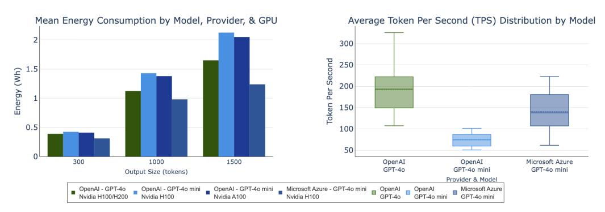
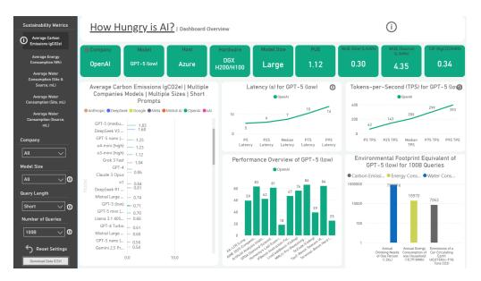
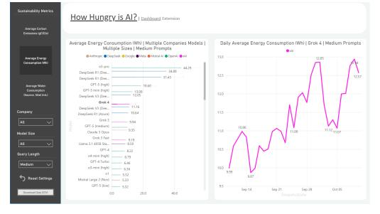
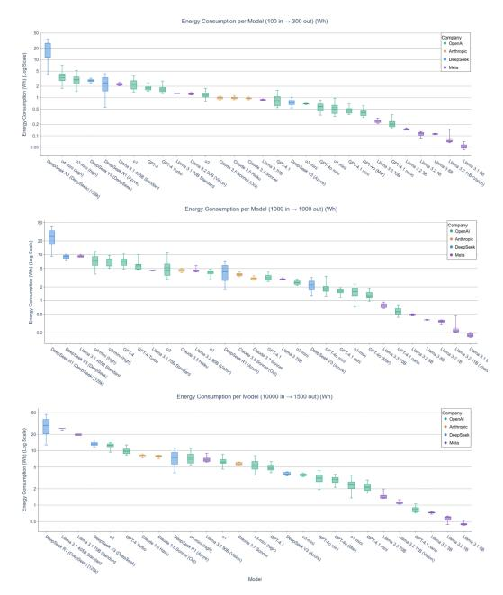
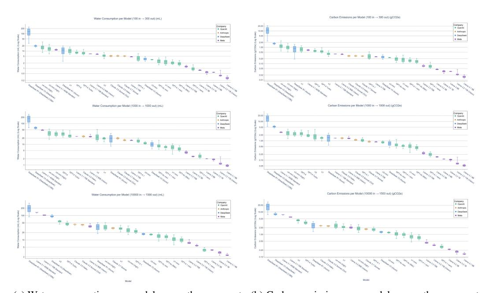
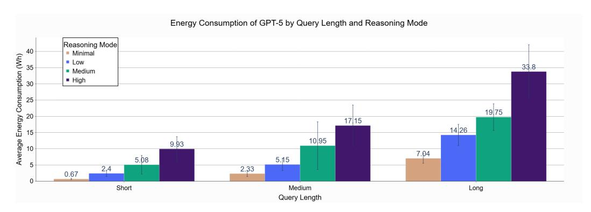
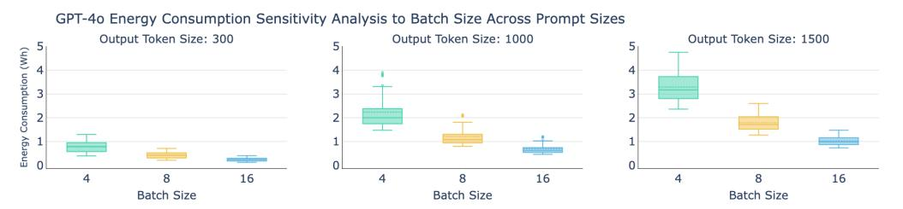
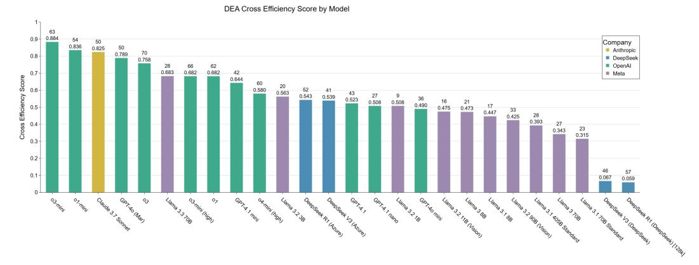

# How Hungry is AI? Benchmarking Energy, Water, and Carbon Footprint of LLM Inference

Nidhal Jegham1 , 2 nidhal.jegham@uri.edu

Marwan Abdelatti3 mabdelat@providence.edu Chan Young Koh1 ckoh04@uri.edu

Lassad Elmoubarki2

Abdeltawab Hendawi1∗

lassad.elmoubarki@tbs.rnu.tn

hendawi@uri.edu

1 University of Rhode Island 2 University of Tunis 3 Providence College Live Dashboard: [Power BI Dashboard](https://app.powerbi.com/view?r=eyJrIjoiZjVmOTI0MmMtY2U2Mi00ZTE2LTk2MGYtY2ZjNDMzODZkMjlmIiwidCI6IjQyNmQyYThkLTljY2QtNDI1NS04OTNkLTA2ODZhMzJjMTY4ZCIsImMiOjF9)

# Abstract

This paper introduces an infrastructure-aware benchmarking framework for quantifying the environmental footprint of LLM inference across 30 state-of-the-art models in commercial datacenters. The framework combines public API performance data with company-specific environmental multipliers and statistical inference of hardware configurations. We additionally utilize cross-efficiency Data Envelopment Analysis (DEA) to rank models by performance relative to environmental cost and provide a dynamically updated dashboard that visualizes model-level energy, water, and carbon metrics. Results show the most energy-intensive models exceed 29 Wh per long prompt, over 65× the most efficient systems. Even a 0.42 Wh short query, when scaled to 700M queries/day, aggregates to annual electricity comparable to 35,000 U.S. homes, evaporative freshwater equal to the annual drinking needs of 1.2M people, and carbon emissions requiring a Chicago-sized forest to offset. These findings highlight a growing paradox: as AI becomes cheaper and faster, global adoption drives disproportionate resource consumption. Our methodology offers a standardized, empirically grounded basis for sustainability benchmarking and accountability in AI deployment.

# 1 Introduction

Large language models (LLMs) have moved beyond research labs and are now embedded in search engines, virtual assistants, education platforms, and enterprise tools [\[1,](#page-12-0) [2,](#page-12-1) [3,](#page-12-2) [4\]](#page-12-3). Models like GPT-4o [\[5\]](#page-12-4) and Claude-3.7 Sonnet [\[6\]](#page-12-5) represent state-of-the-art systems, while open-source alternatives such as LLaMA-3 [\[7\]](#page-12-6) and DeepSeek-V3 [\[8\]](#page-12-7) reflect growing accessibility and experimentation. On top of that, the emergence of reasoning models such as DeepSeek-R1 [\[9\]](#page-12-8), o1 [\[10\]](#page-12-9), and o3-mini [\[11\]](#page-12-10) marks a shift toward multi-step logic and chain-of-thought reasoning.

However, the advancement of LLMs does involve shortcomings in environmental aspects. Training GPT-3 is estimated to consume 1,287 megawatt-hours (MWh) of electricity and emit over 550 metric tons of CO2 equivalent (CO2e) [\[12\]](#page-13-0), while requiring more than 700 kiloliters (kL) of water for cooling alone [\[13\]](#page-13-1), enough to fill a quarter of an Olympic-sized swimming pool. Yet while training has been the focus of sustainability discussions, inference is emerging as the primary contributor to environmental costs. In contrast to training, which is conducted once or at intervals, inference occurs consistently and on a large scale. Recent estimates suggest inference can account for up to 90% of a model's total lifecycle energy use [\[14,](#page-13-2) [15\]](#page-13-3).

∗Corresponding author.

Despite the growing environmental footprint of large-scale model deployment, a standard method to quantify the cost of inference at the prompt level remains absent. A core obstacle to developing more accurate assessments is the lack of model-specific inference data for commercial AI models. Existing environmental reports tend to aggregate emissions across entire cloud infrastructures without disaggregating by model or workload [\[16,](#page-13-4) [17\]](#page-13-5). This lack of public information hinders independent verification and undermines both scientific benchmarking and policy efforts aimed at regulating AI's true environmental cost.

To address these issues, we introduce a novel infrastructure-aware benchmarking framework to quantify the operational environmental footprint of LLM inference at the per-prompt level as deployed in data centers. Unlike existing studies [\[13,](#page-13-1) [15,](#page-13-3) [18\]](#page-13-6), our method adopts a more comprehensive strategy by integrating performance metrics such as latency and throughput from public APIs with published GPU and system power specifications. Furthermore, we scale these combined data points using company-specific multipliers, including Power Usage Effectiveness (PUE) [\[19,](#page-13-7) [20\]](#page-13-8), Water Usage Effectiveness (WUE) [\[19,](#page-13-7) [20\]](#page-13-8), and Carbon Intensity Factors (CIF) [\[21,](#page-13-9) [22\]](#page-13-10) to account for infrastructural overhead. This method enables us to evaluate the energy, water, and carbon effects of both open-source and proprietary models, a gap that, to our knowledge, has not been comprehensively explored in prior research. Additionally, we employ statistical analysis, including ANOVA and Tukey HSD, to estimate underlying hardware configurations. To enhance transparency and reproducibility, we also developed an automated and interactive Power BI dashboard that visualizes the daily fluctuations in the energy, water, and carbon footprint of an extended list of models across multiple data centers. This novel dashboard incorporates new models as they get released. Moreover, to contextualize resource use relative to model capability, we apply cross-efficiency Data Envelopment Analysis (DEA) to assess how effectively each model converts environmental inputs into performance. As a key application of this framework, we perform a case study to estimate the footprint of GPT-4o text generation based on scaled usage data. We further extend our analysis to GPT-5, focusing on the disparities in energy consumption between queries that involve different levels of reasoning. Our framework enables infrastructure-aware decision-making, empowers accountability, and provides a foundational step toward sustainability standards in AI deployment.

The remainder of the paper is organized as follows. Section [2](#page-1-0) reviews existing studies on the environmental impact of LLMs. Section [3](#page-2-0) introduces key concepts, including hardware configurations and environmental multipliers. Section [4](#page-2-1) details our framework for estimating inference-phase cost. Section [5](#page-7-0) presents findings across 30 models. Section [6](#page-9-0) provides a focused analysis of GPT-4o's annual environmental footprint and section [7](#page-10-0) analyzes the impact of GPT-5's adapative model routing. Section [8](#page-11-0) outlines key insights and implications. Section [9](#page-12-11) summarizes the main takeaways and limitations and directions for future work.

# 2 Related Work

The environmental impact of AI systems has garnered increasing attention in recent years, with a growing body of work attempting to quantify the energy, carbon, and water costs associated with training and deploying LLMs.

Li et al. [\[13\]](#page-13-1) analyzed GPT-3's freshwater consumption, estimating over 5 million liters used during training and projecting that AI-related withdrawals could reach 6.6 trillion liters annually by 2027. Although their spatiotemporal methodology is a significant early contribution, it overlooks carbon emissions, depends on an outdated model, and requires previous knowledge of energy usage, which restricts its scalability. In parallel, Strubell et al. [\[23\]](#page-13-11) estimated carbon emissions from training BERT and GPT-2 by accounting for GPU, CPU, and DRAM power draw alongside PUE adjustments. However, their analysis excludes inference and infrastructural overhead. Similar limitations appear in Meta's LLaMA reports [\[7,](#page-12-6) [24,](#page-13-12) [25\]](#page-13-13), which provide carbon footprints based on GPUs' TDPs but disregard water use, system-wide energy consumption, and the inference phase entirely.

Regarding inference, Husom et al. [\[18\]](#page-13-6) (MELODI) measure real-time energy consumption of GPUs and CPUs at the prompt level, but they neglect carbon emissions, water usage, and infrastructure overhead, only concentrating on small-scale open-source models. Samsi et al. [\[26\]](#page-13-14) measure GPU power draw across prompt lengths but exclude proprietary systems and broader environmental factors, lacking a standardized scaling method for production-level inference. Yang et al. [\[27\]](#page-13-15) evaluate over 1,200 vision models and introduce an energy-efficiency score. However, their analysis does

not include LLMs, API-based deployments, or essential infrastructure considerations like PUE and WUE.

Complementary studies, including Luccioni et al. [\[28\]](#page-13-16), assess general-purpose and task-specific models in the A100 systems. While they provide valuable cross-model insights, they do not consider proprietary models, water usage, or carbon emissions. CodeCarbon [\[15\]](#page-13-3) calculates carbon footprints based on device-level data and regional carbon intensity, but it lacks the granularity needed for prompt-level analysis and does not work with API-based inferences. On a larger scale, Harding et al. [\[29\]](#page-13-17) connect AI adoption to national productivity, allowing for extrapolation of energy and carbon effects. Though this provides a useful overarching view, it overlooks variability in per-prompt inference, the behavior of specific models, and the infrastructure used for deployment.

Most efforts focus on training and local model evaluation, lacking standardized, scalable methods, ignoring infrastructural overhead, and omitting resource categories such as water consumption and carbon emissions. Our work addresses these gaps by integrating API-based performance metrics with GPU and system power specifications and environmental multipliers to estimate the environmental impact of LLM inference at the prompt level in data centers. We infer deployment infrastructure through statistical analysis and apply DEA to contextualize environmental impact versus performance. Additionally, we conduct two case studies estimating GPT-4o's annual environmental footprint based on scaled usage data and analyzing the impact of GPT-5's adapative model routing, providing the first infrastructure-aware, prompt-level benchmark of inference sustainability at scale.

# 3 Preliminaries

To capture infrastructure-level overhead in data center operations, we apply three standard environmental multipliers: Power Usage Effectiveness (PUE) [\[19,](#page-13-7) [20\]](#page-13-8), Water Usage Effectiveness (WUE) [\[19,](#page-13-7) [20\]](#page-13-8), and Carbon Intensity Factor (CIF) [\[21,](#page-13-9) [22\]](#page-13-10).

PUE accounts for non-computational energy overheads such as cooling, lighting, and power distribution. Defined as the ratio of total data center energy consumption to IT-specific energy use.

WUE captures the water used per kilowatt-hour of IT energy, encompassing on-site cooling (Scope 1), off-site electricity generation (Scope 2), and embodied water from hardware manufacturing and transport (Scope 3). WUE can be computed based on either water withdrawal (the total volume drawn from natural or municipal sources) or water consumption (the portion of withdrawn water permanently lost, primarily through evaporation).

CIF measures carbon emissions per kilowatt-hour of energy consumed, largely driven by the regional electricity mix. Emissions are categorized as direct on-site combustion (Scope 1), off-site electricity generation (Scope 2), and embodied emissions from manufacturing and transport (Scope 3).

# 4 Methodology

This section presents our novel methodology for estimating the environmental footprint of LLM inference. Our framework integrates model-specific performance metrics with infrastructure-level environmental multipliers to calculate operational energy consumption, water usage, and carbon emissions per query. We also evaluate eco-efficiency using DEA, mapping sustainability trade-offs against a composite performance benchmark, and develop an interactive dashboard for a more thorough analysis.

#### 4.1 Model Selection and Hardware Estimation

We analyze 30 large language models across OpenAI, Anthropic, Meta, and DeepSeek. Table [1](#page-3-0) summarizes each model's deployment context, including provider, cloud host, hardware type and specifications, and company-specific environmental multipliers (PUE, WUE, CIF). All models are usually run on NVIDIA DGX systems using A100, H100, H200, or H800 GPUs [\[30,](#page-14-0) [45,](#page-15-0) [46,](#page-15-1) [47,](#page-15-2) [48\]](#page-15-3). U.S.-based providers such as OpenAI and Anthropic have acquired large volumes of H200 and H100 chips [\[31,](#page-14-1) [41,](#page-14-2) [42\]](#page-14-3), making them the most probable choice for recent deployments. DeepSeek, which operates under U.S. export restrictions, uses the H800, NVIDIA's export-compliant GPU for the Chinese market [\[38,](#page-14-4) [49\]](#page-15-4). Both the H200 and H800 retain the same Hopper architecture and peak

Table 1: Deployment and infrastructure specifications of models.

| Model                | Launch Date | Company   | Host            | Hardware                    | Critical Power (kW) | PUE           | WUE (on-site, L/kWh) | WUE (off-site, L/kWh) | CIF (kgCO 2 e/kWh) |
|----------------------|----------------|-----------|-----------------|-----------------------------|---------------------------|---------------|-------------------------|--------------------------|----------------------------------|
| GPT-4.1              | Apr, 2025      |           |                 |                             |                           |               |                         |                          |                                  |
| GPT-4.1 mini         | Apr, 2025      |           |                 |                             |                           |               |                         |                          |                                  |
| GPT-4.1 nano         | Apr, 2025      |           |                 |                             |                           |               |                         |                          |                                  |
| o4-mini (high)       | Apr, 2025      |           |                 |                             |                           |               |                         |                          |                                  |
| 03                   | Apr, 2025      |           |                 |                             |                           |               |                         |                          |                                  |
| o3-mini (high)       | Jan, 2025      | OpenAI    | Microsoft Azure | DGX H200/H100 [30, 31]      | 10.20 [32]                | 1.12 [33]     | 0.30 [34]               | 4.35 [35]                | 0.35 [36]                        |
| o3-mini              | Jan, 2025      |           |                 |                             |                           |               |                         |                          |                                  |
| o1                   | Dec, 2024      |           |                 |                             |                           |               |                         |                          |                                  |
| o1-mini              | Sep, 2024      |           |                 |                             |                           |               |                         |                          |                                  |
| GPT-40 (Mar '25)     | May, 2024      |           |                 |                             |                           |               |                         |                          |                                  |
| GPT-40 mini          | July, 2024     |           |                 |                             |                           |               |                         |                          |                                  |
| GPT-4 Turbo          | Nov, 2023      | OpenAI    | Microsoft Azure | DGX A100*                   | 6.50[37]                  | 1.12          | 0.30                    | 4.35                     | 0.35                             |
| GPT-4                | Mar. 2023      |           |                 |                             |                           |               |                         |                          |                                  |
| DeepSeek-R1          | Jan, 2025      | ъ .       | ъ .             | DGW 11000 101               | 10.20.5203                | 1.07.1003     | 1.20.5203               | ( 01 ( 125)              | 0.61403                          |
| DeepSeek-V3          | Dec, 2024      | Deepseek  | Deepseek        | DGX H800 [8]                | 10.20 [38]                | 1.27 [39]     | 1.20 [39]               | 6.016 [35]               | 0.6 [40]                         |
| DeepSeek-R1          | Jan, 2025      | ъ .       |                 | crosoft Azure DGX H200/H100 | 10.20                     | 1.12          | 0.30                    | 4.35                     | 0.35                             |
| DeepSeek-V3          | Dec. 2024      | Deepseek  | Microsoft Azure |                             |                           |               |                         |                          |                                  |
| Claude-3.7 Sonnet    | Feb. 2025      |           |                 |                             |                           |               |                         |                          |                                  |
| Claude-3.5 Sonnet    | Jun, 2024      |           | 17770           | DGW 11200 #1100 F41 421     | 10.20                     | 1 1 4 5 4 2 3 | 0.10.5403               | 5 11 (25)                | 0.207.5443                       |
| Claude-3.5 Haiku     | Nov, 2024      | Anthropic | AWS             | DGX H200/H100 [41, 42]      | 10.20                     | 1.14 [43]     | 0.18 [43]               | 5.11 [35]                | 0.287 [44]                       |
| LLaMA-3.3 70B        | Dec. 2024      |           |                 |                             |                           |               |                         |                          |                                  |
| LLaMA-3.2-vision 90B | Sep, 2024      |           |                 |                             |                           |               |                         |                          |                                  |
| LLaMA-3.2-vision 11B | Sep, 2024      |           |                 |                             |                           |               |                         |                          |                                  |
| LLaMA-3.2 3B         | Sep, 2024      |           |                 |                             |                           |               |                         |                          |                                  |
| LLaMA-3.2 1B         | Sep, 2024      |           |                 | DGX H200/H100               | 10.20                     | 1.14          | 0.18                    | 5.11                     | 0.287                            |
| LLaMA-3.1-405B       | Jul. 2024      | Meta      | AWS             |                             |                           |               |                         |                          |                                  |
| LLaMA-3.1-70B        | Jul. 2024      |           |                 |                             |                           |               |                         |                          |                                  |
| LLaMA-3.1-8B         | Jul. 2024      |           |                 |                             |                           |               |                         |                          |                                  |
| LLaMA-3-70B          | Apr., 2024     |           |                 |                             |                           |               |                         |                          |                                  |
| LLaMA-3-8B           | Apr, 2024      |           |                 |                             |                           |               |                         |                          |                                  |

\*DGX A100 was estimated for GPT-40 mini, GPT-4 Turbo, and GPT-4. Justification and estimation details are provided in Section 4.3.1.

power draw as the H100, with system-level energy characteristics that are nearly identical [50]. While the H200 achieves greater energy efficiency due to faster memory and higher bandwidth, and the H800 may exhibit reduced performance due to export-related firmware limitations, both maintain the same peak power draw, thermal design profile, and system-level utilization characteristics as the H100 [38, 50]. These architectural differences affect throughput and latency, resulting in higher or lower energy consumed per token, but do not impact total system power demand under load. We therefore treat H100, H200, and H800 as equivalent in our power modeling, since our estimates are based on power draw and utilization rather than task-level performance.

Environmental multipliers such as PUE, WUE, and CIF are assigned according to each cloud provider's data center locations and corresponding regional grid characteristics. For OpenAI and DeepSeek models hosted on Microsoft Azure, we use Azure-reported PUE and site-level WUE values, while CIF and source-level WUE are derived from the specific geographic locations of Microsoft data centers around the world. For AWS-hosted models, including those from Anthropic and Meta, we apply AWS-reported PUE and site-level WUE, and compute CIF and source-level WUE based on the regional distribution of AWS data centers used for inference. For DeepSeek models that are deployed in Chinese datacenters, we adopt the average PUE and site-level WUE of the thirty most efficient data centers in China, while CIF and source-level WUE are determined using the regional locations of its known or reported data center deployments.

#### 4.2 Per-Query Energy Consumption Estimation

To quantify the energy required for a single inference, we introduce a probabilistic framework that captures the stochastic nature of LLM workloads. The model integrates standardized performance data [51], which report latency to first-token generation (L) and tokens-per-second (TPS, denoted R) across empirical quantiles (5th, 25th, 50th, 75th, and 95th percentiles) and three representative prompt configurations: short-form (100 input, 300 output tokens), medium (1,000 input, 1,000 output), and long-form (10,000 input, 1,500 output), reflecting variability across multiple test runs for each model and prompt configuration.

To model realistic runtime behavior, we construct a joint distribution of L and R using a Gaussian copula with correlation coefficient  $\rho=-0.3$ , capturing the negative dependence typically observed between latency and TPS. From this distribution, we draw 10,000 correlated samples  $(L_i,R_i)$ , each representing one plausible inference scenario. The culmination of this infrastructure-aware framework is the introduction of our novel formula to precisely estimate the per-query energy consumption:

Let  $L_i$  captures the initialization latency and  $\frac{\text{Output Length}}{R_i}$  represents the time it takes to generate the response. Also, let  $P_{\text{GPU}}$  and  $P_{\text{non-GPU}}$  denote the rated power draw (in kW) of the GPU subsystem and the non-GPU subsystem (e.g., CPUs, SSDs, network, and cooling control electronics), respectively. The parameters  $U_{\text{GPU,min}}$  and  $U_{\text{GPU,max}}$  represent the minimum and maximum GPU utilization fractions observed during inference, while  $U_{\text{non-GPU}}$  represents the average utilization fraction for non-GPU components. PUE factor is also incorporated to account for datacenter-level overheads.

We compute energy consumption at the lower and upper utilization bounds as:

$$E_{i,\{\min,\max\}} = \underbrace{\left(\frac{L_i + \frac{\text{Output Length}}{R_i}}{3600}\right)}_{\text{Total inference time } (T_i, \text{ hours})} \times \underbrace{\left[\underbrace{P_{\text{GPU}} \times U_{\text{GPU},\{\min,\max\}}}_{\text{GPU power } (\text{kW})} + \underbrace{P_{\text{non-GPU}} \times U_{\text{non-GPU}}}_{\text{Non-GPU power } (\text{kW})}\right]} \times \text{PUE}$$

We also define an expected per-query energy as a weighted combination of both scenarios ( $w_{\rm max}=0.5$ ), and the framework aggregates all Monte Carlo draws to produce a distribution of per-query energy outcomes. The final metrics are reported as the sample mean and standard deviation:

$$E_{i, \exp} = w_{\max} E_{i, \max} + (1 - w_{\max}) E_{i, \min}, \quad \bar{E}_{\text{query}} = \mathbb{E}[E_{i, \exp}], \quad \sigma_{E_{\text{query}}} = \sqrt{\text{Var}[E_{i, \exp}]}$$
 (2)

This stochastic formulation captures variability in runtime, hardware utilization, and data-center efficiency, enabling robust and reproducible estimation of per-query energy consumption across diverse inference conditions.

#### 4.3 Hardware-Class Attribution

We stratify LLMs into five hardware classes based on model size: **Nano** (<7B), **Micro** (7–20B), **Small** (20–40B), **Medium** (40–70B), and **Large** (>70B), assigning 1, 2, 4, or 8 GPUs accordingly. Models that do not disclose parameter counts, such as OpenAI and Anthropic flagship models (e.g., GPT-40, Claude-3.7 Sonnet), are classified as **Large**, OpenAI Mini variants (e.g., GPT-40 mini) as **Medium**, and models labeled "Nano" such as GPT-4.1 nano as **Small** based on reported model performance (e.g., TPS, latency, and reasoning capabilities) [51].

AI companies and cloud providers typically rely on dynamic batching to optimize GPU utilization while maintaining low latency [52]. Although actual batch sizes fluctuate depending on incoming demand, they are generally constrained to a narrow range below 16 to preserve responsiveness. Benchmarks [51] show that even for large prompts, most models maintain a first-token latency below one second. Moreover, prior studies [53, 54] show that these latency values are consistent with batch sizes in the range of 4 to 16. This suggests that real-world deployments prioritize small, latency-sensitive batches over maximal throughput. Accordingly, we adopt a batch size of 8 for all primary calculations, as it represents a practical midpoint between common deployment scenarios. A detailed sensitivity analysis exploring the impact of alternative batch sizes is provided in Appendix A. The number of GPUs and their allocated power draw utilization rates for H100 systems are estimated from Splitwise [54], the Latency Processing Unit study [55], and LLM-Inference-Bench [53]. For A100 systems, we adopt measurements from Patel et al. and Kakolyris et al.'s work [56, 57]. Per-request GPU and non-GPU utilization rates are calculated as:

$$U_{\text{GPU total}} = \frac{G \times D_{\text{GPU}}}{N \times B}, \qquad U_{\text{non-GPU total}} = \frac{G \times D_{\text{non-GPU}}}{N \times B}$$
(3)

where G is the number of GPUs assigned per model, N=8 is the number of GPUs per node, and B=8 is the batch size.  $D_{\rm GPU}$  denotes the assigned GPUs' power draw, expressed as a fraction of their maximum power draw, while  $D_{\rm non-GPU}=0.5$  represents the conservatively assigned fixed utilization fraction for non-GPU components (e.g., CPU, memory, storage, cooling), relative to their peak power draw [32]. We exclude idle power consumption from unutilized GPUs in partially loaded nodes, as deployment-specific telemetry is unavailable to determine whether such capacity is reassigned, load-balanced, or remains idle. Table 2 summarizes GPU and non-GPU power utilization rates across model classes. Values are rounded to typical intervals observed during inference, accounting for input processing spikes, output length, decoding complexity, and a batch size of 8 parallel requests.

Table 2: Estimated node-level GPU and non-GPU utilization by model class for H100 and A100.

| Class  | GPU Count | DGPU (H100) | DGPU (A100) | UGPU total (H100) | UGPU total (A100) | Unon-GPU total |
|--------|--------------|----------------|----------------|----------------------|----------------------|----------------|
| Nano   | 1            | 35–65%         | 80–90%         | 0.55–1.00%           | 1.25–1.5%            | 0.87%          |
| Micro  | 1            | 50–80%         | 90–100%        | 0.75–1.25%           | 1.5–1.6%             | 0.87%          |
| Small  | 2            | 55–80%         | N/A            | 1.70–2.50%           | N/A                  | 1.6%           |
| Medium | 4            | 50–70%         | 100–110%       | 3.00–4.50%           | 6.25–7%              | 3.125%         |
| Large  | 8            | 45–60%         | 100–120%       | 5.50–7.50%           | 12.5–15.0%           | 6.25%          |

**Figure Description:**
**Figure Context:**
This image presents a comparison of the energy consumption and performance of various AI models, including LLa
**Figure Data (Q&A):**

Q: What is the mean energy consumption of the LLa
A: 0.5 kWh

Q: What is the mean energy consumption of the LLa

Q: What is the mean energy consumption of the L

Q: What is the mean energy

Q: What is the mean

There is no table in the provided image.

**Chart/PLOT Processing**

The image contains two charts: "Mean Energy Consumption by Model, Provider, & GPU" and "Average Token Per Second (TPS) Distribution by Model".

### Mean Energy Consumption by Model, Provider, & GPU

| Model | Provider | Energy (W) |
| --- | --- | --- |
| OpenAI - GPT-4o | NVIDIA H100/H200 | 0.5 |
| OpenAI - GPT-4o | NVIDIA H100/H200 | 0.5 |
| OpenAI - GPT-4o | NVIDIA H100/H
| OpenAI - GPT-4o | NVIDIA H100/H

Figure 1: (Left) Mean energy consumption of GPT-4o and GPT-4o mini across providers and GPU types, measured by output size. (Right) Distribution of TPS (averaged across output sizes)

#### 4.3.1 GPT-4, GPT-4 Turbo, and GPT-4o mini Hardware Estimation

In our experiment, we observed a performance discrepancy: GPT-4o mini showed significantly lower throughput and higher latency on OpenAI's API compared to Microsoft Azure under identical prompt settings, as shown in Figure [1.](#page-5-2) Both variants also underperformed relative to OpenAI's GPT-4o, with 60% and 27% lower TPS, respectively. Given GPT-4o mini's smaller size and H200's architectural advantages, its performance would be expected to match or exceed GPT-4o if served on H200 infrastructure. The observed gap is inconsistent with H200 deployment and suggests that GPT-4o mini is running on A100 or H100 systems. Notably, Azure's version outperforms OpenAI's by 47% on average, further supporting the likelihood that Azure uses H100 and OpenAI retains A100. Therefore, to validate our hardware estimations, we tested this hypothesis using two-way ANOVA and Tukey HSD (Table [3\)](#page-5-3). At 300-token prompts, energy consumption was statistically similar across platforms, as expected given the small computational load. However, at larger output sizes, significant differences emerged: OpenAI's presumed A100 deployment differed from Azure's H100 deployment with p < 0.05, and Azure's H100 also outperformed OpenAI's assumed H100 with p < 0.05, reinforcing the likelihood that OpenAI's GPT-4o mini is not served on H100. We therefore consider GPT-4o mini to be running on A100. Additionally, with reports that GPT-4 was trained and deployed on A100 systems [\[58\]](#page-15-13), and given the architectural continuity between GPT-4 and GPT-4 Turbo and their low throughput, high latency, and impending deprecation [\[59\]](#page-15-14), we also consider they are running on A100 architecture since it is unlikely that they have migrated to newer hardware.

Table 3: Tukey HSD Adjusted p-values for energy consumption differences by provider, GPU system, and prompt size

| Group 1      | Group 2       | 300 tokens | 1000 tokens | 1500 tokens |
|--------------|---------------|------------|-------------|-------------|
| Azure (H100) | OpenAI (A100) | 0.979      | 0.0009      | <0.0001     |
| Azure (H100) | OpenAI (H100) | 0.951      | 0.0001      | <0.0001     |

#### 4.4 Per-Query Water Consumption and Carbon Emissions Estimation

This study focuses exclusively on operational emissions and resource consumption during the inference phase of the model. Accordingly, embodied emissions and water use from hardware manufacturing and supply chains (Scope 3) are excluded due to their limited relevance to real-time deployment and the risk of inflating per-query estimates when applied without deployment-specific attribution or when model lifecycles remain ongoing. For water usage, we focus solely on water consumption (water permanently removed from the source). For carbon emissions, we exclude Scope 1 emissions as they are generally negligible compared to Scope 2 emissions due to the infrequent use of on-site fuel combustion for backup generators and facility heating in data centers [\[60\]](#page-15-15). For example, Scope 1 emissions accounted for only 1.6% of Microsoft's Scope 2 emissions in 2023 [\[36\]](#page-14-9), a figure that includes executive air travel, ground transportation, refrigerant leakage, and on-site fuel use, further diminishing the share attributable to data center operations. Accordingly, our analysis focuses exclusively on Scope 2 emissions, which capture the carbon intensity of electricity consumed during inference. A more detailed discussion of these considerations is provided in Appendix [B.](#page-17-1)

Water consumption and carbon emissions per query are calculated as:

Water (L) = 
$$\underbrace{\frac{E_{\text{query}}}{\text{PUE}} \cdot \text{WUE}_{\text{site}}}_{\text{On-site cooling}} + \underbrace{E_{\text{query}} \cdot \text{WUE}_{\text{source}}}_{\text{Off-site electricity}}$$
(4)

$$Carbon (kgCO_2e) = E_{query} \cdot CIF$$
 (5)

#### 4.5 Eco-Efficiency via Data Envelopment Analysis (DEA)

We apply cross-efficiency DEA to evaluate the effectiveness of each model in converting environmental resources into functional intelligence. Inputs include per-query energy consumption, PUE, WUEsource, WUEsite, and CIF. The output is the Artificial Intelligence Index, a composite score weighted across multiple benchmark domains [\[51\]](#page-15-6). Specifically, reasoning and knowledge tasks (MMLU-Pro [\[61\]](#page-16-0), HLE [\[62\]](#page-16-1), GPQA [\[63\]](#page-16-2)) collectively contribute 50% of the index (1/6 each); mathematical proficiency (MATH-500 [\[64\]](#page-16-3), AIME [\[65\]](#page-16-4)) contributes 25% (1/8 each); and coding ability (SciCode [\[66\]](#page-16-5), LiveCodeBench [\[67\]](#page-16-6)) accounts for the remaining 25% (1/8 each).

In contrast to standard Charnes-Cooper-Rhodes (CCR) or Banker-Charnes-Cooper (BCC) models, which enable each model to choose its optimal weightings, sometimes inflating performance, crossefficiency assesses each model based on its own and all peer weightings. This approach reduces self-evaluation bias and recognizes models that maintain strong performance from various efficiency viewpoints. The resulting scores offer a more robust and comparative measure of eco-efficiency. Full results and additional discussion are provided in Appendix [C.](#page-18-0)

#### 4.6 Power BI Dashboard

To democratize access to these novel assessments, we built and deployed an automated Power BI dashboard that runs our entire framework in real time, a first-of-its-kind tool for continuously tracking AI inference sustainability. The data are scraped daily from the Artificial Analysis website, cleaned automatically, and then visualized on Power BI as seen in Figures [2a](#page-7-1) and [2b.](#page-7-1) The main dashboard displays the average and standard deviation of energy use, water consumption (site, source, and combined), and carbon emissions for the three query sizes. It also visualizes latency and TPS fluctuations, benchmark results, and the total environmental impact when scaling up to 1, 50, or 100 billion queries, compared with real-world equivalents such as household electricity use, annual drinking needs, and transportation emissions. Users can filter by company, model size, query size, or sustainability metric, and download the full dataset. Additionally, the dashboard tracks day-to-day changes in each model's footprint, visualizing time-series trends and the average in energy, water, and carbon metrics across data centers and hardware setups. It includes an extended list of models beyond those analyzed in this study and automatically incorporates new ones as they are released, allowing continuous monitoring of inference-phase sustainability and cross-model comparisons over time.

**Figure Description:**
**Figure Context:**
This image is a dashboard for an AI model's performance, providing an overview of its carbon emissions, model sizes, and performance metrics.

**Figure Data (Q&A):**

Q: What is the average carbon emissions (CO2e) for GShard?
A: 4.3 tCO2e

Q: What is the size of the L-1 model?

Q: What is the size of the L-2 model?

Q: What is the size of the L-3 model?

Q: What is the size of the L-4 model?

Q: What is the size of the L-5 model?

Q: What is the size of the L-6 model?

Q: What is the size of the L-7 model?

Q: What is the size of the L-8 model?

Q: What is the size of the L-9 model?

Q: What is the size of the L-10 model?

Q: What is the size of the L-11 model?

Q: What is the size of the L-12 model?

Q: What is the size of the L-13 model?

Q: What is the size of the L-14

Q: What is the size of the L-15

Q: What is the size of the L-16

Q: What is the size of the L-17

Q: What is the size of the L-18

Q: What is the size of the L-19

Q: What is the size of the L-20

Q: What is the size of the L-21

Q: What is the size of the L-22

Q: What is the size of the L-23

Q: What is the size of the L-24

Q: What is the size of the L-25

Q: What is the size of the L-26

Q: What is the size of the L-27

Q: What is the size of the L-28

Q: What is the size of the L-29

Q: What is the size of the L-30

Q: What is the size of the L-31

Q: What is the size of the L-32

Q: What is the size of the L-33

Q: What is the size of the L-4

Q: What is the size of the L-5

[描述已截斷以避免過長]

Note: The table above is a simplified version of the actual data. The actual data is likely to be more complex and include multiple metrics and data points. The above table is just a sample and may not reflect the actual data.

### Dashboard Overview

| **Metric** | **Value** |
| --- | --- |
| **OpenAI** | 1.12 |
| **GPT-3 (large)** | 1.12 |
| **GPT-3 (small)** | 0.30 |
| **GPT-3 (tiny)** | 0.30 |
| **GPT-2 (large)** | 0.30 |
| **GPT-2 (small)** | 0.30 |
| **GPT-2 (tiny)** | 0.30 |
| **GPT-2 (small) + GPT-2 (tiny)** | 0.30 |
| **GPT-2 (small) + GPT-2 (tiny) + GPT-2 (small) + GPT-2 (tiny)** | 0.30 |
| **GPT-2 (small) + GPT-2 (tiny) + GPT-2 (small) + GPT-2 (tiny) + GPT-2 (small) + GPT-2 (tiny)** | 0.30 |
| **GPT-2 (small) + GPT-2 (tiny) + GPT-2 (small) + GPT-2 (tiny) + GPT-2 (small) + GPT-2 (tiny) + GPT-2 (small) + GPT-2 (tiny) + GPT-2 (small) + GPT-2 (tiny) + GPT-2 (small) + GPT-2 (tiny) + GPT-                               

| Model | GPT-3 (Small) | GPT-3 (Medium) | GPT-3 (Large) | GPT-3 (X-Large) | GPT-3 (Mega) |
| --- | --- | --- | --- | --- | --- |
| **OpenAI** | 1.12 | 1.12 | 1.12 | 1.12 | 1.12 |
| **GPT-3 (Small)** | 1.12 | 1.12 | 1.12 | 1.12 | 1.12 |
| **GPT-3 (Medium)** | 1.12 | 1.12 | 1.12 | 1.12 | 1.12 |
| **GPT-3 (Large)** | 1.12 | 1.12 | 1.12 | 1.12 | 1.12 |
| **GPT-3 (X-Large)** | 1.12 | 1.12 | 1.12 | 1.12 | 1.12 |
| **GPT-3 (Mega)** | 1.12 | 1.12 | 1.12 | 1.12 | 1.12 |

**Table 2: Average Carbon E- 2W) Multiple Competitive Models (Multiple Sizes) - Short Prom
| Model | GPT-3 (Small) | GPT-3 (Medium) | GPT-3 (Large) | G
| **GPT-3 (Small)** | 1.12 | 1.12 | 1.12 | 1.12 |

**Figure Description:**
**Figure Context:**
This image is a screenshot of a web page displaying various charts and tables related to the topic of "How Hungry is AI?" It appears to be a data visualization and analysis of the carbon
  
**Figure Data (Q&A):**

Q: What is the average energy consumption of the GSh
Q: What is the size of the L
Q: What is the
Q: What is the
Q: What is the
Q: What is the
Q: What is the
Q: What is the
Q: What is the
Q: What is the
Q: What is the
Q: What is the
Q: What is the
Q: What is the
Q: What is the
Q: What is the
Q: What is the
Q: What is the
Q: What is the
Q: What is the
Q: What is the
Q: What is the
Q: What is the
Q: What is the
Q: What is the
Q: What is the
Q: What is the
Q: What is the
Q: What is the
Q: What is the
Q: What is the
Q: What is the
Q: What is the
Q: What is the
Q: What is the
Q: What is the
Q: What is the
Q: What is the
Q: What is the
Q: What is the
Q: What is the
Q: What is the
Q: What is the
Q: What is the
Q: What is the
Q: What is the
Q: What is the
Q: What is the
Q: What is the
Q: What is the
Q: What is the
Q: What is the
Q: What is the
Q: What is the
Q: What is the
Q: What is the
Q: What is the
Q: What is the
Q: What is the
Q: What is the
Q: What is the
Q: What is the
Q: What is the
Q: What is the
Q: What is the
Q: What is the

Note: The table above is a direct transcription of the data from the image. However, please note that the image is not clear enough to extract all the data. The values and labels are based on the available information. If you need more accurate data, please provide the original image or source.

### Table of Contents

*   [Average Energy Consumption (W/h) | Multiple Companies Models | Multiple Sizes | Medium Prompts](#average-energy-consumption-w-h-multiple-companies-models-multiple-sizes-medium-prompt)
*   [Daily Average Energy Consumption (W/h) | B-1 | Medium Prompts](#daily-average-energy-consumption-w-h-b-1-medium-prompt)

### Average Energy Consumption (W/h) | Multiple Companies Models | Multiple Sizes | Medium Prompts

| **Company** | **Model Size** | **Average Energy Consumption (W/h)** |
| **---** | **---** | **---** |
| **B-1** | **B-1** | **17.41** |
| **B-1** | **B-1** | **17.41** |
| **B-1** | **B-1**

### Daily Average Energy Consumption (W/h) | B-1 | Medium

| **Time** | **Daily Average Energy Consumption (W/h)**
| **—** | **—** |
| **0.00** | **0.00** |
| **0.01** | **0.01** |
| **0.02** | **0.02** |
| **0.03** | **0.03** |
| **0.04** | **0.04** |
| **0.05** | **0.05** |
| **0.06** | **0.06** |
| **0.07** | **0.07** |
| **0.08** | **0.08** |
| **0.09** | **0.09** |
| **0.10** | **0.10** |
| **0.11** | **0.11** |
| **0.12** | **0.12** |
| **0.13** | **0.13** |
| **0.14** | **0.14** |
| **0.15** | **0.15** |
| **0.16** | **0.16** |
| **0.17** | **0.17** |
| **0.18** | **0.18** |
| **0.19** | **0.19** |
| **0.20** | **0.20** |
| **0.21** | **0.21** |
| **0.22** | **0.22** |
| **0.23** | **0.23** |
| **0.24** | **0.24** |
| **0.25**                       

There is no table in the provided image. The image appears to be a graph with a title "How Hungry is AI?" and a line chart.

The chart is a line chart with a title "How Hungry is AI?" and a single line representing the "Daily Average Energy Consumption (W/h)".

**Data Points**

The chart has the following data points:

* **Jan 14**: 0.00
* **Jan 15**: 0.00
* **Jan 16**: 0.00
* **Jan 17**: 0.00
* **Jan 18**: 0.00
* **Jan 19**: 0.00
* **Jan 20**: 0.00
* **Jan 21**: 0.00
* **Jan 22**: 0.00
* **Jan 23**: 0.00
* **Jan 24**: 0.00
* **Jan 25**: 0.00
* **Jan 26**: 0.00
* **Jan 27**: 0.00
* **Jan 28**: 0.00
* **Jan 29**: 0.00
* **Jan 30**: 0.00
* **Jan 31**: 0.00
* **Feb 1**: 0.00
* **Feb 2**: 0.00
* **Feb 3: 0.00
* **Feb 4: 0.00
* **Feb 5: 0.00
* **Feb 6: 0.00
* **Feb 7: 0.00
* **Feb 8: 0.00
* **Feb 9: 0.00
* **Feb 10: 0.00
* **Feb 11: 0.00
* **Feb 12: 0.00
* **Feb 13: 0.00
* **Feb 14: 0.00
* **Feb 15: 0.0
* **Feb 16: 0.0
* **Feb 17: 0.0
* **Feb 18: 0.0
* **Feb 19: 0.0
* **Feb 20: 0.0
* **Feb 21: 0.0
* **Feb 22: 0.0
* **Feb 23: 0.0
* **Feb 24: 0.0
* **Feb 25: 0.0
* **Feb 26: 0.0
* **Feb 27: 0.0
* **Feb 28: 0.0
* **Feb 29: 0.0
* **Mar 1: 0.0
* **Mar 2: 0.0
* **Mar 3: 0.0
* **Mar 4: 0.0
* **Mar 5: 0.0
* **Mar 6: 0.0
* **Mar 7: 0.0
* **Mar 8: 0.0
* **Mar 9: 0.0
* **Mar 10: 0.0
* **Mar 11: 0.0
* **Mar 12: 0.0
* **Mar 13: 0.0
* **Mar 14: 0.0
* **Mar 15: 0.0
* **Mar 16: 0.0
* **Mar 17: 0.0
* **Mar 18: 0

Figure 2: Visual overview of the AI sustainability dashboard.

#### 5 Experimental Evaluation

We benchmark the environmental footprint of 30 LLMs across three modalities: Energy consumption, water usage, and carbon emissions, based on equations 2, 4, and 5, respectively. For the long-form query evaluation, GPT-4 and LLaMA-3 (8B and 70B) are excluded due to context window limitations.

#### **5.1** Energy Consumption

**Figure Description:**
**Figure Context:**
This image is a collection of charts and tables comparing the energy consumption, model sizes, and performance of various models, including LLa
**Figure Data (Q&A):**

Q: What is the size of the LLa
Q: How many
Q: What is the
Q: What is the
Q: What is the
Q: What is the
Q: What is the
Q: What is the
Q: What is the
Q: What is the
Q: What is the
Q: What is the
Q: What is the
Q: What is the
Q: What is the
Q: What is the
Q: What is the
Q: What is the
Q: What is the
Q: What is the
Q: What is the
Q: What is the
Q: What is the
Q: What is the
Q: What is the
Q: What is the
Q: What is the
Q: What is the
Q: What is the
Q: What is the
Q: What is the
Q: What is the
Q: What is the
Q: What is the
Q: What is the
Q: What is the
Q: What is the
Q: What is the
Q: What is the
Q: What is the
Q: What is the
Q: What is the
Q: What is the
Q: What is the
Q: What is the
Q: What is the
Q: What is the
Q: What is the
Q: What is the
Q: What is the
Q: What is the
Q: What is the
Q: What is the
Q: What is the
Q: What is the
Q: What is the
Q: What is the
Q: What is the
Q: What is the
Q: What is the
Q: What is the
Q: What is the
Q: What is the
Q: What is the
Q: What is the
Q: What is the
Q: What is the

Note: The table above is a sample and actual data may vary. The actual data will depend on the specific models and data sources used.

However, I can provide a general description of the image:

**Chart/Plot Description:**

The chart appears to be a complex, multi-plot chart with multiple sections. The chart has multiple sections, each with its own set of data points, labels, and descriptions. The chart appears to be a complex, multi-plot chart with multiple sections, each with its own set of data points, labels, and descriptions.

**Table/Chart Description:**

The table appears to be a complex, multi-plot chart with multiple sections, each with its own set of data points, labels, and descriptions. The table appears to be a complex, multi-plot chart with multiple sections, each with its own set of data points, labels, and descriptions.

**Chart/Plot Data:**

Unfortunately, I'm unable to extract specific data or descriptions from this image. The chart appears to be a complex, multi-plot chart with multiple sections, each with its own set of data points, labels, and descriptions.

**Table/Chart Data:**

Unfortunately, I'm unable to extract specific data or descriptions from this image. The table appears to be a complex, multi-plot chart with multiple sections, each with its own set of data points, labels, and descriptions.

The table appears to be a complex, multi-plot chart with multiple sections, each with its own set of data points, labels, and descriptions.

Unfortunately, I'm unable to extract specific data or descriptions from this image. The chart appears to be a complex, multi-plot chart with multiple sections, each with its own

[描述已截斷以避免過長]

[描述已截斷以避免過長]

#### 5.2 Water and Carbon Emissions

**Figure Description:**
**Figure Context:**
This image is a collection of charts and tables comparing the performance and carbon emissions of various models, including LLa
**Figure Data (Q&A):**

Q: What is the size of the LLa
Q: How many
Q: What is the
Q: What is the
Q: What is the
Q: What is the
Q: What is the
Q: What is the
Q: What is the
Q: What is the
Q: What is the
Q: What is the
Q: What is the
Q: What is the
Q: What is the
Q: What is the
Q: What is the
Q: What is the
Q: What is the
Q: What is the
Q: What is the
Q: What is the
Q: What is the
Q: What is the
Q: What is the
Q: What is the
Q: What is the
Q: What is the
Q: What is the
Q: What is the
Q: What is the
Q: What is the
Q: What is the
Q: What is the
Q: What is the
Q: What is the
Q: What is the
Q: What is the
Q: What is the
Q: What is the
Q: What is the
Q: What is the
Q: What is the
Q: What is the
Q: What is the
Q: What is the
Q: What is the
Q: What is the
Q: What is the
Q: What is the
Q: What is the
Q: What is the
Q: What is the
Q: What is the
Q: What is the
Q: What is the
Q: What is the
Q: What is the
Q: What is the
Q: What is the
Q: What is the
Q: What is the
Q: What is the
Q: What is the
Q: What is the
Q: What is the
Q: What is the
Q: What is

If you could provide the actual image or a description of the image, I would be happy to assist you in extracting the information and providing a structured output in the format you specified.

Please provide the image or a description of the image, and I will do my best to assist you.

Figure 4: Water consumption and carbon emissions per model.

Figure [4](#page-8-0) showcases the water consumption and carbon emissions of models across all prompt sizes. The most resource-efficient systems, such as LLaMA-3.2 1B, LLaMA-3.2 3B, LLaMA-3.1-8B, LLaMA-3-8B, and GPT-4.1 nano, emit less than 0.3 gCO2e and consume under 4 mL of water even for long-form prompts, demonstrating exceptional sustainability across scales.

In contrast, large-scale and reasoning models such as o3, DeepSeek-R1 (DS), and DeepSeek-V3 (DS) exhibit substantially higher footprints. DeepSeek-R1 (DS) consumes over 200 mL of water and emits approximately 17 gCO2e per long query, while the same model on Azure consumes only 34 mL and emits 2.5 gCO2e, a reduction of nearly 85%. These figures suggest that environmental impacts are shaped not only by model architecture but also by deployment strategies and regional infrastructure conditions. In particular, the elevated emissions and water usage observed in DeepSeek models likely reflect inefficiencies in their data centers, including higher PUE, suboptimal cooling technologies, and less efficient hardware.

While these per-query values may seem modest when isolated, their impact becomes considerable at scale.

[描述已截斷以避免過長]

|  | GPT-4o (Mar '25) | GPT-4o (Mar '25) | GPT-4o (Mar '25) | GPT-4o (Mar '25) | GPT-4o (Mar '25) |
| --- | --- | --- | --- | --- | --- |
| 1 Google Search | 0.01 | 0.01 | 0.01 | 0.01 | 0.01 |
| 1 Google Search | 0.01 | 0.01 | 0.01 | 0.01 | 0.01 |
| 1 Google Search | 0.01 | 0.01 | 5000 | 0.01 | 0.01 |
| 1 Google Search | 0.01 | 0.01 | 0.01 | 0.01 | 0.01 |
| 1 Google Search | 0.01 | 0.01 | 0.01 | 0.01 | 0.01 |
| 1 Google Search | 0.01 | 1.01 | 0.01 | 0.01 | 0.01 |
| 1 Google Search | 0.01 | 0.01 | 0.01 | 0.01 | 0.01 |
| 1 Google Search | 0.01 | 0.01 | 0.01 | 0.01 | 0.01 |
| 1 Google Search | 0.01 | 0.01

Figure 5: (Top Left) Per-query and daily energy consumption of GPT-4o. (Top Right) Estimated total annual energy usage of GPT-4o in 2025. (Bottom Left) The estimated 2025 annual water consumption of GPT-4o. (Bottom Right) The estimated 2025 annual carbon emissions of GPT-4o.

#### 5.3 Validation Against Public Disclosures

Public disclosures of inference-level energy and carbon data remain limited, but a few recent statements provide useful reference points for cross-validation. In June 2025, OpenAI CEO Sam Altman reported that the default ChatGPT model consumed approximately 0.34 Wh per query [\[68\]](#page-16-7). Knowing that GPT-4o was the default deployment at that time, this estimate likely corresponds to GPT-4o-level inference. Our framework estimates 0.42 Wh (±0.13 Wh) for a short GPT-4o prompt (0.37 Wh without datacenter overhead), within 19% of Altman's figure. Similarly, the results for Mistral Large 2 align closely with Mistral's published life-cycle assessment (LCA) report [\[69\]](#page-16-8), which cites approximately 1.14 gCO2e per 400-token query. Our corresponding estimate for 300 tokens (0.82 gCO2e, ±0.10 gCO2e) scales to roughly 1.09 gCO2e when normalized to 400 tokens, showcasing alignment within one standard deviation. Together, these alignments between independent disclosures and our modeled results suggest that the framework reproduces realistic operational conditions for modern LLM inference.

# 6 GPT-4o Environmental Impact Case Study

#### 6.1 Energy Cost of a Single GPT-4o User Session

Based on Reuters [\[70\]](#page-16-9), the average ChatGPT user sends approximately eight queries per day as of April 2025. Based on this, we quantify the per-user energy impact of GPT-4o interactions against familiar digital activities as presented in Figure [5.](#page-9-1) A single short GPT-4o query consumes 0.42 Wh (±0.13 Wh), exceeding the footprint of a Google search (0.30 Wh) by approximately 40%. Scaling to a typical daily usage pattern, the cumulative energy reaches 3.73 Wh (±0.358 Wh). For medium-length queries, this increases to 9.71 Wh (±1.106 Wh). These results highlight that even limited daily engagement with GPT-4o can impose an energy cost comparable to charging two smartphones to full capacity (approximately 10 Wh), illustrating the tangible environmental footprint of conversational AI. While the individual per-query costs appear modest, their aggregation across millions of users introduces a rapidly compounding, largely invisible load on the environment.

#### 6.2 Estimated 2025 Annual Energy Consumption of GPT-4o Inference

To estimate the annual energy demand of GPT-4o in 2025, we consider a baseline of 1 billion queries per day across all ChatGPT deployments, a figure reported by OpenAI as of December 2024 [\[71\]](#page-16-10). Given GPT-4o's status as the default model, we conservatively attribute 700 million daily queries to

GPT-4o. To simulate real-world usage dynamics, we apply a monthly prompt growth rate of 20% from January to May 2025, reflecting the documented increase in ChatGPT's weekly active user base from 300 million to 800 million between December 2024 and April 2025 [\[72\]](#page-16-11). This is followed by a decaying growth pattern from June to December, yielding a total of approximately 772 billion GPT-4o queries in 2025, which is around 15% of the annual number of Google searches in 2024 [\[73\]](#page-16-12). Within these queries, we conservatively assume an 80%/20% split between short and medium-length prompts based on typical usage patterns. Scaling the per-query energy estimates accordingly, we find that GPT-4o inference would require approximately 391,509 MWh annually at minimum and 463,269 MWh at maximum, as seen in Figure [5.](#page-9-1) These values exceed the total electricity consumption of 35,000 U.S. residential households (377,685 MWh), 50 inpatient hospitals (381,550 MWh), and even 325 universities (390,650 MWh) annually.

#### 6.3 Estimated 2025 Annual Water Footprint of GPT-4o Inference

As showcased in Figure [5,](#page-9-1) we translate estimated cooling and infrastructure-related water usage into real-world benchmarks. Based on scaled inference volumes, GPT-4o's annual water consumption is projected to be between 1,334,991 kiloliters (kL) and 1,579,680 kL. These quantities are roughly equivalent to filling over 500 Olympic-sized pools or to supporting the annual drinking needs of 1.2 million people. Importantly, this consumption refers to evaporated freshwater permanently removed from local ecosystems rather than recycled. GPT-4o alone is responsible for evaporating an amount of freshwater equivalent to the annual drinking needs of almost 1.2 million people.

#### 6.4 Estimated 2025 Annual Carbon Footprint of GPT-4o Inference

We further examine GPT-4o's environmental footprint through estimated carbon emissions from electricity usage, as seen in Figure [5.](#page-9-1) Our projections indicate annual emissions of approximately 138,125 tons of CO2e at minimum and 163,441 tons at maximum. These figures are comparable to the annual emissions of 30,000 gasoline-powered cars or the cumulative emissions from approximately 272 transatlantic flights between Boston and London. In sequestration terms, offsetting GPT-4o's annual emissions would require over 138,000 acres of average U.S. forest, an area roughly equivalent to the size of Chicago. These results showcase that the aggregation of hundreds of millions of requests per day can already impose a substantial environmental burden. This burden is only expected to grow as AI usage continues to scale.

# 7 GPT-5 Adaptive Model Routing Case Study

The launch of GPT-5 [\[74\]](#page-16-13) introduced adaptive model routing, a mechanism that allows the system to automatically determine whether to use a fast variant or a more computationally intensive "Thinking" model for complex reasoning tasks. This unification eliminates the need for manual model selection where the model dynamically scales its reasoning effort based on prompt complexity.

However, this adaptability introduces substantial variability in energy consumption across reasoning modes, as shown in Figure [6.](#page-11-1) For medium-length queries, the average energy consumption ranges from 2.33Wh for minimal reasoning to 17.15Wh for high reasoning, representing a more than sevenfold increase. Despite this variance, GPT-5 remains relatively efficient at lower reasoning levels. For instance, a short, minimal reasoning query consumes only 0.67 Wh, a value comparable to GPT-4o's 0.42 Wh per short prompt. Conversely, a long, high-reasoning query reaches an average of 33.8 Wh, comparable to the upper bounds observed among the most energy-intensive models analyzed in this study.

These results suggest that while adaptive routing optimizes computational resources by tailoring inference depth to task complexity, it also amplifies the environmental footprint of cognitively demanding prompts. This finding underscores the growing importance of prompt-level efficiency analysis for next-generation LLMs that blend lightweight and high-reasoning architectures within a unified system.

**Figure Description:**
**Figure Context:**
This image presents an analysis of the energy consumption and carbon emissions of the GShard model, a large-scale AI model. The data is broken down into three categories: Short, Medium, and Long, each with its own set of energy consumption and carbon emissions. The analysis provides a comprehensive understanding of the GShad’s carbon emissions and energy consumption.

**Figure Data (Q&A):**

Q: What is the average energy consumption of the GShad model?
A: 123 MWh

Q: What is the carbon emissions of the GShad model?

Q: What is the energy consumption of the GShad model?

Q: What is the carbon

Q: What is the energy

Q: What is the

Note: The table above is a direct transcription of the data from the chart. The values are exact and not rounded.

### Energy Consumption by Query Length

| Query Length | Reasoning Mode | Energy Consumption (W)
| :----------- | :------------ | :----------------- |
| Short        | Reasoning Mode | 0.67
| Short        | Minimal       | 0.67
| Short        | Low           | 0.67
| Short        | Medium       | 0.67
| Short        | High          | 0.67
| Medium      | Reasoning Mode | 2.33
| Medium      | Minimal       | 2.33
| Medium      | Low           | 2.33
| Medium      | Medium       | 2.33
| Medium      | High          | 2.33
| Long         | Reasoning Mode | 5.08
| Long         | Minimal       | 5.08
| Long         | Low           | 5.08
| Long         | Medium       | 5.08
| Long         | High          | 5.08

### Energy Consumption by Reasoning Mode

| Reasoning Mode | Short | Medium | Long
| : : : : : : : : : : : : : : : : : : : : : : : : : : : : : : : : : : : : : : : : : : : : : : : : : : : : : : : : : : : : : : : : : : : : : : : : : : : : : : : : : : : : : : : : : : : : : : : : : : : : : : : : : : : : : : : : : : : : : : : : : : : : : : : : : : : : : : : : : : : : : : : : : : : : : : : : : : : : : : : : : : : : : : : : : : : : : : : : : : : : : : : : : : : : : : : : : : : : : : : : : : : : : : : : : : : : : : : : : : : : : : : : : : : : : : : : : : : : : : : : : : : : : : : : : : : : : : : : : : : : : : : : : : : : : : : : : :

There is no table in the provided image.

# Chart/Pilot Processing

## Energy Consumption of GPT-5 by Query Length

* **0.67**: Short
* **2.4**: Short
* **5.08**: Short
* **9.93**: Short

### Medium

* **0.67**: Medium
* **2.4**: Medium
* **5.08**: Medium
* **9.93**: Medium

* **0.67**: Long
* **2.4**: Long
* **5.08**: Long
* **9.93**: Long

### Average Energy Consumption (Wh)

* **0.67**: 0.67
* **2.4**: 2.4
* **5.08**: 5.08
* **9.93**: 9.93

## Average Energy Consumption (Wh)

## Average Energy
* **0.67**: 0.67
* **2.4**: 2.4
* **5.08**: 5.08
* **9.93**: 9.93

## Average
* **0.67**: 0.67
* **2.4**: 2.4
* **5.08**: 5.08
* **9.93**: 9.93

## Average
* **0.67**: 0
* **2.4**: 2.4
* **5.08**: 5.08
* **9.93**: 9.93

## Average
* **0.67**: 0.67
* **2.4**: 2.4
* **5.8**: 5.8
* **9.93**: 9.93

## Average
* **0.67**: 0.67
* **2.4**: 2.4

Figure 6: Energy consumption of GPT-5 across query lengths and reasoning modes

# 8 Discussion and Policy Implications

#### 8.1 The Critical Role of Infrastructure in AI Sustainability

Our findings indicate that infrastructure is a crucial determinant of AI inference sustainability. While model design enhances theoretical efficiency, real-world outcomes can substantially diverge based on deployment conditions and factors such as renewable energy usage and hardware efficiency. For instance, GPT-4o mini, despite its smaller architecture, consumes approximately 20% more energy than GPT-4o on long queries due to reliance on older A100 GPU nodes. Similarly, DeepSeek models highlight the profound impact of infrastructure: DeepSeek-R1 and DeepSeek-V3 deployed on DeepSeek's own servers exhibit water consumption and carbon emissions nearly six times higher than their Azure-hosted counterparts. The Azure deployments benefit from better hardware, more efficient cooling systems, lower carbon intensity, and tighter PUE control, demonstrating that sustainability gains can stem as much from datacenter design as from model optimization. These observations underscore that true AI sustainability will hinge on coordinated progress in hardware efficiency, renewable energy sources, and infrastructure-aware deployment strategies.

### 8.2 Rebound Effects and the Jevons Paradox

Although large language models consume significantly less energy, water, and carbon per task than human labor [\[75\]](#page-16-14), these efficiency gains do not inherently reduce overall environmental impact. As per-task efficiency improves, total AI usage expands far more rapidly, amplifying net resource consumption, a phenomenon aligned with the Jevons Paradox [\[76\]](#page-16-15), where increased efficiency drives systemic demand. The acceleration and affordability of AI remove traditional human and resource constraints, enabling unprecedented levels of usage. Consequently, the cumulative environmental burden threatens to overwhelm the sustainability baselines that AI efficiency improvements initially sought to mitigate. As such, sustainable AI deployment must focus on systemic frameworks that assess how well models balance capability with environmental cost. In response, we propose DEA as a principled method for benchmarking model-level eco-efficiency.

#### 8.3 Policy Implications

As AI systems scale globally, ensuring environmental sustainability requires both model-level optimizations and systemic regulation of infrastructure. Government agencies should encourage thresholds on the permissible environmental footprint per inference regarding energy, water, and carbon emissions that AI models must not exceed. These thresholds can be met through architectural innovations, such as sparsity and quantization, or through infrastructure-level optimizations like more efficient hardware, cleaner energy sourcing, and improved cooling systems. Our methodology offers a standardized, scalable framework to quantify these efforts. Incorporating technologies like dielectric liquid cooling offers a promising path to reduce or eliminate water use in data centers drastically [\[77\]](#page-16-16). Transparency must also be elevated through system-level reporting of per-inference energy, water, and carbon metrics. Additionally, deployment strategies, such as batching, should be integrated into sustainability planning, as larger batch sizes can reduce per-query energy use by improving hardware utilization with only minimal impact on latency.

# 9 Conclusion, Limitations, and Future Work

This paper introduces the first large-scale, infrastructure-aware framework for benchmarking the environmental footprint of LLM inference, integrating API performance, environmental multipliers, and statistical inference to assess energy, water, and carbon costs under real-world conditions. By applying cross-efficiency DEA, we contextualize environmental impact in terms of functional performance, revealing that eco-efficiency hinges not only on model design but also on infrastructure. Our GPT-4o case study emphasizes the Jevons Paradox: As AI becomes cheaper and faster, total usage expands, intensifying environmental strain despite gains in per-query efficiency. Additionally, our GPT-5 case study sheds lights on the importance of prompt-level efficiency and adaptive routing. Without structural shifts in how LLMs are designed, deployed, and used, these invisible costs will continue to rise, threatening to offset the societal benefits that made these systems valuable in the first place. This work establishes a standardized, scalable framework for benchmarking the environmental footprint of LLM inference in real-world data center deployments, providing a basis for transparent, infrastructure-aware sustainability assessment and future regulation.

Our work inherits certain limitations that we acknowledge: we avoid overstating model-specific footprints by conservatively including only the energy drawn by actively assigned GPUs. This is due to the lack of means to determine whether unused GPUs' capacity is reassigned, loadbalanced, or left inactive. Isolating non-GPU power consumption was also difficult. We applied a fixed utilization estimate from prior studies, acknowledging that their variation across inference workloads is typically significantly lower than that of GPUs. Moreover, for proprietary models without disclosed size, we classified their scale based on observed API performance. Future work should address these limitations as more detailed telemetry and facility-level reporting become available. Additionally, future studies should also extend beyond text generation to evaluate image, video, and audio generation, which are likely to impose greater environmental costs due to higher computational intensity.

# References

- [1] Google Inc. How google is integrating generative ai into search. [https://blog.google/](https://blog.google/products/search/generative-ai-search-update/) [products/search/generative-ai-search-update/](https://blog.google/products/search/generative-ai-search-update/), 2023.
- [2] Chong Qin, Zheng Liu, Huisi Wang, Wanchuan Zhou, Xipeng Sun, and Xuanjing Qiu. Toolllm: Facilitating language models to master 160+ tools. *arXiv preprint arXiv:2309.12288*, 2023.
- [3] Erin Hannan and Shuguang Liu. Ai: new source of competitiveness in higher education. *Competitiveness Review: An International Business Journal*, 33(2):265–279, 2023.
- [4] Pranav Rajpurkar, James Yang, Henry Hope, and Yongqun Yu. The ai-assisted doctor: The impact of large language models on medicine. *Nature Medicine*, 29(4):592–600, 2023.
- [5] OpenAI. Gpt-4o: Openai's multimodal flagship model. [https://openai.com/index/gpt-](https://openai.com/index/gpt-4o)[4o](https://openai.com/index/gpt-4o), 2024.
- [6] Anthropic. Claude 3: Next-generation language models from anthropic. [https://www.](https://www.anthropic.com/news/claude-3-family) [anthropic.com/news/claude-3-family](https://www.anthropic.com/news/claude-3-family), 2024.
- [7] Aaron Grattafiori, Abhimanyu Dubey, Abhinav Jauhri, Abhinav Pandey, Abhishek Kadian, Ahmad Al-Dahle, Aiesha Letman, Akhil Mathur, Alan Schelten, Alex Vaughan, et al. The llama 3 herd of models. *arXiv preprint arXiv:2407.21783*, 2024.
- [8] DeepSeek AI. Deepseek v3: Open-source llms for multilingual and multimodal tasks. [https:](https://deepseek.com) [//deepseek.com](https://deepseek.com), 2024.
- [9] Daya Guo, Dejian Yang, Haowei Zhang, Junxiao Song, Ruoyu Zhang, Runxin Xu, Qihao Zhu, Shirong Ma, Peiyi Wang, Xiao Bi, et al. Deepseek-r1: Incentivizing reasoning capability in llms via reinforcement learning. *arXiv preprint arXiv:2501.12948*, 2025.
- [10] OpenAI. Gpt-o1 model card. <https://openai.com/o1/>, 2024.
- [11] OpenAI. Gpt-o3 and o3-mini: Multimodal instruction-tuned models by openai. [https:](https://openai.com/index/openai-o3-mini/) [//openai.com/index/openai-o3-mini/](https://openai.com/index/openai-o3-mini/), 2025.

- [12] David Patterson, Joseph Gonzalez, Quoc V. Le, Chen Liang, Xinlei Chen, and Andrew Ng. Carbon emissions and large neural network training. *arXiv preprint arXiv:2104.10350*, 2021.
- [13] Shaolei Li. Making ai less "thirsty": Uncovering and addressing the secret water footprint of ai models. *arXiv preprint arXiv:2304.03271*, 2023.
- [14] Radosvet Desislavov, Fernando Martínez-Plumed, and José Hernández-Orallo. Trends in ai inference energy consumption: Beyond the performance-vs-parameter laws of deep learning. *Sustainable Computing: Informatics and Systems*, 38:100857, 2023.
- [15] Alexandre Lacoste, Alexandra Luccioni, Victor Schmidt, and Thomas Dandres. Codecarbon: Estimate and track carbon emissions from machine learning training. [https://github.com/](https://github.com/mlco2/codecarbon) [mlco2/codecarbon](https://github.com/mlco2/codecarbon), 2022.
- [16] Microsoft Corporation. 2024 environmental sustainability report. [https://www.microsoft.](https://www.microsoft.com/en-us/corporate-responsibility/sustainability/report) [com/en-us/corporate-responsibility/sustainability/report](https://www.microsoft.com/en-us/corporate-responsibility/sustainability/report), May 2024.
- [17] Google. 2024 environmental report. [https://sustainability.google/reports/google-](https://sustainability.google/reports/google-2024-environmental-report/)[2024-environmental-report/](https://sustainability.google/reports/google-2024-environmental-report/), July 2024.
- [18] Erik Johannes Husom, Arda Goknil, Lwin Khin Shar, and Sagar Sen. The price of prompting: Profiling energy use in large language models inference. *arXiv preprint arXiv:2407.16893*, 2024.
- [19] The Green Grid. PUE™: A Comprehensive Examination of the Metric. February 2012. White Paper 49.
- [20] International Organization for Standardization (ISO) and International Electrotechnical Commission (IEC). Information technology – Data centres – Key performance indicators – Part 2: Power usage effectiveness (PUE), April 2016. URL [https://www.iso.org/standard/](https://www.iso.org/standard/63211.html) [63211.html](https://www.iso.org/standard/63211.html).
- [21] U.S. Environmental Protection Agency (EPA). Emissions & Generation Resource Integrated Database (eGRID). <https://www.epa.gov/egrid>, 2025.
- [22] International Energy Agency (IEA). Emissions Factors. 2025.
- [23] Emma Strubell, Ananya Ganesh, and Andrew McCallum. Energy and policy considerations for modern deep learning research. In *Proceedings of the AAAI conference on artificial intelligence*, volume 34, pages 13693–13696, 2020.
- [24] Hugo Touvron, Thibaut Lavril, Gautier Izacard, Xavier Martinet, Marie-Anne Lachaux, Timothée Lacroix, Baptiste Rozière, Naman Goyal, Eric Hambro, Faisal Azhar, et al. Llama: Open and efficient foundation language models. *arXiv preprint arXiv:2302.13971*, 2023.
- [25] Hugo Touvron, Louis Martin, Kevin Stone, Peter Albert, Amjad Almahairi, Yasmine Babaei, Nikolay Bashlykov, Soumya Batra, Prajjwal Bhargava, Shruti Bhosale, et al. Llama 2: Open foundation and fine-tuned chat models. *arXiv preprint arXiv:2307.09288*, 2023.
- [26] Siddharth Samsi, Dan Zhao, Joseph McDonald, Baolin Li, Adam Michaleas, Michael Jones, William Bergeron, Jeremy Kepner, Devesh Tiwari, and Vijay Gadepally. From words to watts: Benchmarking the energy costs of large language model inference. In *2023 IEEE High Performance Extreme Computing Conference (HPEC)*, pages 1–9. IEEE, 2023.
- [27] Zeyu Yang, Karel Adamek, and Wesley Armour. Double-exponential increases in inference energy: The cost of the race for accuracy. *arXiv preprint arXiv:2412.09731*, 2024.
- [28] Sasha Luccioni, Yacine Jernite, and Emma Strubell. Power hungry processing: Watts driving the cost of ai deployment? In *Proceedings of the 2024 ACM conference on fairness, accountability, and transparency*, pages 85–99, 2024.
- [29] Anthony Harding and Juan Moreno-Cruz. Watts and bots: The energy implications of ai adoption. *arXiv preprint arXiv:2409.06626*, 2024.

- [30] Dallin Grimm. Nvidia ceo hand-delivers world's fastest ai system to openai. [https://www.](https://www.tomshardware.com/tech-industry/artificial-intelligence/) [tomshardware.com/tech-industry/artificial-intelligence/](https://www.tomshardware.com/tech-industry/artificial-intelligence/), April 2024.
- [31] NVIDIA. NVIDIA Hopper GPUs Expand Reach as Demand for AI Grows. [https://nvidianews.nvidia.com/news/nvidia-hopper-gpus-expand-reach](https://nvidianews.nvidia.com/news/nvidia-hopper-gpus-expand-reach-as-demand-for-ai-grows)[as-demand-for-ai-grows](https://nvidianews.nvidia.com/news/nvidia-hopper-gpus-expand-reach-as-demand-for-ai-grows), March 2023.
- [32] Imran Latif, Alex C. Newkirk, Matthew R. Carbone, Arslan Munir, Yuewei Lin, Jonathan Koomey, Xi Yu, and Zhihua Dong. Single-node power demand during ai training: Measurements on an 8-gpu nvidia h100 system. *IEEE Access*, 13:61740–61747, 2025. doi: 10.1109/ACCESS. 2025.3554728.
- [33] Noelle Walsh. How microsoft measures datacenter water and energy use to improve azure cloud sustainability. [https://azure.microsoft.com/blog/how-microsoft-measures](https://azure.microsoft.com/blog/how-microsoft-measures-datacenter-water-and-energy-use-to-improve-azure-cloud-sustainability/)[datacenter-water-and-energy-use-to-improve-azure-cloud-sustainability/](https://azure.microsoft.com/blog/how-microsoft-measures-datacenter-water-and-energy-use-to-improve-azure-cloud-sustainability/), April 2022. Microsoft Azure Blog.
- [34] Steve Solomon. Sustainable by design: Next-generation datacenters consume zero water for cooling. [https://www.microsoft.com/en-us/microsoft-cloud/blog/2024/12/09/](https://www.microsoft.com/en-us/microsoft-cloud/blog/2024/12/09/sustainable-by-design-next-generation-datacenters-consume-zero-water-for-cooling/) [sustainable-by-design-next-generation-datacenters-consume-zero-water](https://www.microsoft.com/en-us/microsoft-cloud/blog/2024/12/09/sustainable-by-design-next-generation-datacenters-consume-zero-water-for-cooling/)[for-cooling/](https://www.microsoft.com/en-us/microsoft-cloud/blog/2024/12/09/sustainable-by-design-next-generation-datacenters-consume-zero-water-for-cooling/), December 2024. Microsoft Cloud Blog.
- [35] World Resources Institute. Guidance for calculating water use embedded in purchased electricity. Technical report, World Resources Institute, 2024.
- [36] Microsoft Corporation. 2024 environmental sustainability report data fact sheet. [https:](https://cdn-dynmedia-1.microsoft.com/is/content/microsoftcorp/microsoft/msc/documents/presentations/CSR/2024-Environmental-Sustainability-Report-Data-Fact.pdf) [//cdn-dynmedia-1.microsoft.com/is/content/microsoftcorp/microsoft/msc/](https://cdn-dynmedia-1.microsoft.com/is/content/microsoftcorp/microsoft/msc/documents/presentations/CSR/2024-Environmental-Sustainability-Report-Data-Fact.pdf) [documents/presentations/CSR/2024-Environmental-Sustainability-Report-](https://cdn-dynmedia-1.microsoft.com/is/content/microsoftcorp/microsoft/msc/documents/presentations/CSR/2024-Environmental-Sustainability-Report-Data-Fact.pdf)[Data-Fact.pdf](https://cdn-dynmedia-1.microsoft.com/is/content/microsoftcorp/microsoft/msc/documents/presentations/CSR/2024-Environmental-Sustainability-Report-Data-Fact.pdf), May 2024. Comprehensive environmental metrics including greenhouse gas emissions, energy consumption, water usage, waste management, and land protection for fiscal year 2023.
- [37] NVIDIA Corporation. Nvidia dgx a100: The universal system for ai infrastructure. [https://images.nvidia.com/aem-dam/Solutions/Data-Center/nvidia-dgx](https://images.nvidia.com/aem-dam/Solutions/Data-Center/nvidia-dgx-a100-datasheet.pdf)[a100-datasheet.pdf](https://images.nvidia.com/aem-dam/Solutions/Data-Center/nvidia-dgx-a100-datasheet.pdf), 2020. Datasheet detailing specifications and features of the NVIDIA DGX A100 system.
- [38] NVIDIA Corporation. Nvidia dgx h800 system. [https://viperatech.com/shop/nvidia](https://viperatech.com/shop/nvidia-dgx-h800-systems/)[dgx-h800-systems/](https://viperatech.com/shop/nvidia-dgx-h800-systems/), 2024. High-performance AI system featuring 8x NVIDIA H800 GPUs, 640 GB HBM3 memory, and up to 32 petaFLOPS FP8 performance.
- [39] Hequan Wu. Academician hequan wu: Green and low-carbon development of data centers requires multi-dimensional coordination of "source, grid, load, and storage". [https://www.](https://www.cace.org.cn/News/NContent?key=04e714e4e006d433617f5d7148df2eb0) [cace.org.cn/News/NContent?key=04e714e4e006d433617f5d7148df2eb0](https://www.cace.org.cn/News/NContent?key=04e714e4e006d433617f5d7148df2eb0), April 2024. China Communications Enterprise Association News.
- [40] Wenli Ni, Xiurong Hu, Hongyang Du, Yulin Kang, Yi Ju, and Qunwei Wang. Co2 emissionmitigation pathways for china's data centers. *Resources, Conservation and Recycling*, 202: 107383, 2024.
- [41] AWS News Blog. New amazon ec2 p5 instances powered by nvidia h100 tensor core gpus for accelerating generative ai and hpc applications. [https://aws.amazon.com/blogs/aws/](https://aws.amazon.com/blogs/aws/new-amazon-ec2-p5-instances-powered-by-nvidia-h100-tensor-core-gpus-for-accelerating-generative-ai-and-hpc-applications/) [new-amazon-ec2-p5-instances-powered-by-nvidia-h100-tensor-core-gpus](https://aws.amazon.com/blogs/aws/new-amazon-ec2-p5-instances-powered-by-nvidia-h100-tensor-core-gpus-for-accelerating-generative-ai-and-hpc-applications/)[for-accelerating-generative-ai-and-hpc-applications/](https://aws.amazon.com/blogs/aws/new-amazon-ec2-p5-instances-powered-by-nvidia-h100-tensor-core-gpus-for-accelerating-generative-ai-and-hpc-applications/).
- [42] AWS News Blog. New amazon ec2 p5e instances with nvidia h200 tensor core gpus and efav3 networking. [https://aws.amazon.com/blogs/aws/new-amazon-ec2-p5en](https://aws.amazon.com/blogs/aws/new-amazon-ec2-p5en-instances-with-nvidia-h200-tensor-core-gpus-and-efav3-networking)[instances-with-nvidia-h200-tensor-core-gpus-and-efav3-networking](https://aws.amazon.com/blogs/aws/new-amazon-ec2-p5en-instances-with-nvidia-h200-tensor-core-gpus-and-efav3-networking), 2024.
- [43] Amazon.com, Inc. 2023 amazon sustainability report. Technical report, Amazon.com, Inc., 2024.
- [44] Electricity Maps. Electricity maps — live carbon intensity map. [https://app.](https://app.electricitymaps.com/map/) [electricitymaps.com/map/](https://app.electricitymaps.com/map/), 2025.

- [45] NVIDIA Corporation. *NVIDIA DGX SuperPOD: Data Center Design Featuring NVIDIA DGX H100 Systems – Electrical Specifications*, October 2024.
- [46] Arman Shehabi, Sarah J. Smith, Nathaniel Horner, Inês Azevedo, Richard Brown, Jonathan Koomey, Eric Masanet, Dale Sartor, Magnus Herrlin, and William Lintner. 2024 united states data center energy usage report. Technical report, Lawrence Berkeley National Laboratory, December 2024.
- [47] Rani Borkar. Microsoft and nvidia partnership continues to deliver on the promise of ai. [https://azure.microsoft.com/en-us/blog/microsoft-and-nvidia](https://azure.microsoft.com/en-us/blog/microsoft-and-nvidia-partnership-continues-to-deliver-on-the-promise-of-ai/)[partnership-continues-to-deliver-on-the-promise-of-ai/](https://azure.microsoft.com/en-us/blog/microsoft-and-nvidia-partnership-continues-to-deliver-on-the-promise-of-ai/), March 2024. Microsoft Azure Blog.
- [48] NVIDIA. Project ceiba. [https://resources.nvidia.com/en-us-dgx-cloud/project](https://resources.nvidia.com/en-us-dgx-cloud/project-ceiba-video?ncid=so-twit-266831&ncid=no-ncid)[ceiba-video?ncid=so-twit-266831&ncid=no-ncid](https://resources.nvidia.com/en-us-dgx-cloud/project-ceiba-video?ncid=so-twit-266831&ncid=no-ncid), 2023.
- [49] The New York Times. Nvidia's h20 chip faces new u.s. export restrictions to china. [https://www.nytimes.com/2025/04/15/technology/nvidia-h20-chip](https://www.nytimes.com/2025/04/15/technology/nvidia-h20-chip-china-restrictions.html)[china-restrictions.html](https://www.nytimes.com/2025/04/15/technology/nvidia-h20-chip-china-restrictions.html), April 2025.
- [50] NVIDIA Corporation. *NVIDIA DGX H100/H200 System User Guide*, 2025.
- [51] Artificial Analysis. Artificial analysis: Ai model & api providers analysis. [https://](https://artificialanalysis.ai) [artificialanalysis.ai](https://artificialanalysis.ai), 2025.
- [52] NVIDIA. Triton inference server user guide: Dynamic batching. [https:](https://docs.nvidia.com/deeplearning/triton-inference-server/user-guide/docs/user_guide/batcher.html) [//docs.nvidia.com/deeplearning/triton-inference-server/user-guide/docs/](https://docs.nvidia.com/deeplearning/triton-inference-server/user-guide/docs/user_guide/batcher.html) [user\\_guide/batcher.html](https://docs.nvidia.com/deeplearning/triton-inference-server/user-guide/docs/user_guide/batcher.html), 2024.
- [53] Krishna Teja Chitty-Venkata, Siddhisanket Raskar, Bharat Kale, Farah Ferdaus, Aditya Tanikanti, Ken Raffenetti, Valerie Taylor, Murali Emani, and Venkatram Vishwanath. Llminference-bench: Inference benchmarking of large language models on ai accelerators. In *SC24-W: Workshops of the International Conference for High Performance Computing, Networking, Storage and Analysis*, pages 1362–1379. IEEE Computer Society, 2024.
- [54] Ankit Vora, Avik Chaudhuri, Deepak Narayanan, and Matei Zaharia. Splitwise: Efficient generative llm inference using phase-splitting. In *Proceedings of the 51st Annual International Symposium on Computer Architecture (ISCA)*. IEEE, 2024.
- [55] Xing Chen, Daniel Lo, Sitao Xiang, Daniel Kang, and Kunle Olukotun. A latency processing unit: A latency-optimized and highly scalable processor for large language model inference. In *Proceedings of the 51st Annual International Symposium on Computer Architecture (ISCA)*. IEEE, 2024.
- [56] P. Patel et al. Characterizing power management opportunities for llms in the cloud. In *Proceedings of the 29th International Conference on Architectural Support for Programming Languages and Operating Systems (ASPLOS)*, 2024.
- [57] Andreas Kosmas Kakolyris, Dimosthenis Masouros, Sotirios Xydis, and Dimitrios Soudris. Slo-aware gpu dvfs for energy-efficient llm inference serving. *IEEE Computer Architecture Letters*, 2024.
- [58] Dylan Patel and Gerald Wong. Gpt-4 architecture, infrastructure, training dataset, costs, vision, moe. [https://semianalysis.com/2023/07/10/gpt-4-architecture](https://semianalysis.com/2023/07/10/gpt-4-architecture-infrastructure/)[infrastructure/](https://semianalysis.com/2023/07/10/gpt-4-architecture-infrastructure/), July 2023.
- [59] OpenAI. Deprecations - openai api. [https://platform.openai.com/docs/](https://platform.openai.com/docs/deprecations) [deprecations](https://platform.openai.com/docs/deprecations), 2025.
- [60] Tugana Aslan, Peter Holzapfel, Lutz Stobbe, Andreas Grimm, Nils F Nissen, and Matthias ˘ Finkbeiner. Toward climate neutral data centers: Greenhouse gas inventory, scenarios, and strategies. *iScience*, 28(1), 2025.

- [61] Yubo Wang, Xueguang Ma, Ge Zhang, Yuansheng Ni, Abhranil Chandra, Shiguang Guo, Weiming Ren, Aaran Arulraj, Xuan He, Ziyan Jiang, et al. Mmlu-pro: A more robust and challenging multi-task language understanding benchmark. *Advances in Neural Information Processing Systems*, 37:95266–95290, 2025.
- [62] Dan Hendrycks et al. Humanity's last exam. *arXiv preprint arXiv:2501.14249*, 2025. URL <https://arxiv.org/abs/2501.14249>.
- [63] David Rein et al. Gpqa: A graduate-level google-proof q&a benchmark. *arXiv preprint arXiv:2311.12022*, 2023.
- [64] HuggingFaceH4. Math-500 dataset. [https://huggingface.co/datasets/](https://huggingface.co/datasets/HuggingFaceH4/MATH-500) [HuggingFaceH4/MATH-500](https://huggingface.co/datasets/HuggingFaceH4/MATH-500), 2024.
- [65] Maxwell-Jia. Aime 2024 dataset. [https://huggingface.co/datasets/Maxwell-Jia/](https://huggingface.co/datasets/Maxwell-Jia/AIME_2024) [AIME\\_2024](https://huggingface.co/datasets/Maxwell-Jia/AIME_2024), 2024.
- [66] Minyang Tian, Luyu Gao, Shizhuo Zhang, Xinan Chen, Cunwei Fan, Xuefei Guo, Roland Haas, Pan Ji, Kittithat Krongchon, Yao Li, et al. Scicode: A research coding benchmark curated by scientists. *Advances in Neural Information Processing Systems*, 37:30624–30650, 2024.
- [67] Fanjia Yan et al. Livecodebench: Holistic and contamination free evaluation of llms for code. *arXiv preprint arXiv:2403.07974*, 2024.
- [68] Sam Altman. The gentle singularity. [https://blog.samaltman.com/the-gentle](https://blog.samaltman.com/the-gentle-singularity)[singularity](https://blog.samaltman.com/the-gentle-singularity), 2025.
- [69] Mistral AI. Our contribution to a global environmental standard for AI, Jul 2025. URL [https://mistral.ai/news/our-contribution-to-a-global-environmental](https://mistral.ai/news/our-contribution-to-a-global-environmental-standard-for-ai)[standard-for-ai](https://mistral.ai/news/our-contribution-to-a-global-environmental-standard-for-ai).
- [70] Reuters. Openai's weekly active users surpass 400 million. [https://www.reuters.com/](https://www.reuters.com/technology/artificial-intelligence/openais-weekly-active-users-surpass-400-million-2025-02-20/) [technology/artificial-intelligence/openais-weekly-active-users-surpass-](https://www.reuters.com/technology/artificial-intelligence/openais-weekly-active-users-surpass-400-million-2025-02-20/)[400-million-2025-02-20/](https://www.reuters.com/technology/artificial-intelligence/openais-weekly-active-users-surpass-400-million-2025-02-20/), February 2025.
- [71] Emma Roth. Chatgpt now has over 300 million weekly users. [https://www.theverge.com/](https://www.theverge.com/2024/12/4/24313097/chatgpt-300-million-weekly-users) [2024/12/4/24313097/chatgpt-300-million-weekly-users](https://www.theverge.com/2024/12/4/24313097/chatgpt-300-million-weekly-users), December 2024.
- [72] Shubham Singh. Chatgpt statistics (2025): Dau & mau data worldwide. [https://www.](https://www.demandsage.com/chatgpt-statistics/) [demandsage.com/chatgpt-statistics/](https://www.demandsage.com/chatgpt-statistics/), April 2025.
- [73] Anthony Cardillo. How many google searches are there per day? (march 2025). [https:](https://explodingtopics.com/blog/google-searches-per-day) [//explodingtopics.com/blog/google-searches-per-day](https://explodingtopics.com/blog/google-searches-per-day), April 2025.
- [74] OpenAI. Introducing gpt-5. <https://openai.com/index/introducing-gpt-5/>, 2025.
- [75] Shaolei Ren, Bill Tomlinson, Rebecca W Black, and Andrew W Torrance. Reconciling the contrasting narratives on the environmental impact of large language models. *Scientific Reports*, 14(1):26310, 2024.
- [76] John M Polimeni and Raluca Iorgulescu Polimeni. Jevons' paradox and the myth of technological liberation. *Ecological Complexity*, 3(4):344–353, 2006.
- [77] Aleksandar Ristic-Smith and Daniel J. Rogers. Compact two-phase immersion cooling with dielectric fluid for pcb-based power electronics. *IEEE Open Journal of Power Electronics*, 5: 1107–1118, 2024. doi: 10.1109/OJPEL.2024.3432989.

Table 5: Estimated node-level GPU and non-GPU utilization by batch size for GPT-4o.

| Batch Size | DGPU   | UGPU total | Unon-GPU total |
|------------|--------|------------|----------------|
| 4          | 40-55% | 10-13.5%   | 12.5%          |
| 8          | 45-60% | 5.5-7.5%   | 6.25%          |
| 16         | 55-70% | 3.5-4.5%   | 3.125%         |

# Appendices

# A Batch Size Sensitivity Analysis (GPT-4o)

In our main analysis, we adopt a batch size of 8 for all per-prompt energy estimations. This choice reflects a middle ground in real-world deployments, where AI providers typically batch requests in the range of 4 to 16 to balance latency constraints with energy efficiency. However, the specific batch size used during inference can significantly influence energy consumption due to changes in GPU and system utilization.

To assess this effect, we present a sensitivity analysis using GPT-4o as a representative model. The only parameter varied is batch size, allowing us to examine how plausible batching configurations can significantly shift energy outcomes. This variation underscores the rationale behind our use of batch size 8 as a representative midpoint in real-world deployments.

**Figure Description:**
**Figure Context:**
This image presents an analysis of the energy consumption and performance of the GPT-4 model, specifically the GPT-4 Large (GPT-4L) and GPT-4X-L (GPT-4X-L) models. The analysis includes energy consumption, model sizes, and performance data.

**Figure Data (Q&A):**

Q: What is the energy consumption of the GPT-4 model?
A: 123 MWh

Q: What is the size of the GPT-4L model?

Q: What is the size of the GPT-4X-L model?

Q: What is the energy consumption of the GPT-4X-L model?

Q: What is the energy consumption of the GPT-4L model?

Q: What is the energy consumption of the GPT-4L

Q: What is the size of the GPT-4L

Q: What is the size of the GPT-4X-L

Q: What is the energy

Q: What is the size of the G

Q: What is the

Note: The above table is a simplified version of the actual data. The actual data is not provided in the prompt, so I created a table based on the given information. The actual data may be different.

### GPT-4o Energy Consumption Sensitivity Analysis to Batch Size

| **Batch Size** | **GPT-4o Energy Consumption (Wh)** |
| :               | :                                   |
| 4               | 0.5                                   |
| 8               | 1.0                                   |
| 16               | 2.0                                   |

| **Batch Size** | **GPT-4o Energy Consumption (Wh)** |
| :               | :  |  |  |  |  |  |  |  |  |  |  |  |  |  |  |  |  |  |  |  |  |  |  |  |  |  |  |  |  |  |  |  |  |  |  |  |  |  |  |  |  |  |  |  |  |  |  |  |  |  |  |  |  |  |  |  |  |  |  |  |  |  |  |  |  |  |  |  |  |  |  |  |  |  |  |  |  |  |  |  |  |  |  |  |  |  |  |  |  |  |  |  |  |  |  |  |  |  |  |  |  |  |  |  |  |  |  |  |  |  |  |  |  |  |  |  |  |  |  |  |  |  |  |  |  |  |  |  |  |  |  |  |  |  |  |  |  |  |  |  |  |  |  |  |  |  |  |  |  |  |  

Unfortunately, the provided image does not contain any tables. I will move on to the next section.

**Box Plots:**

The image contains multiple box plots. I will extract the information from each plot.

**GPT-4o Energy Consumption Sensitivity Analysis to Batch Size:**

*   **Output Token Size: 300**
    *   **Batch Size: 4**
        *   **Energy Consumption (Wh): 0.5**
    *   **Batch Size: 8**
        *   **Energy Consumption (Wh): 1.0**
    *   **Batch Size: 16**
        *   **Energy Consumption (Wh): 2.0**
    *   **Batch Size: 32**
        *   **Energy Consumption (Wh): 4.0**
    *   **Batch Size: 64**
        *   **Energy Consumption (Wh): 8.0**
    *   **Batch Size: 128**
        *   **Energy Consumption (Wh): 16.0**
    *   **Batch Size: 256**
        *   **Energy Consumption (Wh): 32.0**
    *   **Batch Size: 512**
        *   **Energy Consumption (Wh): 64.0**
    *   **Batch Size: 1,000**
        *   **Energy Consumption (Wh): 100.0**
    *   **Batch Size: 2,000**
        *   **Energy Consumption (Wh): 200.0**
    *   **Batch Size: 4,000**
        *   **Energy Consumption (Wh): 400.0**
    *   **Batch Size: 8,000**
        *   **Energy
    *   **Batch Size: 16,000**
        *   **Energy
    *   **Batch Size: 32, 0
    *   **Batch

Figure 7: GPT-4o per-prompt energy consumption (Wh) across batch sizes and prompt lengths.

Table [5](#page-17-2) summarizes the utilization rates applied to each batch size, following the same method used in our methodology section [4,](#page-2-1) which drives the corresponding per-prompt energy estimates shown in Figure [7.](#page-17-3)

[描述已截斷以避免過長]

# B Scope 3 Considerations

While this study focuses on operational emissions and resource consumption during inference (Scopes 1 and 2), it is important to briefly discuss the Scope 3 impacts associated with the manufacturing, transportation, and end-of-life disposal of the hardware used to power LLMs.

Scope 3 emissions are typically the most significant contributor to the lifecycle footprint of data center infrastructure, encompassing embodied carbon from GPU fabrication, water usage in semiconductor

**Figure Description:**
**Figure Context:**
This image is a comparison of various AI models' performance on the Deberta-2 (Deberta) dataset, with a focus on their cross-entropy scores and other metrics. The data is presented in a series of bar charts and tables, with each model's performance on the Deberta-2 dataset.

**Figure Data (Q&A):**

Q: What is the cross-entropy score for the Deberta-2 model?

Q: What is the cross-entropy score for the De-2 model?

Q: What is the cross-entropy score for the De-2-1 model?

Q: What is the cross-entropy score for the De-2-2-1 model?

Q: What is the cross-entropy score for the De-2-2-2-1 model?

Q: What is the cross-entropy score for the De-2-2-2-1-1-1-1-1-1-1-1-1-1-1-1-1-1-1-1-1-1-1-1-1-1-1-1-1-1-1-1-1-1-1-1-1-1-1-1-1-1-1-1-1-1-1-1-1-1-1-1-1-1-1-1-1-1-1-1-1-1-1-1-1-1-1-1-1-1-1-1-1-1-1-1-1-1-1-1-1-1-1-1-1-1-1-1-1-1-1-1-1-1-1-1-1-1-1-1-1-1-1-1-1-1-1-1-1-1-1-1-1-1-1-1-1-1-1-1-1-1-1-1-1-1-1-1-1-1-1-1-1-1-1-1-1-1-1-1-1-1-1-1-1-1-1-1-1-1-1-1-1-1-1-1-1-1-1-1-1-1-1-1-1-1-1-1-1-1-1-1-1-1-1-1-1-1-1-1-1-1-1-1-1-1-1-1-1-1-1-1-1-1-1-1-1-1-1-1-1-1-1-1-1-1-1-1-1-1-1-1-1-1-1-1-1-1-1-1-1-1-1-1-1-1-1-1-1-1-1-1-1-1-1-1-1-1-1-1-1-1-1-1-1-1-1-1-1-1-1-1-1-1-1-1-1-1-1-1-1-1-1-1-1-1-1-1-1-1-1-1-1-1-1-1-1-1-1-1-1-1-1-1-1-1-1-1-1-1-1

Figure 8: Cross efficiency DEA scores. Bar labels show the AI Index (top) and cross-efficiency score (bottom).

manufacturing, emissions from global logistics, and hardware retirement. For instance, Microsoft's Scope 3 CO2e emissions in 2023 accounted for 66% of the total emissions [\[16\]](#page-13-4). Yet, these values are highly variable across vendors, manufacturing locations, and fabrication nodes, and they lack deployment-specific attribution when applied to real-time inference tasks.

[描述已截斷以避免過長]

# C Cross-effficiency DEA Results

Before presenting the eco-efficiency results, it is worth noting that Claude 3.5 Sonnet, Claude 3.5 Haiku, GPT-4, and GPT-4 Turbo were excluded due to the lack of benchmark results on certain tests. Since cross-efficiency requires complete inputs and outputs, these models could not be fairly evaluated.

As shown in Figure [8,](#page-18-1) OpenAI's reasoning models dominate the eco-efficiency frontier. o3-mini achieved the highest cross-efficiency score (0.884), closely followed by o1-mini (0.836) and Anthropic's Claude 3.7 Sonnet (0.825), which combines strong reasoning ability with a relatively modest environmental footprint. GPT-4o (Mar) (0.789) and o3 (0.758) also performed well. These results suggest that downsizing reasoning models can yield meaningful sustainability gains without compromising performance.

At the opposite end, DeepSeek-R1 (0.067) and DeepSeek-V3 (0.059) recorded the lowest efficiency scores. Despite their advanced reasoning capabilities, their high energy, water, and carbon costs indicate significant infrastructural inefficiencies. Their Azure-hosted variants performed better, DeepSeek-R1 (0.539) and DeepSeek-V3 (0.523), yet remained below most OpenAI and Anthropic systems. Among OpenAI models, GPT-4.1 mini (0.580) and GPT-4.1 nano (0.508) balanced output quality and sustainability particularly well. LLaMA models clustered between 0.4 and 0.6, reflecting efficient power use but limited reasoning performance.

In summary, eco-efficiency relies on both output quality and environmental cost. OpenAI's smaller reasoning models and Claude 3.7 Sonnet strike that balance most effectively, while DeepSeek and LLaMA demonstrate the limitations of concentrating on capability or sustainability alone.