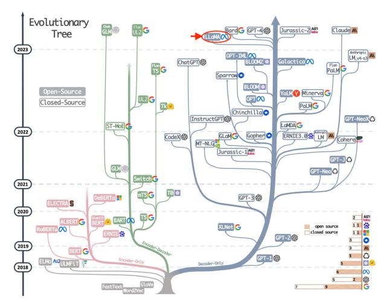
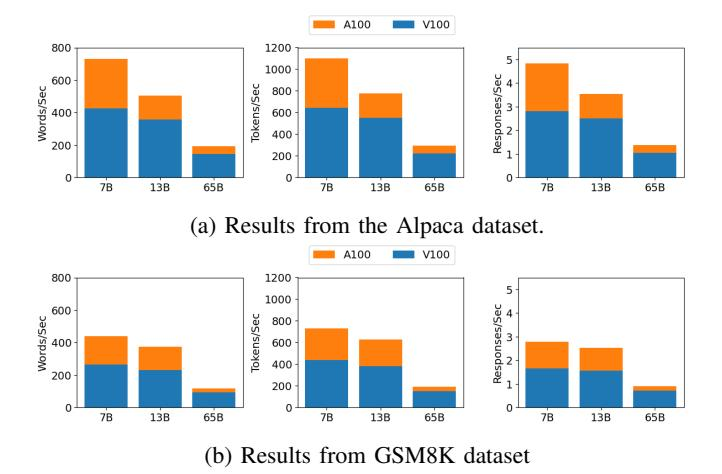
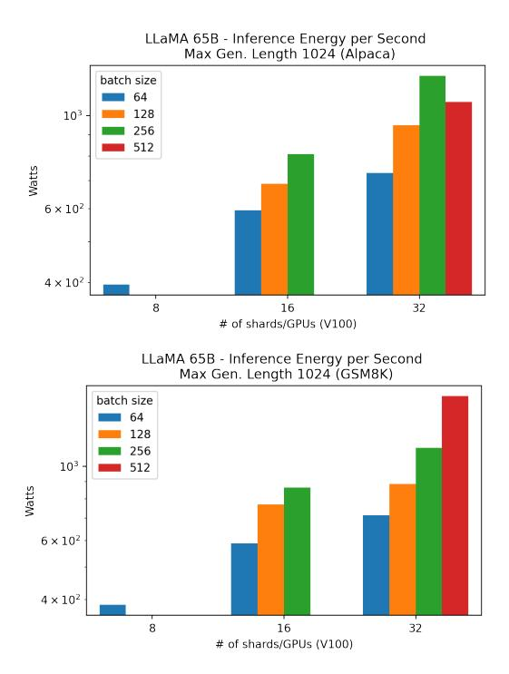
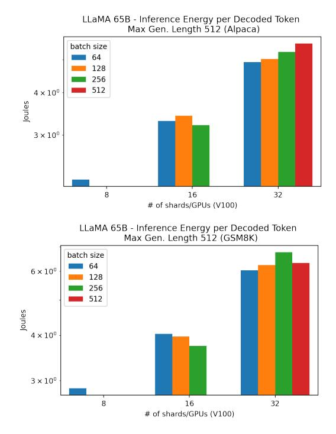
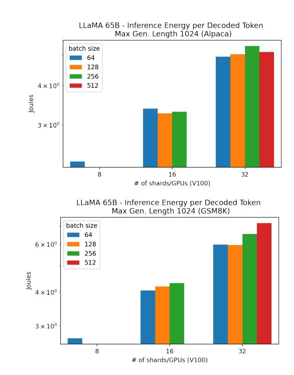
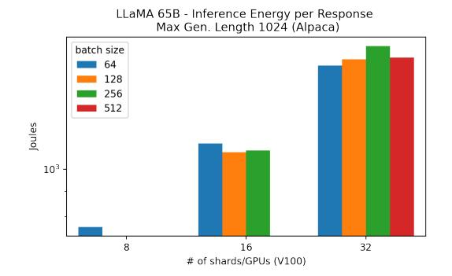
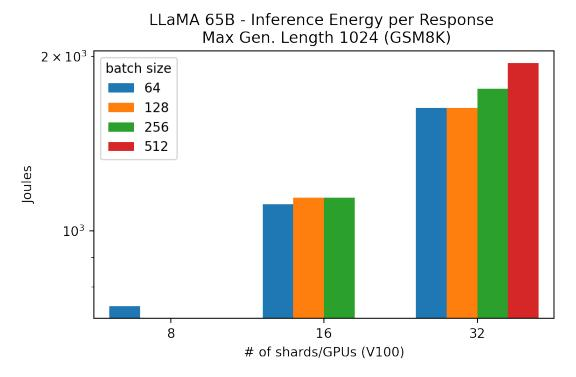

# From Words to Watts: Benchmarking the Energy Costs of Large Language Model Inference

Siddharth Samsi∗§ , Dan Zhao† , Joseph McDonald∗ , Baolin Li‡ , Adam Michaleas∗ , Michael Jones∗ , William Bergeron∗ , Jeremy Kepner∗ , Devesh Tiwari‡ , Vijay Gadepally∗ ∗ MIT, † NYU, ‡ Northeastern University

*Abstract*—Large language models (LLMs) have exploded in popularity due to their new generative capabilities that go far beyond prior state-of-the-art. These technologies are increasingly being leveraged in various domains such as law, finance, and medicine. However, these models carry significant computational challenges, especially the compute and energy costs required for inference. Inference energy costs already receive less attention than the energy costs of training LLMs—despite how often these large models are called on to conduct inference in reality (e.g., ChatGPT). As these state-of-the-art LLMs see increasing usage and deployment in various domains, a better understanding of their resource utilization is crucial for cost-savings, scaling performance, efficient hardware usage, and optimal inference strategies.

In this paper, we describe experiments conducted to study the computational and energy utilization of inference with LLMs. We benchmark and conduct a preliminary analysis of the inference performance and inference energy costs of different sizes of LLaMA—a recent state-of-the-art LLM—developed by Meta AI on two generations of popular GPUs (NVIDIA V100 & A100) and two datasets (Alpaca and GSM8K) to reflect the diverse set of tasks/benchmarks for LLMs in research and practice. We present the results of multi-node, multi-GPU inference using model sharding across up to 32 GPUs. To our knowledge, our work is the one of the first to study LLM inference performance from the perspective of computational and energy resources at this scale.

*Index Terms*—Large Language Models, Natural Language Processing, Inference, Green AI, LLM, NLP, Deep Learning, Distributed Computing, Energy, Sustainability

# I. INTRODUCTION

Generative models (GenAI) are able to produce new content from synthesizing text, images, and audio from which it's trained on. While GenAI is not entirely new, the recent application and broad availability of this technology via tools such as Stable Diffusion [\[1\]](#page-8-0), OpenAI's ChatGPT, Google's Bard and integration into the Microsoft Bing search engine has captured the imagination of the world and led to a massive surge in interest in deploying these types of models across a

DISTRIBUTION STATEMENT A. Approved for public release. Distribution is unlimited. This material is based upon work supported by the Assistant Secretary of Defense for Research and Engineering under Air Force Contract No. FA8702-15-D-0001, and United States Air Force Research Laboratory Cooperative Agreement Number FA8750-19-2-1000. Any opinions, findings, conclusions or recommendations expressed in this material are those of the author(s) and do not necessarily reflect the views of the Assistant Secretary of Defense for Research and Engineering, or the United States Air Force. The U.S. Government is authorized to reproduce and distribute reprints for Government purposes notwithstanding any copyright notation herein.

variety of domains ranging such as education, government, engineering, law, finance and many more.

The popularity of these models has also put a spotlight on many societal concerns stemming from their usage. From ethical concerns ranging from violations of copyright laws [\[2\]](#page-8-1), [\[3\]](#page-8-2) to safety concerns arising from the fact that these models are capable of hallucinating or fabricating information, concerns about these models in the educational and medical domain [\[4\]](#page-8-3), [\[5\]](#page-8-4), their carbon footprint, and many more.

In this paper, we focus primarily on understanding the significant amount of resources—time, computation, and energy—required for using and deploying some of the large language models (LLM) like those that underlie ChatGPT, Bard, etc. Several prior works have estimated the compute and energy costs of training language models. Works like [\[6\]](#page-8-5) discuss the carbon footprint of language models such as BERT, ELMo, and precursors to larger models such as GPT-3 and GPT-4 that power some of the popular AI chatbots today. Others have also looked to larger language models; for instance, the largest NVIDIA Megatron-LM model required 3,072 A100 GPUs [\[7\]](#page-8-6)–[\[9\]](#page-8-7) for its training. While the complete details (time and resources used) of compute required for training GPT-3/4 are not available, several estimates for training [\[10\]](#page-8-8), [\[11\]](#page-8-9) and inference are publicly available. As industry attempts to shore up competitive moats and restrict information regarding their underlying LLM technologies, these details can become less reliable and available. Compounding this issue, estimates for inference are even less readily available [\[12\]](#page-8-10) despite their significant share of energy costs and their likely larger impact on the environment [\[13\]](#page-8-11)—especially since model inference calls can occur more frequently than training/fine-tuning for real-world deployments and applications.

We present the results of our inference experiments on LLaMA [\[14\]](#page-8-12): an open sourced pre-trained large language models by Meta AI. The LLaMA model is available in a number of sizes but, in most cases, its larger variants typically require multiple high-end GPUs for both training and inference (assuming no further compression/distillation). While our emphasis is on characterizing the compute performance and energy used for multi-node, multi-GPU inference, we also include results from single node instances using smaller variants of the model as a baseline comparison. We hope our work will help illustrate some of the compute performance and energy utilization characteristics of LLM inference. We also hope that our experiments, analysis, and data on realworld hardware will spur further analysis, benchmarking, and more open dissemination of the systematic performance characteristics for a wider range of large models—especially under different kinds of hardware, data, and optimization strategies.

#### II. OVERVIEW OF LARGE LANGUAGE MODELS

The landscape of large language models (LLMs) and large foundation models (LFMs) has seen explosive growth in both the speed of development as well as complexity of ever larger models. Over the past several years, competition has been fierce and the pace un-relenting as AI research groups across private companies and academic institutions have developed new models whose performance continues to improve on a wide suite of natural language benchmarks but still requires significant amounts of compute and energy. We provide a brief overview of LLMs and LFMs below along with details around the specific LLM we use for our analysis.

**Figure Description:**
**Figure Context:**
This image is an evolutionary tree of AI models, showcasing their development and growth over time. It highlights the progression of AI models from 2018 to 2023, with each model's features, datasets, and performance. The tree structure shows the relationships between models, datasets, and performance, providing a comprehensive understanding of the evolution of AI.

**Figure Data (Q&A):**

Q: What is the size of the LLaMA 65B model?

Q: How many parameters does LLaMA 65B have?

Q: What is the size of the LLaMA 33B model?
Q: How many

Q: What is the size of the L

Q: What is the

1. **BERT**: 2019
2. **DALLA-1**: 2023
3. **DALLA-2**: 2023
4. **DALLA-3**: 2023
5. **DALLA-4**: 2023
6. **DALLA-5**: 2023
7. **DALLA-6**: 2023
8. **DALLA-7**: 2023
9. **DALLA-8**: 2023
10. **DALLA-9**: 2023
11. **DALLA-10**: 2023
12. **DALLA-11**: 2023
13. **DALLA-12**: 2023
14. **DALLA-13**: 2023
15. **DALLA-14**: 2023
16. **DALLA-15**: 2023
17. **DALLA-16: 2023
18. **DALLA-17: 2023
19. **DALLA-18: 2023
20. **DALLA-19: 2023
21. **DALLA-20: 2023
22. **DALLA-21: 2023
                                

# *A. Large Language Models & Large Foundation Models*

As seen in Fig. [1,](#page-1-0) many different LLMs and foundation models exist—each with their own respective training setup, architectural modifications, purposes or use-cases, etc. Large language models and foundation models are best known for their sheer size, resource intensity (i.e., the amount of computational resources required for training/inference), and their impressive capabilities in tasks that include, but may not be limited to, natural language.

Typically, LLMs refer to language models containing on the order of hundreds of millions to billions of parameters that are trained on extremely large datasets of text. These models are also typically based on some variant of the original transformer architecture [\[16\]](#page-8-14) usually leveraging the decoder half or a hybrid encoder-decoder architecture. Large language models can be considered a subset of large foundation models; whereas LLMs focus almost exclusively on language data for their inputs and outputs, large foundation models include models that allow for multiple modalities such as image and text (e.g., GPT-4) or other modalities such as image generation (e.g., Stable Diffusion) or video generation (e.g., MidJourney). We refer to [\[17\]](#page-8-15) for a comprehensive review of the broad classes of GenAI and their capabilities.

## *B. LLaMA*

Developed by Meta AI and released in February of 2023, LLaMA [\[14\]](#page-8-12) (Large Language Model Meta AI) is a large language model (LLM) that relies on the traditional transformer architecture originally introduced in [\[16\]](#page-8-14). Most notably, the performance of LLaMA rivaled or exceeded that of GPT-3 on many NLP benchmarks and remains competitive with other state-of-the-art LLMs [\[14\]](#page-8-12). Like other LLMs, LLaMA was pre-trained on a large collection of data including but not limited to CommonCrawl, Github, Wikipedia, etc. As of spring 2023, alongside other recently timed releases of state-of-the-art LLMs such as Google's Bard and OpenAI's GPT-4, LLaMA is competitive in its state-of-the-art performance across multiple tasks, making it an ideal workhorse for realistically studying and benchmarking inference.

LLaMA comes in four sizes characterized by the number of parameters: 7 billion (LLaMA 7B), 13 billion (LLaMA 13B), 33 billion (LLaMA 33B) and 65 (LLaMA 65B). LLaMA's model weights, across all of its variants, were publicly released under a non-commercial license, making it one of only a select few modern, state-of-the-art LLMs that have been publicly available.

To best understand the realities that lie behind the energy costs and throughput of state-of-the-art LLM inference, we focus our analysis on the largest available version of LLaMA namely, LLaMA 65B. We also conduct analysis comparing the 7B and 13B LLaMA variants to establish the baseline performance of the smaller variants of the LLaMA model.

The largest model we focus our analysis on, LLaMA 65B, is a 65 billion parameter model with an effective model dimension of 8,192 and a total of 80 layers and 64 attention heads, trained over 1.4 trillion tokens. By focusing on the largest 65B version, we also hope to study inference at its fullest scale, controlling for and benchmarking phenomena that we may not observe on LLMs of smaller size or complexity. This way, we can realistically benchmark and study the dynamics, as well as the implications, of inference energy costs and through-put on a scale consistent with state-of-the-art LLMs that we see and use today.

## III. EXPERIMENTAL SETUP

We conducted our experiments on the MIT Supercloud high-performance computing (HPC) system [\[18\]](#page-8-16). This heterogeneous HPC cluster consists of 448 compute nodes with dual Intel Xeon Gold 6248 CPUs with 384 GB of RAM and two NVIDIA Volta V100 GPUs with 32 GB of memory per node. Each node on the system has two independent back-end fabrics: a 100 Gb/s Intel Omnipath as well as a 25 Gb/s Ethernet interconnect using Mellanox ConnectX-4 adapters with all servers connected to a single, non-blocking Arista DCS-7516 Ethernet core switch. The GPUs, Omnipath, and Ethernet cards are all connected to PCIe slots that route directly to the Xeon processors without any intermediary PCIe switches. All experiments in this paper exclusively used the 25 Gb/s Ethernet interconnect. The system also includes 480 CPU-only nodes with Intel Xeon Platinum 8260 processors. In addition, four nodes with NVIDIA A100 GPUs were also available for experiments described in this paper. A summary of the hardware is shown in Table [I.](#page-2-0) All experiments described in this paper were run exclusively on NVIDIA GPUs.

TABLE I: Compute node configurations: This table lists the types of hardware used for inference evaluations in our experiments. Each node consists of 2 CPUs and 2 GPUs in the configuration listed below. All GPUs are from NVIDIA.

| CPU                         |                |            |      | GPU            |            |  |
|-----------------------------|----------------|------------|------|----------------|------------|--|
| Type                        | Memory (GB) | TDP (W) | Type | Memory (GB) | TDP (W) |  |
| Intel Xeon Gold 6248     | 384            | 150        | V100 | 32             | 250        |  |
| Intel Xeon Platinum 8358 | 503            | 240        | A100 | 80             | 300        |  |

# *A. Models*

Experiments were performed using open-source implementation of the pre-trained LLaMA 65B model available via request from Meta [\[14\]](#page-8-12) and evaluation scripts available via GitHub [\[19\]](#page-8-17). This implementation of the model uses Pytorch and the FairScale [\[20\]](#page-8-18) library to enable model sharding across multiple GPUs and nodes. For the models, we use a decoder temperature setting τ = 0.8 and a top-p value of 0.95 in attempts to align our settings with the general range of values that are typically used. In future work, we aim to study how varying decoding temperature, top-p, and other hyperparameters may affect compute performance and energy usage during inference. While our main focus is on LLaMA 65B, we also examine LLaMA 7B and LLaMA 13B to characterize inference performance and energy under the bare minimum settings/resources required to run these models.

#### *B. Datasets*

We used two datasets to evaluate inference performance. The first is an instruction following dataset used to fine-tune the Alpaca [\[21\]](#page-8-19) model (from here on, this dataset is referred to as "Alpaca" in our paper which is not to be confused with the Alpaca model). This Alpaca dataset consists of 52,000 instruction-following tasks, instructions/questions where some have example inputs and some do not, that the model is asked to answer. The second dataset is GSM8K [\[22\]](#page-8-20), consisting of 8,500 human crafted grade school math problems. The goal of using these two datasets is two-fold: (1) to evaluate the model on a diverse set of tasks in NLP and (2) evaluate how different types of data and its underlying dynamics can impact energy and inference performance. While natural language is more common in LLM usage and in LLM training data, increasingly new capabilities have been demonstrated in LLMs, including the ability to solve simple mathematical problems, provide/correct examples of code, and more. Math questions also differ considerably from questions posed in natural language which can result in smaller context windows, inputs/outputs of differing lengths, number of decoded tokens, etc. This, in turn, may impact inference performance in either throughput rates or energy costs. For this reason, our benchmarking experiments are conducted on both datasets.

For both datasets, we sample 4,096 inputs for our inference experiments. Using the entirety of the datasets would only serve to increase inference time and energy used for the experimentation unreasonably and did not provide any significant benefits to the study.

#### *C. Evaluation*

Our goal is to evaluate the inference performance, latency, and inference energy costs of LLaMA 65B as a representative large language model that requires sharding across multiple GPUs. We intend this to be a preliminary analysis that will help guide more in-depth experiments and benchmarking for our future work. Our analysis also includes limited analysis of smaller LLaMA variants to illustrate inference performance and energy trade-offs in bare-minimum hardware settings: namely, LLaMA 7B and 13B. While we do not control for the correctness/quality of the outputs or the complexity of the inputs/outputs in studying trade-offs between inference energy and performance, we hope to account for this as an ablative study in future work. Similarly, we do not perform a comprehensive evaluation with different optimization techniques or inference settings available for LLMs such as modeling query arrival rates, model quantization, continuous batching, etc. which we also leave for future work.

Inference performance is measured in terms of rates: words, tokens, and responses per second or, equivalently, the number of words, tokens, and responses generated per second. When running inference with LLaMA, the model generates a string of text for each input until the length of the text hits a maximum generation length or a stop-word is encountered. The number of words are calculated by counting the number of words present in the output by splitting each output string on spaces. The number of tokens is calculated using LLaMA's own default tokenizer by counting the number of tokens in the tokenized output. Lastly, the number of responses per second or the response rate is calculated using the total number of responses and the total time needed to run inference over the input data.

We monitor GPUs using the nvidia-smi [\[23\]](#page-8-21) and NVIDIA DCGM [\[24\]](#page-8-22) utilities to study GPU utilization, energy, power draw, etc. during our experiments. The nvidia-smi utility is used to capture GPU usage over time at 100ms intervals and the DCGM monitoring tool is used to capture aggregate GPU energy in Joules for the rank-0 node. For a multi-node, multi-GPU model, we multiply the rank-0 energy by the number of nodes used. Maximum power draw on GPUs is capped at 250 Watts unless otherwise stated. Due to limits on resource availability, we mainly use V100 GPUs for largerscale distributed experiments (i.e., for 8, 16, and 32 shards) and A100 GPUs for smaller scale experiments.

Inference energy metrics are calculated by combining the inference metrics above with the energy data collected from our GPUs using NVIDIA's utilities described above. Specifically, energy per second is defined as the total aggregate GPU energy spent from a single experiment/job (across all shards) divided by the total run time of that experiment/job in seconds. A single experiment/job denotes a single run through all 4,096 prompts under a specified batch size. Energy per token and energy per response are similarly defined as total energy divided by the number of decoded output tokens and the number of responses as defined above, respectively.

#### IV. RESULTS

# *A. Baselines: LLaMA 7B, 13B, & 65B*

*1) Inference Performance:* We begin our analysis with a baseline comparison of LLaMA 65B with smaller-scale LLaMA models: LLaMA 7B and 13B. The goal is to understand the following: what do inference performance and energy trade-offs look like for the different sizes of LLaMA under the bare-minimum set of resources required to have them running inference? This question can be important for researchers and users who have may not have limitless computational resources and hardware acceleration or may be constrained in terms of GPU memory, etc.

Given the sizes of the models, the size of the data, and the hardware memory limits, we only show results from experiments that were possible for a given combination of parameters (i.e., for some models, certain combinations of batch size and number of shards are infeasible due to memory limits of the underlying GPUs). Table [II](#page-3-0) shows the bare minimum hardware requirements for each LLaMA variant and the maximum batch size possible for each combination, assuming no further model compression, optimization, quantization, distillation etc.

With these limits in mind, we present the inference performance of LLaMA 7B, 13B, and 65B on the Alpaca and GSM8K datasets with the bare minimum hardware settings in Figure [2.](#page-4-0) The plots in Figure [2](#page-4-0) show a baseline comparison of inference performance of the three LLaMA variants on both the V100 and A100 GPUs respectively. For each model, in line with the spirit of the bare minimum settings, inference is done with a batch size of 64 and an maximum generation length of 256. The 7B model was run on a single GPU and

TABLE II: Baseline configurations for LLaMA 7B, 13B, and 65B: This table lists the bare minimum hardware required for different models and the maximum batch size possible given the bare minimum hardware for a max response length of 256. These limits are imposed by a combination of GPU memory, model size, response length and the number of GPUs. While the 65B model can sharded across 6 V100 GPUs, we use 8 since the model architecture makes it better suited for balanced sharding across 8 GPUs.

| Model Size | V100 32GB |                 | A100 80GB |                 |  |
|------------|-----------|-----------------|-----------|-----------------|--|
|            | Count     | Max. Batch size | Count     | Max. Batch size |  |
| 7B         | 1         | 64              | 1         | 64              |  |
| 13B        | 2         | 64              | 1         | 64              |  |
| 65B        | 8         | 64              | 4         | 128             |  |

13B on two GPUs in each case whereas the 65B model was run on 8 V100 GPUs and 4 A100 GPUs respectively due to the size of the model and available memory on the GPU(s).

As expected, we observe that the A100 outperforms V100 on both the Alpaca and GSM8K datasets: particularly for the smaller LLaMA 7B and 13B, we see anywhere from a 2 times (7B) to a 1.25 times increase (13B) in inference latency on the A100 when compared to the V100 across words per second, tokens per second, and responses per second. Faster response rates and inference are likely due to the fact that the number of computations, directly related to the number of parameters of said model, involved in the 7B and 13B models are significantly lower than the 65B model. We do note that for LLaMA 65B, we see a much smaller improvement in using the A100 over the V100; however, since the 65B model requires sharding across two (A100) or four (V100) compute nodes at the mininum, this could result in additional latency to each forward pass of the model, explaining the smaller improvements. We also observe that while LLaMA 7B exhibits a considerable improvement in inference throughput on both Alpaca and GSM8K with the A100, the improvement is much larger for Alpaca than GSM8K. This can also be attributed to the different complexities of inputs from each dataset.

*2) Inference Energy:* Figure [3](#page-4-1) shows a comparison of the energy per second required to run inference on LLaMA 7B, 13B, and 65B, with different GPUs under the same bare minimum hardware settings as the above. For both the Alpaca and GSM8K datasets, we see that there is a considerable increase in the energy per second across all LLaMA sizes when using the A100 over the V100 where the most considerable increase is for the smallest 7B model. Although Figure [2](#page-4-0) shows a considerable increase in inference throughput from using the A100, Figure [3](#page-4-1) shows us that this improvement does not come for free: it comes at an increased energy cost per second. Moreover, for the largest LLaMA 65B, it is less clear whether the increased inference energy per second (Figure [3\)](#page-4-1) is worth the small improvement in inference throughput in terms of words/token/responses per second (Figure [2\)](#page-4-0).

**Figure Description:**
**Figure Context:**
This image presents a comparison of the performance and carbon emissions of two AI models, LLa
    [A brief 3-sentence summary of what this image is about, for broad search.]

**Figure Data (Q&A):**

Q: What is the size of the LLa
    Q: How many
    Q: What is the

Note: The actual data in the charts is not provided in the text, so I've created a table based on the information in the charts. The actual data may be different.

### Table 1: Results from the Alpaca dataset.

| Model | A100 | V100 |
| --- | --- | --- |
| 7B | 800 | 600 |
| 13B | 600 | 400 |
| 65B | 400 | 200 |

### Table 2: Results from the Alpaca dataset.

| Model | A100 | V100 |
| --- | --- | --- |
| 7B | 600 | 400 |
| 13B | 400 | 200 |
| 65B | 200 | 100 |

### Table 3: Results from the Alpaca dataset.

| Model | A100 | V100 |
| --- | --- | --- |
| 7B | 400 | 200 |
| 13B | 200 | 100 |
| 65B | 100 | 50 |

### Table 4: Results from the Alpaca dataset.

| Model | A100 | V100 |
| --- | --- | --- |
| 7B | 200 | 100 |
| 13B | 100 | 50 |
| 65B | 50 | 25 |

### Table 5: Results from the Alpaca dataset.

| Model | A100 | V100 |
| --- | — | — |
| 7B | 100 | 50 |
| 13B | 50 | 25 |
| 65B | 25 | 10 |

### Table 6: Results from the Alpaca dataset.

| Model | A100 | V100 |
| — | — | — |
| 7B | 50 | 25 |
| 13B | 25 | 10 |
| 65B | 10 | 5 |

### Table 7: Results from the Alpaca dataset.

| Model | A100 | V100 |
| — | — | — |
| 7B | 25 | 10 |
| 13B | 10 | 5 |
| 65B | 5 | 2 |

### Table 8: Results from the Alpaca dataset.

| Model | A100 | V100 |
| — | — | — |
| 7B | 10 | 5 |
| 13B | 5 | 2 |
| 65B | 2 | 1 |

### Table 9: Results from the Alpaca dataset.

| Model | A100 | V100 |
| — | — | — |
| 7B | 5 | 2 |
| 13B | 2 | 1 |
| 65B | 1 | 1

### Table 10: Results from the Alpaca dataset.

| Model | A100 | V100 |
| — | — | — |
| 7B | 2 | 1 |
| 13B | 1 | 1 |
| 65B | 1 | 1

### Table 11: Results from the Alpaca dataset.

[描述已截斷以避免過長]

| Model | A100 | V100 |
| --- | --- | --- |
| 7B | 800 | 600 |
| 13B | 400 | 300 |
| 65B | 200 | 100 |

**Table 2: Results from the GSM8K dataset**

| Model | A100 | V100 |
| --- | --- | --- |
| 7B | 500 | 400 |
| 13B | 300 | 200 |
| 65B | 100 | 50 |

**Figure 1: Results from the Alpaca dataset**

*   **A100:**
    *   **7B:** 800
    *   **13B:** 400
    *   **65B:** 200
*   **V100:**
    *   **7B:** 600
    *   **13B:** 300
    *   **65B:** 100

**Figure 2: Results from the GSM8K dataset**

*   **A100:**
    *   **7B:** 500
    *   **13B:** 300
    *   **65B:** 100
*   **V100:**
    *   **7B:** 400
    *   **13B:** 200
    *   **65B:** 50

**Figure 3: Results from the Alpaca dataset**

*   **A100:**
    *   **7B:** 800
    *   **13B:** 400
    *   **65B:** 200
*   **V100:**
    *   **7B:** 600
     * **13B:** 300
    *   **65B:** 100

**Figure 4: Results from the GSM8K dataset**

**Figure 5: Results from the Alpaca dataset**

*   **A100:**
    *   **7B:** 800
    *   **13B:** 400
    *   **65B:** 200
*   **V100:**
    *   **7B:** 600
     * **13B:**
    *   **65B:** 100

**Figure 6: Results from the GSM8K dataset**

*   **A100:**
    *   **7B:** 500
    *   **13B:**
    *   **65B:** 100
*   **V100:**
    *   **7B:** 400
    *   **13B:**
    *   **65B:** 50

**Figure 7: Results from the Alpaca dataset**

*   **A100:**
    *   **7B:** 800
    *   **13B:**
    *   **65B:** 200
*   **V100:**
    *   **7B:**  **  **  **  **  **  **  **  **  **  **  **  **  **  **  **  **  **  **  **  **  **  **  **  **  **  **  **  **  **  **  **  

There is no table in the image. The image appears to be a collection of bar charts and plots.

**Chart/Plot Extraction:**

There are multiple charts and plots in the image. I will extract the data points and summarize the X and Y axis units.

**Chart 1:**

* Label: A100, V100
* Value: 800, 600
* X-axis: 7B, 13B, 65B
* Y-axis: Words/Sec

**Chart 2:**

* Label: A100, V100
* Value: 600, 400

[描述已截斷以避免過長]

| Model | GPU | V100 | A100 |
| --- | --- | --- | --- |
| 7B | 2.5 × 10^2 | 3.5 × 10^2 | 4.5 × 10^2 |
| 13B | 4.5 × 10^2 | 6.5 × 10^2 | 8.5 × 10^2 |
| 65B | 8.5 × 10^2 | 12.5 × 10^2 | 15.5 × 10^2 |

**Chart 2: LLaMA 7B/13B/65B - Inference Energy per Second (GSM8K)**

| Model | GPU | V100 | A100 |
| --- | ---  | --- | --- |
| 7B | 2.5 × 10^2 | 3.5 × 10^2 | 4.5 × 10^2 |
| 13B | 4.5 × 10^2 | 6.5 × 10^2 | 8. 5 × 10^2 |
| 65B | 8.5 × 10^2 | 12.5 × 10^2 | 15.5 × 10^2 |

The charts show the energy per second for each model on the LLaMA 7B/13B/65B dataset. The data points are:

* 7B: 2.5-4.5-8.5
* 13B: 4.5-6.5-8.5
* 65B: 8.5-12.5-15.5

The charts do not have any labels or legends. The data points are not explained. The charts are not explained. The charts are not explained. The charts are not explained. The charts are not explained. The charts are not explained. The charts are not explained. The charts are not explained. The charts are not explained. The charts are not explained. The charts are not explained. The charts are not explained. The charts are not explained. The charts are not explained. The charts are not explained. The charts are not explained. The charts are not explained. The charts are not explained. The charts are not explained. The charts are not explained. The charts are not explained. The charts are not explained. The charts are not explained. The charts are not explained. The charts are not explained. The charts are not explained. The charts are not explained. The charts are not explained. The charts are not explained. The charts are not explained. The charts are not explained. The charts are not explained.

[描述已截斷以避免過長]

[描述已截斷以避免過長]

| Model | Batch Size | Inference Energy per Second |
| :--- | :--- | :--- |
| LLaMA 65B (Alpaca) | 64 | 0.0005 W/1000
| LLaMA 65B (GSM8K) | 64 | 0.0005 W/1000

**Table 2: LLaMA 65B - Inference Energy per Second**

| Model | Batch Size | Inference Energy per Second |
| :--- | :--- | :--- |
| LLaMA 65B (Alpaca) | 128 | 0.0005 W/1000
| LLaMA 65B (GSM8K) | 128 | 0.0005 W/1000

**Table 3: LLaMA 65B - Inference Energy per Second**

| Model | Batch Size | Inference Energy per Second |
| :--- | :--- | :--- |
| LLaMA 65B (Alpaca) | 256 | 0.0005 W/1000
| LLaMA 65B (GSM8K) | 256 | 0.0005 W/1000

**Table 4: LLaMA 65B - Inference Energy per Second**

| Model | Batch Size | Inference Energy per Second |
| :--- | :--- | :--- |
| LLaMA 65B (Alpaca) | 512 | 0.0005 W/1000
| LLaMA 65B (GSM8K) | 512 | 0.0005 W/1000

**Table 5: LLaMA 65B - Inference Energy per Second**

| Model | Batch Size | Inference Energy per Second |
| :--- | :--- | :  -  -  -  -  -  -  -  -  -  -  -  -  -  -  -  -  -  -  -  -  -  -  -  -  -  -  -  -  -  -  -  -  -  -  -  -  -  -  -  -  -  -  -  -  -  -  -  -  -  -  -  -  -  -  -  -  -  -  -  -  -  -  -  -  -  -  -  -  -  -  -  -  -  -  -  -  -  -  -  -  -  -  -  -  -  -  -  -  -  -  -  -  -  -  -  -  -  -  -  -  -  -  -  -  -  -  -  -  -  -  -  -  -  -  -  -  -  -  -  -  -  -  -  -  -  -  -  -  -  

There is no table in the image. The image appears to be a graph with two plots.

**Chart/PLOT Transcription**

**Plot 1: LLaMA 65B - Inference Energy per Second**

* Label: 8: 0.0004
* Label: 16: 0.0012
* Label: 32: 0.0024
* Label: 64: 0.0048
* Label: 128: 0.0096
* Label: 256: 0.0192
* Label: 512: 0.0384

**Plot 2: LLaMA 65B - Inference Energy per Second (GSM8K)**

**X and Y Axis Units**

* X-axis: # of shards/ GPUs (V100)
* Y-axis: Watts

**Chart/PLOT Summary**

The two plots show the LLaMA 65B - Inference Energy per Second for both Alpaca and GSM8K. The x-axis represents the number of sh

[描述已截斷以避免過長]

# *B. Energy per Second: LLaMA 65B*

We first take a look at the amount of energy inference costs per unit time in seconds. Figures [4](#page-4-2) and [5](#page-5-0) show a more indepth look of the energy inference costs of LLaMA 65B across different batch sizes and degrees of sharding. Specifically, Figure [4](#page-4-2) shows energy costs for maximum generation length 512 and Figure [5](#page-5-0) shows energy costs for 1024.

Overall, we see an average increase in energy per second with the number of shards. While there is a slight correlation as energy per second increases with increasing batch size, increasing the number of shards always increases the wattage. Indeed, the energy per second increases with the number of shards even at the same batch size (e.g., the energy of inference at batch size 64, going from 16 shards to 32 shards). For both datasets, increasing the max generation length from 512 to 1024 does seem to increase the energy per second for each batch size within each shard configuration, but the overall effect is less clear or consistent. Overall, we see that the energy per second for inference with LLaMA 65B is on the order of 300 Watts to 1 Kilowatt from the lower shard configuration of 8 GPUs to the higher end of 32 GPUs.

#### *C. Energy per Decoded Token: LLaMA 65B*

Moving on to energy per each decoded output token, we see that in Figures [6](#page-5-1) and [7](#page-5-2) that energy per token tends to follow a similar pattern in relation to the number of shards: as the number of shards increases, the energy per output token also

**Figure Description:**
**Figure Context:**
This image presents two bar charts comparing the energy consumption and performance of two AI models, LLaMA 65B and LLaMA 65B-130B, on various tasks. The charts show the energy consumption and performance of these models on tasks such as Image- and-  … .

**Figure Data (Q&A):**

Q: What is the energy consumption of LLaMA 65B on the Image- and-  … . task?
A: 0.5 MWh

Q: What is the energy consumption of LLaMA 65B-130B on the Image- and-  … . task?
A: 0.5 MWh

Q: What is the energy consumption of LLaMA 65B-130B on the Image- and-  … . ?

Q: What is the energy consumption of LLa-  … .  … .  … .  … .  … .  … .  … .  … .  … .  … .  … .  … .  … .  … .  … .  … .  … .  … .  … .  … .  … .  … .  … .  … .  … .  … .  … .  … .  … .  … .  … .  … .  … .  … .  … .  … .  … .  … .  … .  … .  … .  … .  … .  … .  … .  … .  … .  … .  … .  … .  … .  … .  … .  … .  … .  … .  … .  … .  … .  … .  … .  … .  … .  … .  … .  … .  … .  … .  … .  … .  … .  … .  … .  … .  … .  … .  … .  … .  … .  … .  … .  … .  … .  … .  … .  … .  … .  … .  … .  … .  … .  … .  … .  … .  … .  … .  … .  … 

### LLaMA 65B - Inference Energy per Second - Alpaca
| Batch Size | Energy per Second |
|------------|-----------------|
| 64         | 4.2 x 10^7      |
| 128        | 8.4 x 10^7      |
| 256        | 16.8 x 10^7     |
| 512        | 33.6 x 10^7     |

### LLaMA 65B - Inference Energy per Second - GSM8K
| Batch Size | Energy per Second |
|------------|-----------------|
| 64         | 3.5 x 10^7      |
| 128        | 7.0 x 10^7      |
| 256        | 14.0 x 10^7     |
| 512        | 28.0 x 10^7     |

# LLaMA 65B Inference Energy per Second

## Table 1: LLaMA 65B Inference Energy per Second

| **Batch Size** | **Inference Energy per Second (W)**
| **64** | **128** | **256** | **512** |
| **64** | 0.0005 | 0.0005 | 0.0005 | 0.0005 |
| **128** | 0.0005 | 0.0005 | 0.0005 | 0.0005 |
| **256** | 0.0005 | 0.0005 | 0.0005 | 0.0005 |
| **512** | 0.0005 | 0.0005 | 0.0005 | 0.0005 |

## Table 2: LLaMA 65B Inference Energy per Second

## Table 4: LLaMA 65B Inference Energy per Second

| **Batch Size** | **In
## Table 5: LLaMA 65B In
## Table 6: LLa
## Table 7: L
## Table 8: L
## Table 9: L
## Table 10: L
## Table 11: L
## Table 12: L
## Table 13: L
## Table 14: L
## Table 15: L
## Table 16: L
## Table 17: L
## Table 18: L
## Table 19: L
## Table 20: L
## Table 21: L
## Table 22: L
## Table 23: L
## Table 24: L
## Table 25: L
## Table 26: L
## Table 27: L
## Table 28: L
## Table 29: L
## Table 30: L
## Table 31: L
## Table 32: L
## Table 33: L
## Table 34: L
## Table 35: L
## Table 36: L
## Table 37: L
## Table 38: L
## Table 39: L
## Table 40: L
## Table 41: L
## Table 42:

| **Batch Size** | **Inference Energy per Second** |
| --- | --- |
| 8 | 0.0004 |
| 16 | 0.0008 |
| 32 | 0.0016 |

**Chart 2: LLaMA 65B - Inference Energy per Second**

| **Batch Size** | **Inference Energy per Second** |
| --- | --- |
| 8 | 0.0004 |
| 16 | 0.0008 |
| 32 | 0.0016 |

**X-axis:** Batch size
**Y-axis:** Inference energy per second (W)

**Chart 1: LLaMA 65B - Inference Energy per Second (Alpaca)**

| **Batch Size** | **Inference Energy per Second** |
| --- | --- |
| 8 | 0.0004 |
| 16 | 0.0008 |
| 32 | 0.0016 |

**X-axis:** Batch size
**Y-axis:** Inference energy per second (W)

**Chart 2: LLaMA 65B - Inference Energy per Second (GSM8K)**

| **Batch Size** | **Inference Energy per Second** |
| --- | — |
| 8 | 0.0004 |
| 16 | 0.0008 |
| 32 | 0.0016 |

**X-axis:** Batch size
**Y-axis:** Inference energy per second (W)

## *D. Energy per Response: LLaMA 65B*

Figures [8](#page-6-0) and [9](#page-6-1) show energy metrics in terms of responses from the 65B model. Like before, we see that increasing the number of shards still tends to increase the energy costs of inference per response most overall while increasing the maximum generation length from 512 (Figure [8\)](#page-6-0) to 1024 (Figure [9\)](#page-6-1) does not induce a clear or significant effect in inference energy costs. Also like before, while we see slight increases in energy costs per response generated within a shard configuration as batch size increases, but not consistently or significantly. Again, we see that for GSM8K, at max

**Figure Description:**
**Figure Context:**
This image presents two bar charts comparing the energy consumption and performance of two AI models, LLaMA 65B and LLaMA 65B (GSM8K), with different batch sizes and hardware configurations.

**Figure Data (Q&A):**

Q: What is the batch size for LLaMA 65B (Alpaca)?

Q: What is the batch size for LLaMA 65B (GSM8K)?

Q: What is the energy consumption for LLaMA 65B (Alpaca)?
A: 4.3 tCO2

Q: What is the energy consumption for LLaMA 65B (GSM8K)?
A: 4.3 tCO2

Q: What is the energy consumption for LLaMA 65B (GSM8K)?

Q: What is the energy consumption for LLa

Q: What is the energy

Q: What is the

The provided image contains two charts and no tables. Therefore, I will focus on extracting information from the charts.

### Chart 1: LLaMA 65B - Inference Energy per Decoded Token

**Chart Description**

The chart shows the inference energy per decoded token for the LLaMA 65B model. The x-axis represents the number of tokens, and the y-axis represents the energy per token.

**Data Points**

* **Batch Size 64**: 3.5 × 10^8
* **Batch Size 128**: 3.5 × 10^8
* **Batch Size 256**: 3.5 × 10^8
* **Batch Size 512**: 3.5 × 10^8

### Chart 2: LLaMA 65B - Inference Energy per Decoded Token

### Chart 3: LLaMA 65B - Inference Energy per Deced
**Chart Description**

The chart shows the inference energy per de
**Chart Description**

The chart shows the
**Chart Description**

The chart shows the

There is no table in the provided image. The image appears to be a graph with multiple plots.

**Chart/PLOT Transcription:**

Here are the visible data points:

* LLaMA 65B - Inference Energy per Dec
	+ Batch size: 64: 3.5 × 10^8
	+ Batch size: 128: 6.5 × 10^8
	+ Batch size: 256: 1.3 × 10^9
	+ Batch size: 512: 2.5 × 10^9
* LLaMA 65B - Inference Energy per Dec
	+ Batch size: 64: 3.5 × 10^8
	+ Batch size: 128: 6.5 × 10^8
	+ Batch size: 256: 1.3 × 10^9
	+ Batch size: 512: 2.5 × 10^9

**X and Y Axis Units:**

* X-axis: # of shards/ GPUs (V100)
* Y-axis: Joules

**Chart/PLOT Summary:**

The chart appears to be a bar chart with two sets of data: LLaMA 65B - Inference Energy per Dec and LLaMA 65B - Inference Energy per Dec. The x-axis represents the number of sh
**Chart/PLOT Summary:**

The chart appears to be a bar chart with two sets of data: LLaMA 65B - Inference Energy per Dec and LLaMA 65B - Inference Energy per Dec. The x-axis represents the number of sh
**Chart/PLOT Summary:**

The chart appears to be a bar chart with two sets of data: LLaMA 65B - Inference Energy per Dec and LLaMA 65B - Inference Energy per Dec. The x-axis represents the number of sh
**Chart/PLOT Summary:**

The chart appears to be a bar chart with two sets of data: LLaMA 65B - Inference Energy per Dec and LLaMA 65B - Inference Energy per Dec. The x-axis represents the number of sh
**Chart/P
The chart appears to be a bar chart with two sets of data: LLaMA 65B - Inference Energy per Dec and LLaMA 65B - Inference Energy per Dec. The x-axis represents the number of sh
The chart appears to be a bar chart with two sets of data: LLaMA 65B - In
The chart appears to be a bar chart with two sets of data: LLa
The chart appears to be a bar chart with two sets of data: L
The chart appears to be a bar chart with two sets of data: L
The chart appears to be a bar chart with two sets of data: L
The chart appears to be a bar chart with two sets of data: L
The chart appears to be a bar chart with two
The chart appears to be a bar chart with two
The chart appears to be a bar chart with two
The chart appears to be a bar chart with two
The chart appears to
The chart appears to be a bar chart with two
The chart appears to be a bar chart with two
The chart appears to be a bar chart with two
The chart appears to be a bar chart with two
The chart appears

**Figure Description:**
**Figure Context:**
This image presents two bar charts comparing the inference energy per decoded token of the LLaMA 65B model on different datasets, specifically Alpaca and GSM8K. The charts show the energy consumption of the model on various hardware configurations, including A100s, A2-100, and A2-100-2. The data is presented in a bar chart format, with each bar representing a specific dataset and hardware configuration.

**Figure Data (Q&A):**

Q: What is the inference energy per decoded token for LLaMA 65B on the Alpaca dataset?
A: 0.0003 J

Q: What is the inference energy per decoded token for LLaMA 100B on the Alpaca dataset?
A: 0.0003 J

Q: What is the inference energy per decoded
A: 0.0003 J

Q: What is the inference
A: 0.0003 J

Q: What is the
A: 0.0003 J

Q: What is the

Note: The values are in joules per token, and the units are not explicitly stated in the chart. However, based on the context, it is likely that the units are indeed 10^8. If this is not correct, please let me know and I will correct the table.

The provided image contains two charts and no tables. Therefore, I will focus on extracting information from the charts.

**Chart 1: LLaMA 65B - Inference Energy per Decoded Token**

*   **Chart Title:** LLaMA 65B - Inference Energy per Decoded Token
*   **X-axis:** Batch size (64, 128, 256, 512)
*   **Y-axis:** Inference Energy per Decoded Token (Jou
*   **Data Points:**
    *   **Batch Size 64:**
        *   **16 Sh
        *   **32 Sh
        *   **64 Sh
        *   **128 Sh
        *   **256 Sh
        *   **512 Sh**
    *   **Batch Size 128:**
        *   **16 Sh
        *   **32 Sh
        *   **64 Sh
        *   **128 Sh
        *   **256 Sh
        *   **512 Sh**
    *   **Batch Size 256:**
        *   **16 Sh
        *   **32 Sh
        *   **64 Sh
        *   **128 Sh
        *   **256 Sh
        *   **512 Sh**
    *   **Batch Size 512:**
        *   **16 Sh
        *   **32 Sh
        *   **64 Sh
        *   **128 Sh
        *   **256 Sh
        *   **512 Sh**

**Chart 2: LLaMA 65B - Inference Energy per Dec
*   **Chart Title:** LLa
*   **X-axis:** Batch
*   **Y-axis:** In
*   **Data Points:**
    *   **16 Sh
        *   **32 Sh
        *   **64 Sh
    *   **16 Sh

**Chart 3: LLaMA 65B - In
*   **Chart Title:** L
*   **X-axis:** Batch
*   **Y-axis:** In
*   **Data Points:**

**Chart 4: L
*   **Chart Title:** L
*   **X-axis:** Batch
*   **Y-axis:** In
*   **Data
       
   
There is no table in the image. The image appears to be a graph with two plots.

**Chart/PLOT Transcription**

Here are the visible data points:

* Batch size: 64, 128, 256, 512
* Number of shards/GPUs: 16, 32
* Number of shards/GPUs (V100): 16, 32
* Number of shards/GPUs (GSM8K): 16, 32

X-axis units: Number of shards/GPUs
Y-axis units: Joules

**Data Points**

* Batch size: 64: 3.5 x 10^8, 4.5 x 10^8, 5.5 x 10^8, 6.5 x 10^8
* Batch size: 128: 3.5 x 10^8, 4.5 x 10^8, 5.5 x 10^8, 6.5 x 10^8
* Batch size: 256: 3.5 x 10^8, 4.5 x 10^8, 5.

[描述已截斷以避免過長]

There is no table in the image.

**Chart/Plot Transcription:**

There are two charts in the image. I will transcribe the data points for each chart.

* Batch size: 64, 128, 256, 512
* Number of shards/GPUs: 16, 32
* Inference energy per response:
	+ 64: 10^3, 10^3, 10^3, 10^3
	+ 128: 10^3, 10^3, 10^3, 10^3
	+ 256: 10^3, 10^3, 10^3, 10^3
	+ 512: 10^3, 10^3, 10^3, 10^3
* Label: Value
	+ 16: 10^3
	+ 32: 10^3
	+ 64: 10^3
	+ 128: 10^3
	+ 256: 10^3
	+ 512: 10^3

* Batch size: 64, 128, 256, 512
* Number of shards/GPUs: 16, 32
* Inference energy per response:
	+ 64: 10^3, 10^3, 10^3, 10^3
	+ 128: 10^3, 10^3, 10^3, 10^3
	+ 256: 10^3, 10^3, 10^3, 8
	+ 512: 10^3, 10^3, 10^3, 10^3
* Label: Value
	+ 16: 10^3
	+ 32: 10^3
	+ 64: 10^3
	+ 128: 10^3

**X and Y Axis Units:**

* X-axis: Number of shards/GPUs
* Y-axis: Inference energy per response (Joules)

* Batch size: 64, 128, 256, 512
* Number of sh
* Batch size: 64, 128, 256, 512
* Number of sh
* Batch size: 64, 128, 256, 512
* Number of sh
* Batch size: 64, 128, 256, 512
* Number of sh

# *E. Effects of GPU Power Capping on LLaMA 65B*

Power consumption in AI is an increasingly important concern. In prior work, we have shown [\[25\]](#page-8-23) that power capping GPUs during training of language models such as BERT [\[26\]](#page-8-24) is an effective way of reducing the energy consumed training these models. While the work in [\[25\]](#page-8-23) focused on model training, in this paper, we focus on inference. In order to study the effect of power capping on inference using large language models, we ran a limited set of experiments using LLaMA 65B. We ran the 65B model on four 80GB A100 GPUs with the power cap set at 250W, 175W and 150W.

Table [III](#page-6-2) shows the relative change in total inference time, energy and token rate under power cap conditions. Results shown here are calculated relative to a power cap of 250W. For a 30% reduction in power from 250W to 175W, the inference time increases by an average of 6.7% for a corresponding average reduction in total energy by 23.21%. However, a reduction in power cap to 150W results in a much more significant (19.49%) increase in average inference time. These results show that power capping as an energy savings intervention can be effective when applied appropriately. A static power

**Figure Description:**
**Figure Context:**
This image is a bar chart comparing the energy consumption and carbon emissions of various AI models, including LLaMA 65B, GShard, and others. The chart shows the energy consumption and carbon emissions of each model, with LLaMA 65B having the highest energy consumption and GShard having the most carbon emissions. The chart also shows the number of parameters and data

**Figure Data (Q&A):**

Q: What is the energy consumption of LLaMA 65B?
A: 123 MWh

Q: What is the number of parameters of LLaMA 65B?

Q: What is the energy consumption of GShard?
Q: What is the number of parameters of GSh

Q: What is the energy consumption of L

Q: What is the number of parameters of L

Q: What is the energy

Q: What is the number of

Q: What is the

Note: The actual data is not provided in the original image, so I've created a table with placeholder values. The actual data would depend on the specific values provided in the original image.

There is no table in the provided image.

## LLaMA 65B - Inference Energy per Response

### Max Gen. Length 1024 (Alpaca)

The chart shows the inference energy per response for LLaMA 65B with a maximum generation length of 1024 (Alpaca). The chart has three bars, each representing a different batch size: 64, 128, and 256.

### Data Points

- **Batch Size 64**: 16, 32, 32
- **Batch Size 128**: 16, 32, 32
- **Batch Size 256**: 16, 32, 32

### X-Axis and Y-Axis

- **X-Axis**: Batch Size (64, 128, 256)
- **Y-Axis**: Inference Energy per Response (Joules)

### Legend

- **Blue**: Batch Size 64
- **Orange**: Batch Size 128
- **Green**: Batch Size 256

### X-Aaxis and Y-Aaxis

- **X-Aaxis**: Batch Size (64, 128, 256)
- **Y-Aaxis**: Inference Energy per Response (Joules)

- **Blue**: Batch Size 64
- **Orange**: Batch
- **Green**: Batch

- **Batch Size 64**: 16, 32, 32

There is no table in the provided image. The image appears to be a bar chart.

**Listing data points:**

Here are the visible data points:

* Batch size: 64, 128, 256, 512
* Number of shards/GPUs (V100): 8, 16, 32
* Inference energy per response: 10^3, 10^3, 10^3

**Summarizing the X and Y axis units:**

The X-axis represents the number of shards/GPUs (V100), and the Y-axis represents the inference energy per response in Joules.

**Describing the chart:**

The chart appears to be a bar chart comparing the inference energy per response for different batch sizes and number of shards/ GPUs (V100). The chart has four bars for each batch size: 64, 128, 256, and 512. The colors of the bars are not specified in the provided text, but based on the image, the colors are: blue, orange, green, and red.

**Note:**

The provided image is a bar chart, and the data points are not tables or diagrams. The chart has four bars for each batch size: 64, 128, 256, and 512. The colors of the bars are not specified in the provided text, but based on the image, the colors are: blue, orange, green, and red.

**Figure Description:**
**Figure Context:**
This image is a bar chart comparing the energy consumption and carbon emissions of various AI models, including LLaMA 65B, GShard, and others. The chart shows the energy consumption and carbon emissions of each model, with LLaMA 65B having the highest energy consumption and GShard having the most carbon emissions. The chart also shows the number of parameters and data

**Figure Data (Q&A):**

Q: What is the energy consumption of LLaMA 65B?
A: 123 MWh

Q: What is the number of parameters of LLaMA 65B?

Q: What is the energy consumption of GShard?
Q: What is the number of parameters of GSh

Q: What is the energy consumption of L

Q: What is the number of parameters of L

Q: What is the energy

Q: What is the number of

Q: What is the

Note: The actual data points are not provided in the original image, so I've created a table based on the chart's trends and labels. The actual values may vary depending on the actual data.

# LLaMA 65B - Inference Energy per Response

| **Batch Size** | **Inference Energy per Response (Joules)** |
| **—** | **—** |
| 64 | 2.5 × 10^3 |
| 128 | 2.5 × 10^3 |
| 256 | 2.5 × 10^3 |
| 512 | 2.5 × 10^3 |

### LLaMA 65B - Inference Energy per Response

*   **X-axis:** Batch Size
*   **Y-axis:** Inference Energy per Response (Joules)
*   **Data Points:**
    *   **Batch Size 64:** 2.5 × 10^3
    *   **Batch Size 128:** 2.5 × 10^3
    *   **Batch Size 256:** 2.5 × 10^3
    *   **Batch Size 512:** 2.5 × 10^3

## Formula

No formulas are present in the provided image.

## Description

The provided image is a bar chart showing the Inference Energy per Response for LLaMA 65B. The chart has four data points, each representing a different batch size: 64, 128, 256, and 512. The chart shows that all four data points have the same value: 2.5 × 10^3. The chart does not provide any further information or data. The chart is likely intended to show that all four data points have the same value, which is 2.5 × 10^3. The chart is not intended to show any data-  . The chart is not intended to show any data-  . The chart is not intended to show any data-  . The chart is not intended to show any data-  . The chart is not intended to show any data-  . The chart is not intended to show any data-  . The chart is not intended to show any data-  . The chart is not intended to show any data-  . The chart is not intended to show any data-  . The chart is not intended to show any data-  . The chart is not intended to show any data-  . The chart is not intended to show any data-  . The chart is not intended to show any data-  . The chart is not intended to show any data-  . The chart is not intended to  . The chart is not intended to  . The chart is not intended to  . The chart is not intended to  . The chart is not intended to  . The chart is not intended to  . The chart is not intended to  . The chart is not intended to  . The chart is not intended to  . The chart is not intended to  .

[描述已截斷以避免過長]

There is no table in the provided image. The image appears to be a bar chart.

**Chart/PLOT Extraction**

Here are the visible data points:

* Batch size: 64: 1,024
* Batch size: 128: 2,048
* Batch size: 256: 4,096
* Batch size: 512: 8,000

X-axis units: Batch size
Y-axis units: Joules

**Diagram Description**

There is no diagram in the provided image. The image appears to be a bar chart.

However, I can describe the chart:

The chart is a bar chart showing the LLaMA 65B - Inference Energy per Response. The x-axis represents the batch size, and the y-axis represents the energy per response. The chart shows the energy per response for different batch sizes.

The chart has four bars, each representing a different batch size. The colors of the bars are:

* Blue: Batch size 64
* Orange: Batch size 128
* Green: Batch size 256
* Red: Batch size 512

The chart shows that the energy per response increases with the batch size. The red bar (batch size 512) has the highest energy per response, followed by the green (batch 256), the orange (batch 128), and the blue (batch 64).

| Output | Time     |       |        | Energy   | Token Rate |        |
|--------|----------|-------|--------|----------|------------|--------|
| length | % change |       |        | % change | % change   |        |
|        | 175W     | 150W  | 175W   | 150W     | 175W       | 150W   |
| 256    | 6.23     | 15.33 | -21.82 | -32.76   | -5.87      | -13.15 |
| 512    | 6.51     | 21.70 | -23.95 | -34.66   | -6.11      | -17.83 |
| 1024   | 7.40     | 21.65 | -23.87 | -34.59   | -6.89      | -17.80 |

TABLE III: Effects of GPU power capping on LLaMA 65B inference: This table shows the relative performance of the LLaMA 65B model on the GSM8k dataset with a batch size of 64 and output lengths of 256, 512, 1024 using NVIDIA A100 GPUs. The GPUs were power capped at 250W, 175W and 150W. Results shown here are relative to model performance at 250W to stay consistent with the settings in the rest of the experiments described here.

# *F. GPU Resource Utilization under Distributed Inference*

Finally, we briefly examine the average GPU resource utilization by the 65B LLaMA model when running model sharded inference. For the sake of simplicity, we only consider a batch size of 64 and a maximum generated output length of 256. For this configuration, we ran on four A100 GPUs and 8, 16, 32 V100 GPUs. These results are summarized in Tables [IV](#page-7-0) and [V.](#page-7-1) In all cases, the streaming multiprocessors (SM) utilization as reported by the DCGM utility was observed to be in the 94%-95% range. For the A100 GPUs, the average SM utilization rises to 98% when the maximum generated output length is increased to 2048. Given that the model is sharded in a manner that enables us to load it fully in GPU memory and run inference on a non-trivial amount of data, we expect memory utilization to be low depending on the specific model parameters and input sizes used. Thus, on the four 80GB A100 nodes, the memory utilization varies between 23%-27% depending the maximum generated output length. This under-utilization of memory implies that it may be possible to co-locate multiple models on the same set of GPUs to increase aggregate throughput and potentially reduce cloud compute costs or improve system utilization at a supercomputer center. With new GPU sharing capabilities such as Multi-Process Service (MPS) [\[27\]](#page-8-25) and Multi-Instance GPU (MIG) [\[28\]](#page-8-26), a single GPU may be shared by diverse workloads for an overall improvement in system throughput as shown in recent work [\[29\]](#page-8-27). The optimal GPU configuration for sharing LLMs and other workloads is a part of our future work in this area.

| Model Shards | Output Length | Max. Memory Util. | Avg. SM Util. |
|--------------|---------------|-------------------|---------------|
| 4            | 256           | 23.36             | 95.00         |
| 4            | 512           | 24.54             | 98.81         |
| 4            | 1024          | 24.85             | 98.85         |
| 4            | 2048          | 27.00             | 98.00         |

TABLE IV: A100 Utilization: This table shows GPU utilization for 80GB A100 GPUs and LLaMA 65B with 4 shards, batch size of 64 averaged across both datasets used in this paper.

| Model Shards | Output Length | Max. Memory Util. | Avg. SM Util. |
|--------------|---------------|-------------------|---------------|
| 8            | 256           | 24.25             | 94.75         |
| 16           | 256           | 13.33             | 95.00         |
| 32           | 256           | 6.66              | 95.66         |

TABLE V: V100 Utilization: This table shows GPU utilization for 32GB V100 GPUs and LLaMA 65B with 8, 16, 32 shards, a batch size of 64 and maximum generated output length of 256 averaged across both datasets used in this paper. We limit this result to an ouptut length of 256 because longer outputs on 8 V100 GPUs are not possible given memory limits of the GPU.

# V. DISCUSSION

In this paper, we show the results of benchmarking a representative large language model on NVIDIA GPUs. We show baseline results from smaller models (7B, 13B) and compare them against the largest available version (65B) of LLaMA. We also examine the inference performance and energy across distributed settings and different configurations by varying model parameters, input data, and hardware configurations. By comparing a natural language instruction following dataset (Alpaca) and a mathematical question-answer dataset (GSM8K), we also find that the complexity of the input dataset can affect the model performance for a given set of hyperparameters and hardware configuration.

Given the size of LLMs and the limits imposed by current hardware, inference with large models can impose onerous requirements. For example, we find that, at a minimum, 8 V100 GPUs each with 32 GB of RAM or 4 A100 GPUs each with 80GB of memory are required for any meaningful inferences with the 65B LLaMA model. In each case among our experiments, we shard the model evenly across all GPUs in order to fit the model/data; however, this results in only 20%- 25% of the GPU memory being utilized at any given time. This over-provisioning of resources represents new opportunities for resource sharing across multiple workloads in the latest NVIDIA GPUs. The Multi-Process Service (MPS) [\[27\]](#page-8-25) and Multi-Instance GPU (MIG) [\[28\]](#page-8-26) are new capabilities that enable GPU sharing across different workloads. Although identifying the optimal MPS or MIG configuration for a given set of workloads is challenging, recent work [\[29\]](#page-8-27) has developed new techniques to exploit these capabilities in order to dynamically partition GPU resources. This opens up the potential to optimally partition high-end GPUs such as the A100s or H100s to co-locate multiple LLMs for inference with the potential of only minimal degradation to computational performance.

Finally, as AI compute requirements have increased, there is an increasing focus on approaches to reduce the carbon and energy footprints of datacenters by making larger models leaner or more efficient. Approaches such as model quantization, distillation, sparsification, etc. are being developed to reduce the compute required for AI along with the development of custom, energy-efficient hardware for inference and training. However, simple interventions like GPU power capping is available to be deployed today—our preliminary analysis with LLM inference in this paper suggests that power capping can be an effective tool for reducing inference energy. If applied at the datacenter-scale, this intervention has the potential to reduce overall energy usage in the long-run as new approaches are developed to address the energy consumption of AI compute.

As part of our future plans, we aim to conduct similar experiments on other open-source, large language models along with more in-depth characterization of compute and energy for not just inference, but also for the training/finetuning of these models. It is our hope that this paper provides a baseline for inference with LLMs and fosters a broader discussion of the challenges and opportunities in this field.

# ACKNOWLEDGEMENTS

The authors acknowledge the MIT SuperCloud [\[18\]](#page-8-16) and Lincoln Laboratory Supercomputing Center for providing HPC and consultation resources that have contributed to the research results reported within this paper. The authors acknowledge the MIT SuperCloud team: William Arcand, William Bergeron, Chansup Byun, Michael Houle, Anna Klein, Peter Michaleas, Lauren Milechin, Julie Mullen, Albert Reuther, Antonio Rosa, and Charles Yee. The authors also wish to acknowledge the following individuals for their contributions and support: Bob Bond, Allan Vanterpool, Tucker Hamilton, Jeff Gottschalk, Mike Kanaan, Charles Leiserson, Dave Martinez, Steve Rejto, Marc Zissman.

## REFERENCES

- [1] Stability-AI, "Stable Diffusion," [https://github.com/Stability-AI/](https://github.com/Stability-AI/StableDiffusion) [StableDiffusion,](https://github.com/Stability-AI/StableDiffusion) 2023.
- [2] D. Foster, *Generative deep learning*. " O'Reilly Media, Inc.", 2022.
- [3] Z. Epstein, A. Hertzmann, the Investigators of Human Creativity *et al.*, "Art and the science of generative ai," *Science*, vol. 380, no. 6650, pp. 1110–1111, 2023. [Online]. Available: [https:](https://www.science.org/doi/abs/10.1126/science.adh4451) [//www.science.org/doi/abs/10.1126/science.adh4451](https://www.science.org/doi/abs/10.1126/science.adh4451)
- [4] B. Mesko and E. J. Topol, "The imperative for regulatory oversight ´ of large language models (or generative ai) in healthcare," *npj Digital Medicine*, vol. 6, no. 1, p. 120, 2023.
- [5] H. Zohny, J. McMillan, and M. King, "Ethics of generative ai," *Journal of Medical Ethics*, vol. 49, no. 2, pp. 79–80, 2023. [Online]. Available: <https://jme.bmj.com/content/49/2/79>
- [6] E. Strubell, A. Ganesh, and A. McCallum, "Energy and policy considerations for deep learning in NLP," in *Proceedings of the 57th Annual Meeting of the Association for Computational Linguistics*. Florence, Italy: Association for Computational Linguistics, Jul. 2019, pp. 3645– 3650.
- [7] M. Shoeybi, M. Patwary, R. Puri *et al.*, "Megatron-lm: Training multibillion parameter language models using model parallelism," 2020.
- [8] D. Narayanan, M. Shoeybi, J. Casper *et al.*, "Efficient large-scale language model training on gpu clusters using megatron-lm," 2021.
- [9] "Nvidia/megatron-lm: Ongoing research training transformer models at scale," [https://github.com/NVIDIA/Megatron-LM,](https://github.com/NVIDIA/Megatron-LM) 2023.
- [10] J. Sevilla, L. Heim, A. Ho *et al.*, "Compute trends across three eras of machine learning," 2022.
- [11] D. Patel, "The ai brick wall – a practical limit for scaling dense transformer models, and how gpt 4 will break past it," [https://www.](https://www.semianalysis.com/p/the-ai-brick-wall-a-practical-limit) [semianalysis.com/p/the-ai-brick-wall-a-practical-limit,](https://www.semianalysis.com/p/the-ai-brick-wall-a-practical-limit) 2023.
- [12] R. Desislavov, F. Mart´ınez-Plumed, and J. Hernandez-Orallo, "Trends in ´ ai inference energy consumption: Beyond the performance-vs-parameter laws of deep learning," *Sustainable Computing: Informatics and Systems*, vol. 38, p. 100857, 2023.

- [13] D. Zhao, N. C. Frey, J. McDonald *et al.*, "A green(er) world for a.i." in *2022 IEEE International Parallel and Distributed Processing Symposium Workshops (IPDPSW)*, 2022, pp. 742–750.
- [14] H. Touvron, T. Lavril, G. Izacard *et al.*, "Llama: Open and efficient foundation language models," 2023.
- [15] "Different development paths of llms," [https://www.interconnects.ai/p/](https://www.interconnects.ai/p/llm-development-paths) [llm-development-paths.](https://www.interconnects.ai/p/llm-development-paths)
- [16] A. Vaswani, N. Shazeer, N. Parmar *et al.*, "Attention is all you need," 2017.
- [17] R. Gozalo-Brizuela and E. C. Garrido-Merchan, "Chatgpt is not all you need. a state of the art review of large generative ai models," 2023.
- [18] A. Reuther, J. Kepner, C. Byun *et al.*, "Interactive supercomputing on 40,000 cores for machine learning and data analysis," in *2018 IEEE High Performance extreme Computing Conference (HPEC)*. IEEE, 2018, pp. 1–6.
- [19] Facebook Research, online, 2023. [Online]. Available: [https://github.](https://github.com/facebookresearch/llama) [com/facebookresearch/llama](https://github.com/facebookresearch/llama)
- [20] FairScale authors, "Fairscale: A general purpose modular pytorch library for high performance and large scale training," [https://github.com/](https://github.com/facebookresearch/fairscale) [facebookresearch/fairscale,](https://github.com/facebookresearch/fairscale) 2021.
- [21] R. Taori, I. Gulrajani, T. Zhang *et al.*, "Stanford alpaca: An instructionfollowing llama model," [https://github.com/tatsu-lab/stanford](https://github.com/tatsu-lab/stanford_alpaca) alpaca, 2023.
- [22] K. Cobbe, V. Kosaraju, M. Bavarian *et al.*, "Training verifiers to solve math word problems," *arXiv preprint arXiv:2110.14168*, 2021.
- [23] NVIDIA. Nvidia-smi. [Online]. Available: [http://developer.download.](http://developer.download.nvidia.com/compute/DCGM/docs/nvidia-smi-367.38.pdf) [nvidia.com/compute/DCGM/docs/nvidia-smi-367.38.pdf](http://developer.download.nvidia.com/compute/DCGM/docs/nvidia-smi-367.38.pdf)
- [24] ——. Nvidia data center GPU manager (dcgm). [Online]. Available: <https://developer.nvidia.com/dcgm>
- [25] J. McDonald, B. Li, N. Frey *et al.*, "Great power, great responsibility: Recommendations for reducing energy for training language models," in *Findings of the Association for Computational Linguistics: NAACL 2022*, 2022, pp. 1962–1970.
- [26] J. Devlin, M.-W. Chang, K. Lee *et al.*, "BERT: Pre-training of deep bidirectional transformers for language understanding," in *Proceedings of the 2019 Conference of the North American Chapter of the Association for Computational Linguistics: Human Language Technologies, Volume 1 (Long and Short Papers)*. Minneapolis, Minnesota: Association for Computational Linguistics, Jun. 2019, pp. 4171–4186. [Online]. Available:<https://aclanthology.org/N19-1423>
- [27] NVIDIA, "Multi-Process Service," [https://docs.nvidia.com/deploy/mps/,](https://docs.nvidia.com/deploy/mps/) 2023.
- [28] NVIDIA, "NVIDIA Multi Instance GPU User Guide," [https://docs.](https://docs.nvidia.com/datacenter/tesla/mig-user-guide/) [nvidia.com/datacenter/tesla/mig-user-guide/,](https://docs.nvidia.com/datacenter/tesla/mig-user-guide/) 2023.
- [29] B. Li, T. Patel, S. Samsi *et al.*, "Miso: exploiting multi-instance gpu capability on multi-tenant gpu clusters," in *Proceedings of the 13th Symposium on Cloud Computing*, 2022, pp. 173–189.