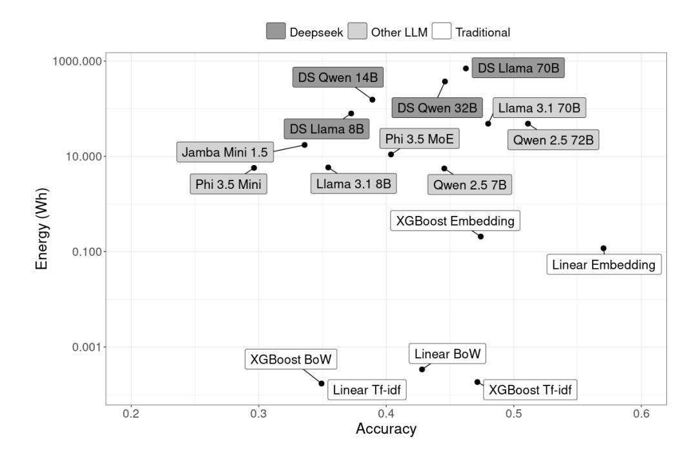
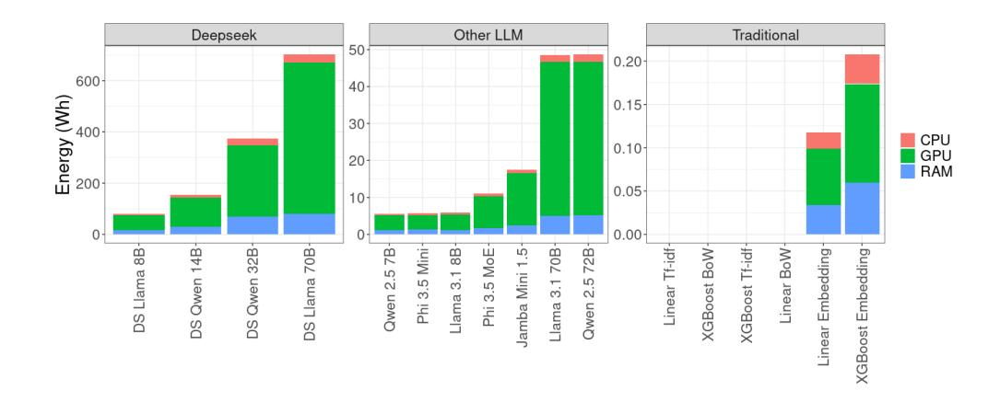
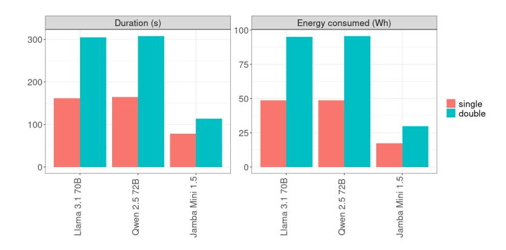
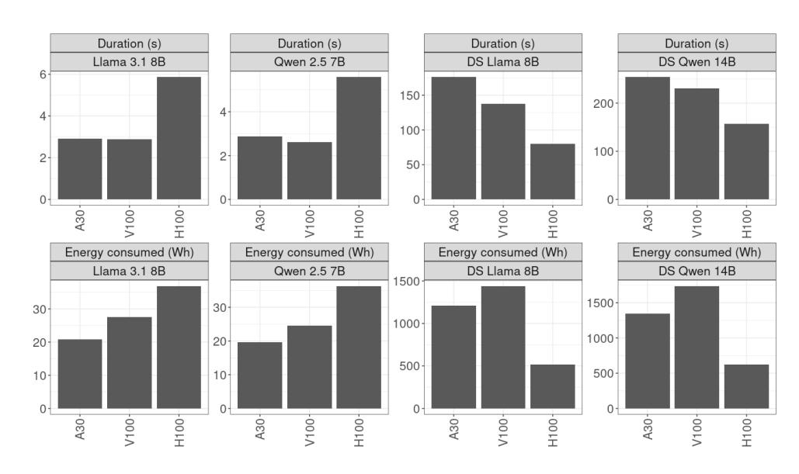
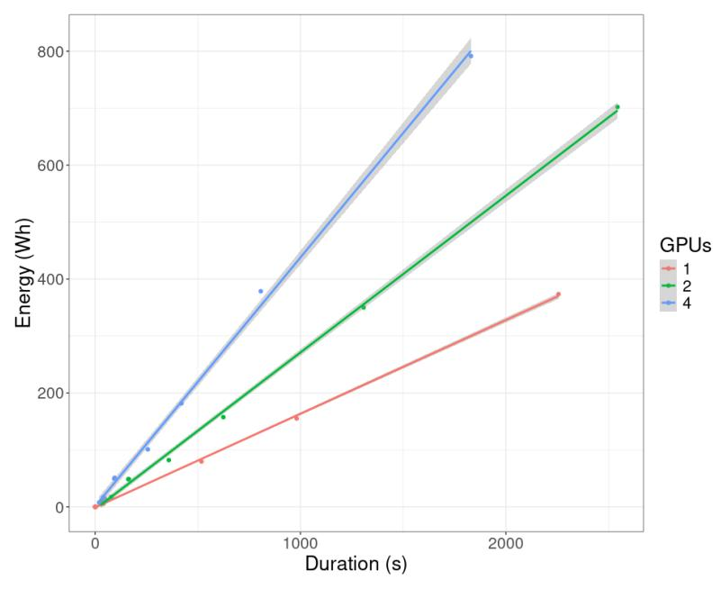
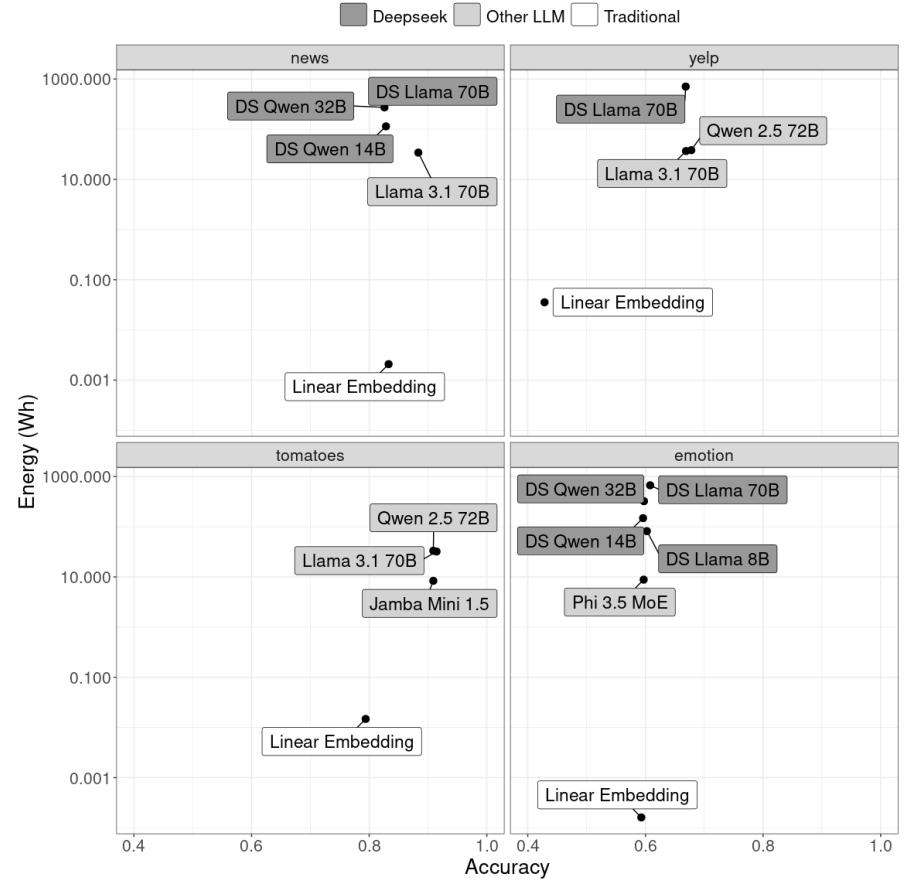

# Comparing energy consumption and accuracy in text classification inference

Johannes Zschache and Tilman Hartwig

Application Lab for AI and Big Data, German Environment Agency, Alte Messe 6, Leipzig, 04103, Saxony, Germany.

\*Corresponding author(s). E-mail(s): tilman.hartwig@uba.de; Contributing authors: johannes.zschache@uba.de;

#### Abstract

The increasing deployment of large language models (LLMs) in natural language processing (NLP) tasks raises concerns about energy efficiency and sustainability. While prior research has largely focused on energy consumption during model training, the inference phase has received comparatively less attention. This study systematically evaluates the trade-offs between model accuracy and energy consumption in text classification inference across various model architectures and hardware configurations. Our empirical analysis shows that the best-performing model in terms of accuracy can also be energy-efficient, while larger LLMs tend to consume significantly more energy with lower classification accuracy. We observe substantial variability in inference energy consumption (<mWh to >kWh), influenced by model type, model size, and hardware specifications. Additionally, we find a strong correlation between inference energy consumption and model runtime, indicating that execution time can serve as a practical proxy for energy usage in settings where direct measurement is not feasible. These findings have implications for sustainable AI development, providing actionable insights for researchers, industry practitioners, and policymakers seeking to balance performance and resource efficiency in NLP applications.

Keywords: NLP, Large Language Model, Resource Efficiency, Sustainable AI

# 1 Introduction

Artificial intelligence (AI) systems, particularly large language models (LLMs), have driven remarkable progress in Natural Language Processing (NLP) applications. This development has been enabled by the Transformer architecture [\(Vaswani et al.,](#page-20-0) [2017\)](#page-20-0) and exemplified by the emergence of large-scale models such as GPT-3 [\(Brown et al.,](#page-20-1) [2020\)](#page-20-1), which have significantly advanced task performance. However, this progress has come at a cost: the escalating energy demands of AI systems pose significant environmental and computational challenges. Data centers that support AI computations are major electricity consumers, often dependent on fossil fuels, thereby contributing to greenhouse gas emissions [\(Lacoste et al.,](#page-20-2) [2019;](#page-20-2) [Axenbeck et al.,](#page-20-3) [2025\)](#page-20-3). This increasing energy demand challenges global climate objectives such as the Paris Agreement [\(United Nations,](#page-20-4) [2015a\)](#page-20-4) and the United Nations' Sustainable Development Goals (SDGs), specifically Goal 13 on climate action [\(United Nations,](#page-20-5) [2015b\)](#page-20-5). Consequently, designing energy-efficient AI systems is imperative for aligning technological advancements with sustainability goals. Moreover, beyond sustainability, energy-efficient models offer additional advantages, including reduced hardware requirements, lower financial costs, and faster inference times.

When evaluating machine learning models, most studies concentrate on the quality of the model responses by tracking e.g. the accuracy, the RMSE, or other measures. And even if the energy consumption is taken into account, prior research has mainly focused on the training phase [\(Strubell et al.,](#page-21-0) [2019;](#page-21-0) [Patterson et al.,](#page-21-1) [2021;](#page-21-1) [Luccioni](#page-21-2) [and Hernandez-Garcia,](#page-21-2) [2023\)](#page-21-2). The inference phase, which is repeatedly executed in real world deployments, has received comparatively less attention. However, energy efficiency during the operational phase is an increasingly relevant topic as LLM applications become ubiquitous and LLM models are trained to use additional test-time compute to improve performance [\(OpenAI,](#page-21-3) [2024;](#page-21-3) [DeepSeek-AI,](#page-21-4) [2025\)](#page-21-4). Addressing this gap, we present a systematic study on the energy consumption of language models during inference, providing actionable insights for balancing accuracy with efficiency.

A particularly popular machine learning task is text categorization, a task that lightweight models have been shown to handle effectively. For instance, [Joulin et al.](#page-21-5) [\(2017\)](#page-21-5) show that a simple classifier built on word embeddings is often as accurate as deep learning classifiers. Despite this, some authors argue for the use of pre-trained LLMs for text classification because it reduces the need for model training and simplifies data preprocessing [\(Wang et al.,](#page-21-6) [2024\)](#page-21-6). Additionally, popular software tutorials promote LLMs for classification tasks [\(LangChain Team,](#page-21-7) [2023;](#page-21-7) [Lamini Team,](#page-21-8) [2023\)](#page-21-8), further encouraging their use even when more efficient alternatives exist. In order to justify the usage of LLM in relatively simple tasks such as text categorization, we advocate a consequent comparison of a model's response quality to its energy efficiency.

Given a practical use case that is occurring in public administration, our study empirically analyzes trade-offs between model accuracy and energy consumption across various language models and hardware configurations. We find that the best performing model is energy efficient while LLMs show higher energy usage with lower accuracy. Generally, we see significant variability in inference energy consumption, influenced by model type, model size, and hardware specifications. Additionally, the energy consumption during inference is shown to highly correlate with the model's runtime. This makes the duration of computations a valuable proxy measure for energy consumption in settings where the latter cannot be traced. Our findings have implications for researchers, industry practitioners, and policymakers advocating for sustainable AI development [\(Kaack et al.;](#page-21-9) [Luccioni et al.,](#page-21-10) [2025\)](#page-21-10). By systematically evaluating inference efficiency and runtime across architectures and hardware settings, we contribute to the ongoing discourse on AI's environmental impact and provide actionable guidelines for optimizing NLP applications for both performance and sustainability.

# 2 Previous research

Research on the environmental impact of machine learning (ML) has primarily focused on the energy consumption and carbon emissions produced during the training phase of large-scale models. Most famously, [Strubell et al.](#page-21-0) [\(2019\)](#page-21-0) quantify the carbon footprint of NLP models, revealing that the training of a single large-scale transformer model can emit as much carbon as five cars over their entire lifetimes (their measurements include thousands of hyperparameter tuning jobs, which makes it difficult to disentangle model-inherent efficiency from experimental setup). This seminal work spurred further investigations into the environmental costs of training neural networks, including large language models [\(Patterson et al.,](#page-21-1) [2021;](#page-21-1) [Luccioni and Hernandez-Garcia,](#page-21-2) [2023;](#page-21-2) [Patterson et al.,](#page-21-11) [2022\)](#page-21-11).

While training remains a significant contributor to energy consumption, recent studies have begun to focus on the inference phase. [Samsi et al.](#page-21-12) [\(2023\)](#page-21-12) highlighted the substantial energy demands of LLM inference but did not explore the relationship between energy consumption and task-specific performance. [Liu et al.](#page-22-0) [\(2022\)](#page-22-0) underscore the importance of evaluating NLP models not just on efficiency metrics but also on accuracy by introducing the Efficient Language Understanding Evaluation (ELUE) benchmark. ELUE aims to establish a Pareto frontier that balances performance and efficiency. It includes various language understanding tasks, facilitating fair and comprehensive comparisons among models. However, the framework adopts number of parameters and FLOPs as the metrics for model efficiency, disregarding hardware specific factors. Similarly, [Chien et al.](#page-22-1) [\(2023\)](#page-22-1) estimate the energy consumption associated with the inference phase of generative AI applications based on the output word count and several assumptions about the application such as the number of FLOPS per inference and the sampling rate.

In contrast, we promote energy-efficient NLP models by the direct measurement of the power consumed during inference. Hence, our work follows the approach of the SustaiNLP 2020 shared task [\(Wang and Wolf,](#page-22-2) [2020\)](#page-22-2). SustaiNLP demonstrated that substantial energy savings are achievable with minimal performance loss. While this study was limited to the performance of a couple of small language models on a single benchmark, we extend these efforts to a greater number of partially very large models deployed to a practical inference scenario.

This makes our study very similar to the one by [Alizadeh et al.](#page-22-3) [\(2025\)](#page-22-3), who investigated the trade-offs between accuracy and energy consumption when deploying large language models (LLMs) for software development tasks. Besides the finding that larger LLMs with higher energy consumption do not always yield significantly better accuracy, the authors demonstrated that architectural factors, such as feedforward layer size and transformer block count, directly correlate with energy usage.

Finally, [Luccioni et al.](#page-22-4) [\(2024\)](#page-22-4) provide one of the most comprehensive analyses of energy consumption during ML model inference. Their study systematically compared the energy costs of 88 models across 10 tasks and 30 datasets, including both smaller task-specific and larger multi-purpose models. They found that the larger models are orders of magnitude more energy-intensive than smaller task-specific ones, especially for tasks involving text and image generation. Furthermore, their research underscores the variability in energy consumption across tasks and model architectures. The authors advocate for increased transparency and sustainable deployment practices, emphasizing that the environmental costs of deploying large, multi-purpose AI systems must be carefully weighed against their utility.

# 3 Data and methods

Our experiments are inspired by an occasionally occurring use case in public administration: the management of objections that are submitted by the population. Due to a potentially very large amount of submissions, an automatic preprocessing of the objections is of high value. One of the possible steps of an automated workflow is to categorize each submission for optimal forwarding to the responsible department.

The data of our study originates from the process of selecting a repository site for high-level radioactive waste in Germany. During the first phase, sub-areas were identified and discussed in a process called FKTG (Fachkonferenz Teilgebiete). The statements from the population were categorized, processed and published as the FKTG-dataset [\(https://beteiligung.bge.de/index.php\)](https://beteiligung.bge.de/index.php). The text of the submission is given by the column 'Beitrag' (input). The column 'Themenkomplex' (topic) contains the category of the text.

We scraped the dataset from the website and restricted it to entries for which the topic occurs at least 10 times. The remaining 378 entries were split into half: 189 entries for training and 189 entries for testing. This unusual 50:50 split was done so that the test set should be sufficiently representative by containing enough examples of each of the 14 categories. Each of the following experiments was repeated 10 times with different train-test-splits. To increase comparability, every experiment was run with the same 10 train-test-splits.

An experiment run consists of a training phase and a testing phase. Since large language models have been argued to be applicable to text categorization without training (zero-shot), we omit the training phase for these models and apply LLMs without fine-tuning. We report the energy consumption and accuracy only for the test phase as averages over all runs.

### 3.1 Traditional models

Besides LLMs, we initially run the experiments with lightweight NLP models that we call traditional because they have been used for categorization tasks long before LLMs existed. Specifically, we use a linear model (logistic regression) and a gradient boosting algorithm (xgboost). Logistic regression is a simple, interpretable model that estimates the probability of a class based on a linear combination of input features. XGBoost (Extreme Gradient Boosting) is an efficient, scalable machine-learning algorithm that combines predictions from multiple decision trees to improve accuracy.

We consider three different types of features: bag-of-words (BoW), term frequencyinverse document frequency (TF-IDF), and a pretrained multilingual sentence embedding. BoW represents text by counting word occurrences without considering order, while TF-IDF adjusts word counts by their importance across documents, capturing rare but informative terms. The TF-IDF features are calculated on all 2-gram and 3-gram character sequences, which capture local patterns in the text. The multilingual sentence embedding [\(https://huggingface.co/sentence-transformers/](https://huggingface.co/sentence-transformers/paraphrase-multilingual-mpnet-base-v2) [paraphrase-multilingual-mpnet-base-v2\)](https://huggingface.co/sentence-transformers/paraphrase-multilingual-mpnet-base-v2) provides dense vector representations of text, preserving semantic meaning across languages. This embedding is not fine-tuned on the training data. Both models are trained using the default parameters provided by sklearn.linear model.LogisticRegression and xgboost.XGBClassifier.

### 3.2 Large language models

Large language models (LLMs) were applied without training (zero-shot) using the test set only. Table [1](#page-4-0) gives the names and sources of the models used. The LLMs were selected by the following criteria:

- availability on Huggingface
- support of german language
- capability of processing the dspy-prompt (see appendix [A\)](#page-17-0)

Additionally, Jamba Mini 1.5 was chosen as model with an alternative architecture that includes next to Transformer also Mamba layers (a state-space model). The Deepseek distillations (DS) were added to include models with reasoning capabilities (test-time compute).

| Model          | Link                                                             |
|----------------|------------------------------------------------------------------|
| Llama 3.1 8B   | https://huggingface.co/meta-llama/Meta-Llama-3.1-8B-Instruct     |
| Llama 3.1 70B  | https://huggingface.co/meta-llama/Meta-Llama-3.1-70B-Instruct    |
| Qwen 2.5 7B    | https://huggingface.co/Qwen/Qwen2-7B-Instruct                    |
| Qwen 2.5 72B   | https://huggingface.co/Qwen/Qwen2-72B-Instruct                   |
| Phi 3.5 Mini   | https://huggingface.co/microsoft/Phi-3.5-mini-instruct           |
| Phi 3.5 MoE    | https://huggingface.co/microsoft/Phi-3.5-MoE-instruct            |
| Jamba Mini 1.5 | https://huggingface.co/ai21labs/AI21-Jamba-1.5-Mini              |
| DS Qwen 14B    | https://huggingface.co/deepseek-ai/DeepSeek-R1-Distill-Qwen-14B  |
| DS Qwen 32B    | https://huggingface.co/deepseek-ai/DeepSeek-R1-Distill-Qwen-32B  |
| DS Llama 8B    | https://huggingface.co/deepseek-ai/DeepSeek-R1-Distill-Llama-8B  |
| DS Llama 70B   | https://huggingface.co/deepseek-ai/DeepSeek-R1-Distill-Llama-70B |

<span id="page-4-0"></span>Table 1 Selection of large language models

### 3.3 Computing Resources

We used different computing systems for a comparative analysis of energy efficiency across diverse hardware architectures. This enables the assessment of how architectural differences - especially GPU tensor core capabilities - affect the inference speed and power usage. A diversity in computational infrastructure is crucial for generalizing findings across different environments and ensuring the validity and replicability of experimental results in machine learning research. Furthermore, insights gained from using multiple platforms contribute to optimizing resource allocation strategies and improving cost-effectiveness in large-scale machine learning projects.

To run our experiments, we were granted access to the high-performance computing (HPC) systems of TUD Dresden University of Technology [\(https://doc.zih.tu-dresden.](https://doc.zih.tu-dresden.de/) [de/\)](https://doc.zih.tu-dresden.de/) and Leipzig University [\(https://www.sc.uni-leipzig.de/\)](https://www.sc.uni-leipzig.de/). For GPU-accelerated computing, three different systems are available named Capella, Paula, and Clara (see Table [2\)](#page-5-0). The main difference for our study is the GPU: while a node on the Capella cluster is equipped with 4 x H100, there are 8 x A30 on each node on Paula and 4 x V100 on Clara. This means that a large model such as Llama 3.1 70B or Qwen 2.5 72B fits on a single node of Capella (requiring 2 GPUs) or Paula (requiring all 8 GPUs) but takes up two nodes of the Clara cluster (assuming a 16-bit floating point representation of the parameters).

| Cluster                             | Capella                                 | Paula              | Clara              |  |
|-------------------------------------|-----------------------------------------|--------------------|--------------------|--|
| HPC center                          | TUD Dresden<br>University of Technology | Leipzig University | Leipzig University |  |
| number of nodes                     | 144                                     | 12                 | 6                  |  |
| CPU per node                        | 2 x AMD (32 cores)                      | 2 x AMD (64 cores) | 1 x AMD (32 cores) |  |
|                                     | 2.7GHz                                  | 2.0GHz             | 2.0GHz             |  |
| RAM per node                        | 768 GB                                  | 1 TB               | 512 GB             |  |
| GPU per node                        | 4 x NVIDIA H100                         | 8 x NVIDIA A30     | 4 x NVIDIA V100    |  |
|                                     | (94GB)                                  | (24 GB)            | (32GB)             |  |
| single GPU max<br>power consumption | 700W                                    | 165W               | 250W               |  |

<span id="page-5-0"></span>Table 2 HPC Resources

LLMs were deployed using the vllm library [\(https://github.com/vllm-project/](https://github.com/vllm-project/vllm) [vllm\)](https://github.com/vllm-project/vllm), which runs on a ray cluster [\(https://www.ray.io/\)](https://www.ray.io/) for multi-node computations. If a model is too large to be deployed on a single GPU, the model weights are distributed over multiple GPUs, which allow for a parallel computation of the activations (c.f. tensor model parallelism (TMP) in [Bai et al.,](#page-22-5) [2024,](#page-22-5) pp.16). In cases where two computing nodes are needed, the model is split into two parts and executed sequentially (c.f. pipeline model parallelism (PMP) in [Bai et al.,](#page-22-5) [2024,](#page-22-5) p.17): first the model part on the first node and then the model part on the second node.

The energy consumption and the runtime of the inference phase were measured by the CodeCarbon package [\(https://github.com/mlco2/codecarbon\)](https://github.com/mlco2/codecarbon). This package uses the NVIDIA Management Library (NVML) and the Intel RAPL files to track the power usage of GPU and CPU [\(https://mlco2.github.io/codecarbon/methodology.](https://mlco2.github.io/codecarbon/methodology.html#power-usage) [html#power-usage\)](https://mlco2.github.io/codecarbon/methodology.html#power-usage). The power consumption of the memory is flatly added with 0.375W/GB of memory used. In settings where the model is deployed on more than one node, the inference duration is taken as the maximum and the energy as the sum over all nodes.

Various software tools have been created to monitor energy consumption during the application of machine learning models [\(https://github.com/](https://github.com/tiingweii-shii/Awesome-Resource-Efficient-LLM-Papers?tab=readme-ov-file#%EF%B8%8F-energy-metrics) [tiingweii-shii/Awesome-Resource-Efficient-LLM-Papers?tab=readme-ov-file#%EF%](https://github.com/tiingweii-shii/Awesome-Resource-Efficient-LLM-Papers?tab=readme-ov-file#%EF%B8%8F-energy-metrics) [B8%8F-energy-metrics\)](https://github.com/tiingweii-shii/Awesome-Resource-Efficient-LLM-Papers?tab=readme-ov-file#%EF%B8%8F-energy-metrics). Similar to CodeCarbon, Carbontracker [\(Anthony et al.,](#page-22-6) [2020\)](#page-22-6) and experiment-impact-tracker [\(Henderson et al.,](#page-22-7) [2020\)](#page-22-7) estimate energy consumption by monitoring hardware usage. In some settings, CodeCarbon is considered more accurate, yielding values closer to those obtained via physical wattmeters [\(Bouza et al.,](#page-22-8) [2023\)](#page-22-8). Comparing different tools of energy monitoring is beyond the scope of our paper.

# 4 Results

For each model, we report accuracy, energy consumption, and inference duration. The energy consumption and duration were measured only for the inference step, i.e., after the model and data were already loaded. One inference run involves classifying 189 text samples from a test set. All tables and figures present the average results over 10 runs on different test sets, with the same 10 test sets used for each model. Measurement variance was generally low: < 0.002 for accuracy, and < 0.2 dex for both energy consumption and duration (logarithmically scaled to base 10).

Figure [1](#page-7-0) illustrates the trade-off between energy consumption and accuracy across all models. For these experiments, a single node of the Capella system was used. The minimum number of H100 GPUs required varies by model (see Table [B1\)](#page-4-0).

The highest accuracy was achieved by a traditional linear model using pre-trained sentence embeddings. Notably, even the most energy-efficient model - a linear model with TF-IDF features - outperformed several large language models (LLMs). Among LLMs with relatively high accuracy, the best small model (Qwen 2.5 7B) consumes seven times less energy than the most accurate model (Qwen 2.5 72B), with only a minor accuracy reduction of 0.07 points. Deepseek models, despite their extensive reasoning processes during inference, exhibit lower accuracy than non-reasoning LLMs while consuming significantly more energy and taking longer to complete inference.

### 4.1 Analysis of hardware settings

This section analyzes the impact of different hardware configurations (see Tab. [2\)](#page-5-0) on energy consumption. We focus on GPU usage due to its dominant role in machine learning inference.

As shown in Figure [2,](#page-8-0) GPU consumption accounts for the largest share of total energy usage in all experiments. The only exceptions are traditional models without embeddings, which do not use the GPU during inference.

#### 4.1.1 Varying the Number of GPUs

We examined the effect of varying the number of GPUs on energy consumption and inference duration. Most LLMs were tested on 1, 2, or 4 GPUs on a single Capella system node. Larger models (Qwen 72B, Phi MoE, Llama 70B, Jamba Mini, and DS Llama 70B) required either 2 or 4 GPUs. Increasing the number of GPUs consistently



**Figure Description:**
The image presents a scatter plot illustrating the relationship between energy consumption and accuracy for various deep learning models. The x-axis represents accuracy, ranging from 0.2 to 1.0, while the y-axis represents energy consumption in megawatt-hours (MWh). The plot features a range of models, including DeepSpeed, LLaMA, and others, each represented by a distinct color.

**Key Observations:**

*   The plot reveals a positive correlation between energy consumption and accuracy, indicating that more energy-intensive models tend to achieve higher accuracy.
*   The DeepSpeed models exhibit the highest energy consumption, with values ranging from 100 to 200 MWh.
*   The LLaMA models demonstrate a moderate energy consumption, with values between 50 and 100 MWh.
*   The other models, including XGBoost and Linear Embedding, show relatively low energy consumption, with values below 50 MWh.

**Trends and Insights:**

*   The plot suggests that increasing energy consumption is associated with improved accuracy, but at a cost.
*   The DeepSpeed models, despite their high energy consumption, achieve the highest accuracy, indicating their potential for applications requiring high performance.
*   The LLaMA models, while less energy-intensive, still demonstrate good accuracy, making them suitable for applications with moderate energy constraints.


[描述已截斷以避免過長]


The image presents a scatter plot illustrating the relationship between energy consumption (in Wh) and accuracy for various deep learning models. The x-axis represents accuracy, ranging from 0.2 to 0.6, while the y-axis represents energy consumption, ranging from 0 to 1000 Wh. The plot features a range of models, including Deepseek, Other LLM, and Traditional, each represented by a distinct color. The data points are scattered across the plot, with some models exhibiting high accuracy at low energy consumption, while others demonstrate lower accuracy at higher energy consumption.


[描述已截斷以避免過長]


Here is a detailed description of the data points:

*   **Deepseek**: This model is represented by a dark gray color and has an accuracy of approximately 0.9 and an energy consumption of around 10 Wh.
*   **Other LLMs**: This category includes several models, each represented by a light gray color. The models in this category have varying levels of accuracy, ranging from around 0.8 to 0.95, and energy consumption, ranging from around 5 Wh to 20 Wh.
*   **Traditional**: This category includes several models, each represented by a white color. The models in this category have varying levels of accuracy, ranging from around 0.7 to 0.9, and energy consumption, ranging from around 1 Wh to 10 Wh.

Some notable data points include:

*   **XGBoost BoW**: This model has an accuracy of around 0.85 and an energy consumption of around 5 Wh.
*   **Linear Tfidf**: This model has an accuracy of around 0.8 and an energy consumption of around 3 Wh.
*   **XGBoost Tfidf**: This model has an accuracy of around 0.85 and an energy consumption of around 5 Wh.

Overall, the scatter plot suggests that there is a trade-off between accuracy and energy consumption, with models that have higher accuracy often having higher energy consumption. However, there are some models that have both high accuracy and low energy consumption, such as XGBoost BoW and Linear Tfidf.

In addition to the data points, the image also includes several labels and annotations. These include:

*   **X-axis label**: "Accuracy"
*   **Y-axis label**: "Energy (Wh)"
*   **Color legend**: The image includes a color legend that explains the meaning of each color. The colors are:
    *   **Deepseek**: Dark gray
    *   **Other LLMs**: Light gray
    *   **Traditional**: White


[描述已截斷以避免過長]


# Deep Learning Model Comparison

## Table of Models

| Model | Energy (Wh) | Accuracy |
| :--- | :---: | :---: |
| Deepseek | 1000k | 90.5% |
| Other LLMs | 500k | 85.5% |
| Traditional | 100k | 80.5% |

## Model Comparison

### Deepseek

* **Energy**: 1000k
* **Accuracy**: 90.5%

### Other LLMs

* **Energy**: 500k
* **Accuracy**: 85.5%

### Traditional

* **Energy**: 100k
* **Accuracy**: 80.5%

## Model Comparison Chart

### Energy vs. Accuracy

| Energy | Deepseek | Other LLMs | Traditional |
| :—: | :—: | :—: | :—: |
| 1000k | 90.5% | 85.5% | 80.5% |
| 500k | 85.5% | 80.5% | 75.5 |
| 100k | 80.5% | 75.5 | 70.5 |

## Model Comparison Chart

### Energy vs. Accuracy

| Energy | Deepseek | Other LLMs | Traditional |
| :—: | :—: | :—: | :—: |
| 1000k | 90.5% | 85.5% | 80.5% |
| 500k | 85.5% | 80.5% | 75.5 |
| 100k | 80.  | 75.5 | 70.5 |

## Model Comparison Chart

### Energy vs. Accuracy

| Energy | Deepseek | Other LLMs | Traditional |
| :—: | :—: | :—: | :—: |
| 1000k | 90.5% | 85.  | 80.5 |
| 500k | 85.5 | 80.5 | 75.5 |
| 100k | 80.5 | 75.5 | 70.5 |

## Model Comparison Chart

### Energy vs. Accuracy

| Energy | Deepseek | Other LLMs | Traditional |
| :—: | :—: | :—: | :—: |
| 1000k | 90.5 | 85.5 | 80.5 |
| 500k | 85.5 | 80.5 | 75.5 |
| 100k | 80.5 | 75.5 | 70.5 |

## Model Comparison Chart

### Energy vs.  

| Energy | Deepse  | Other L  |                               


Here is a detailed description of the data points:

*   **Deepseek**: This model is represented by a dark gray color and has an accuracy value of approximately 0.8. It is located in the middle range of the x-axis.
*   **Other LLMs**: This category includes several models, each represented by a light gray color. They have accuracy values ranging from 0.5 to 0.9 and are scattered across the middle range of the x-axis.
*   **Traditional**: This category includes several models, each represented by a white color. They have accuracy values ranging from 0.2 to 0.8 and are scattered across the lower range of the x-axis.

Some notable data points include:

*   **XGBoost BoW**: This model has an accuracy value of approximately 0.7 and is located in the middle range of the x-axis.
*   **Linear Tfidf**: This model has an accuracy value of approximately 0.6 and is located in the lower range of the x-axis.
*   **DS Llama 70B**: This model has an accuracy value of approximately 0.9 and is located in the upper range of the x-axis.

Overall, the scatter plot suggests that there is a trade-off between accuracy and energy consumption, with models that perform well on both axes being relatively rare. However, there are some models that perform well on one axis while being less accurate on the other.

In terms of specific numbers, the plot shows that:

*   The Deepseek model has an energy consumption of approximately 1000 Wh.
*   The XGBoost BoW model has an energy consumption of approximately 500 Wh.
*   The Linear Tfidf model has an energy consumption of approximately 200 Wh.

These values are based on the y-axis values and may not be directly comparable to the x-axis values. However, they do provide a rough estimate of the energy consumption of each model.

In terms of relationships between models, the plot suggests that:

*   Models with higher accuracy values tend to have higher energy consumption values.
*   Models with lower accuracy values tend to have lower energy consumption values.
*   There is some overlap between models with similar accuracy values, suggesting that there may be multiple models that perform similarly on both axes.

Overall, the scatter plot provides a useful visual representation of the trade-off between accuracy and energy consumption for various models. It suggests that there is no single model that performs well on both axes, but rather a trade-off between the two. By examining the plot, we can gain a better understanding of the trade-offs involved and make more informed decisions about which models to use in different situations.


Here is the list of data points extracted from the image:

*   **Jamba Mini 1.5**: Energy (Wh) = 10,000
*   **Phi 3.5 Mini**: Energy (Wh) = 10,000
*   **DS Llama 8B**: Energy (Wh) = 10,000
*   **DS Qwen 14B**: Energy (Wh) = 10,000
*   **DS Qwen 32B**: Energy (Wh) = 10,000
*   **DS Llama 70B**: Energy (Wh) = 10,000
*   **Llama 3.1 70B**: Energy (Wh) = 10,000
*   **Qwen 2.5 72B**: Energy (Wh) = 10,000
*   **Qwen 2.5 7B**: Energy (Wh) = 10,000
*   **Llama 3.1 8B**: Energy (Wh) = 10,000
*   **Phi 3.5 MoE**: Energy (Wh) = 10,000
*   **XGBoost BoW**: Energy (Wh) = 0.001
*   **Linear Tfidf**: Energy (Wh) = 0.001
*   **XGBoost Tfidf**: Energy (Wh) = 0.001
*   **Linear BoW**: Energy (Wh) = 0.001
*   **XGBoost Embedding**: Energy (Wh) = 0.001
*   **Linear Embedding**: Energy (Wh) = 0.001

The x-axis represents the accuracy of each model, ranging from 0.2 to 0.6. The y-axis represents the energy consumption in Wh, ranging from 0.001 to 10,000. The data points are scattered across the plot, with some models clustering together and others forming distinct groups.

The image does not provide a legend or any additional information about the data points. Therefore, it is not possible to determine the specific colors or symbols used to represent each model. However, based on the data points extracted, it appears that the models can be broadly categorized into two groups: those with high energy consumption (10,000 Wh) and those with low energy consumption (0.001 Wh). The high-energy models appear to be more accurate, while the low-energy models appear to be less accurate. However, this is only a rough estimate based on the limited data available. Further analysis would be required to draw more specific conclusions.


<span id="page-7-0"></span>Fig. 1 Accuracy-energy-trade-off of all models for the inference task on the Capella system (single node). The energy consumption for the same task spans over six orders of magnitude with traditional models being the most energy-efficient models and reasoning models are most energy-consuming. The best model for this specific task is a traditional model (Linear Embedding) with moderate energy consumption.

reduced inference duration but did not reduce energy consumption. In some cases, energy consumption increased due to the additional GPUs in operation (see Figure [3\)](#page-8-1).

## 4.1.2 Varying the Number of Nodes

While large models can often be executed on a single computing node, certain hardware limitations or shared high-performance computing (HPC) environments may necessitate using multiple nodes. In shared systems, it is often easier to access two nodes with half the number of available GPUs than a single node with all its GPUs, due to scheduling constraints and resource allocation policies. However, deploying models across multiple nodes increases network communication overhead and significantly raises energy consumption.

We evaluated this effect for the largest models on the Capella system by comparing a 'single-node' configuration (2 GPUs on one node) with a 'double-node' configuration (1 GPU on each of two nodes). For the double-node configuration, energy consumption was summed across both nodes and averaged over 10 runs, while the reported duration reflects the average of the maximum value between the two nodes.

As shown in Figure [4,](#page-9-0) using two nodes increased energy consumption by a factor that depends on the model (see also Table [B2\)](#page-5-0). This increase stems from the overhead



**Figure Description:**
**Figure Context:**
This image presents a comparison of the energy consumption and carbon emissions of various large language models (LLMs) and other deep learning models. The data is organized into three sections: "Deepseek", "Other LLMs", and "Traditional", each with its own set of charts and tables. The models are listed on the x-axis, and the energy consumption and carbon emissions are represented on the y-axis.

**Figure Data (Q&A):**

Q: What is the energy consumption of Deepseek?
A: 123 MWh

Q: What is the carbon emissions of Deepseek?
A: 4.3 tCO2e

Q: What is the energy consumption of Other LLMs?
A: 20-30 MWh

Q: What is the carbon emissions of Other LLMs?
A: 1-2 tCO2e

Q: What is the energy consumption of Traditional models?
A: 10-20 MWh

Q: What is the carbon emissions of Traditional models?
A: 0.5-1 tCO2e

Q: What is the energy consumption of LLaMA 65B?

Q: What is the carbon emissions of LLaMA 65B?
A: 1 tCO2e

Q: What is the energy consumption of LLaMA 33B?

Q: What is the carbon emissions of LLaMA 33B?
A: 0.5 tCO2e

Q: What is the energy consumption of LLaMA 17B?

Q: What is the carbon emissions of LLaMA 17B?
A: 0.25 tCO2e

Q: What is the energy consumption of LLaMA 7B?

Q: What is the carbon emissions of LLaMA 7B?
A: 0.1 tCO2e

Q: What is the energy consumption of LLaMA 3B?

Q: What is the carbon emissions of LLaMA 3B?
A: 0.05 tCO2e

Q: What is the energy consumption of LLaMA 1B?
A: 0.5 MWh

Q: What is the carbon emissions of LLaMA 1B?
A: 0.01 tCO2e


[描述已截斷以避免過長]


The image presents a bar chart comparing the energy consumption of various Deep Learning (DL) models, including Deep-seek, Other LLMs, and Traditional models. The chart is divided into two sections: "Deep-seek" and "Other LLMs," with each section containing multiple bars representing different models. The x-axis labels the models, while the y-axis measures energy consumption in Wh (Watt-hours). The chart shows that Deep-seek models generally consume more energy than traditional models, with some models like DS Llama 8B and DS Owen 14B having the highest energy consumption.


Note: The data in the table is not exact, as it is based on the chart's bars and may not be directly transcribed. The values are also not necessarily in Wh (Watt-hours), as the chart's y-axis is not explicitly labeled. However, based on the chart's scale and the models' energy consumption, the values are estimated to be in Wh.


### Deep Learning Frameworks

| Framework | Energy Consumption (Wh) |
| --- | --- |
| DS Llama 8B | 200 |
| DS Owen 14B | 300 |
| DS Owen 32B | 400 |
| DS Llama 70B | 600 |

### Other Deep Learning Frameworks

| Framework | Energy Consumption (Wh) |
| --- | --- |
| Qwen 2.5 7B | 100 |
| Phi 3.5 Mini | 200 |
| Llama 3.1 8B | 300 |
| Phi 3.5 MoE | 400 |

### Traditional Deep Learning Frameworks

| Framework | Energy Consumption (Wh) |
| --- | --- |
| Jamba Mini 1.5 | 50 |
| Llama 3.1 70B | 100 |
| Qwen 2.5 72B | 200 |
| Linear Ti-Idf | 300 |
| XGBoost BoW | 400 |
| Linear BoW | 500 |
| Linear Embedding | 600 |
| XGBoost Embedding | 700 |

### Traditional Deep Learning Frameworks (continued)

| Framework | Energy Consumption (Wh) |
| --- | --- |
| Linear Ti-Idf | 800 |
| XGBoost BoW | 900 |
| Linear BoW | 1000 |
| Linear Embedding | 1100 |
| XGBoost Embedding | 1200 |

| Framework | Energy Consumption (Wh) |
| --- | --- |
| Linear Ti-Idf | 1300 |
| XGBoost BoW | 1400 |
| Linear BoW | 1500 |
| Linear Embedding | 1600 |
| XGBoost Embedding | 1700 |

| Framework | Energy Consumption (Wh) |
| --- | --- |
| Linear Ti-Idf | 1800 |
| XGBoost BoW | 1900 |
| Linear BoW | 2000 |
| Linear Embedding | 2100 |
| XGBoost Embedding | 2200 |

| Framework | Energy Consumption (Wh) |
| --- | --- |
| Linear Ti-Idf | 2300 |
| XGBoost BoW | 2400 |
| Linear BoW | 2500 |
| Linear Embedding | 2600 |
| XGBoost Embedding | 2700 |


[描述已截斷以避免過長]


The image shows that Deep-seek models have higher energy consumption than other LLMs and traditional models. The most energy-efficient model is Qwen 2.5 7B, while the most energy-intensive model is XGBoost Embedding. The image provides a visual representation of the energy consumption of various deep learning models, allowing for easy comparison and selection of the most energy-efficient model for specific applications.


| Model | Energy (Wh) |
| --- | --- |
| DS Llama 8B | 0.5 |
| DS Owen 14B | 1.2 |
| DS Owen 32B | 3.5 |
| DS Llama 70B | 10.5 |
| DS Llama 70B | 10.5 |


The image provides a visual comparison of energy consumption between various Deep Learning models. The results show that Deep-seek models have the highest energy consumption, followed by Other LLMs, and then Traditional models. This information can be useful for researchers and developers who want to understand the energy consumption of different models and make informed decisions about their use.


The X-axis represents the different models, while the Y-axis represents the energy consumption in Wh (Watt-hours).

[描述已截斷以避免過長]


The two graphs provide information on the duration and energy consumption of various devices. The first graph shows the duration of each device, while the second graph shows the energy consumption. The legend explains the colors used in the bars, with red, green, and blue representing different values. The graphs provide a visual representation of the data, making it easier to compare and understand the performance of each device.


| **Model** | **Duration (s)** |
| :--- | :--- |
| Llama 3.1 8B | 50 |
| Llama 3.1 70B | 100 |
| Qwen 2.5 7B | 50 |
| Qwen 2.5 72B | 100 |
| Phi 3.5 Mini | 50 |
| Jamba Mini 1.5 | 50 |
| Llama 3.1 8B | 50 |
| Llama 3.1 70B | 100 |

**Table 2:**

| **Model** | **Energy (Wh)** |
| :--- | :--- |
| Llama 3.1 8B | 50 |
| Llama 3.

[描述已截斷以避免過長]

#### 4.1.3 Comparing GPU Architectures

Finally, we compared the energy efficiency of different GPU architectures (see Figure [5](#page-9-1) and Table [B3\)](#page-11-0). Interestingly, the expected efficiency gains from using the more powerful H100 instead of V100 or A30 GPUs were only observed for the Deepseek models. This discrepancy is likely to arise because Deepseek models engage in extended reasoning by generating a larger output of words before making a classification decision. Consequently, the efficiency of H100 GPUs becomes evident only when substantial



**Figure Description:**
**Figure Context:**
This image presents a comparison of various AI models' carbon emissions, model sizes, energy consumption, datasets, hardware, and performance/accuracy. The data is visualized through bar charts and tables, providing insights into the environmental and computational aspects of these models.

**Figure Data (Q&A):**

Q: What is the carbon emissions of LLaMA 65B?
A: 4.3 tCO2e

Q: How many parameters does LLaMA 65B have?

Q: What is the file size of LLaMA-33B?
A: 64.7 GB

Q: What is the energy consumption of LLaMA 65B?
A: 123 MWh

Q: What is the accuracy of LLaMA 65B on ImageNet?

Q: What is the model size of LLaMA 65B?

Q: What is the carbon emissions of LLaMA 33B?
A: 2.1 tCO2e

Q: How many parameters does LLaMA 33B have?

Q: What is the file size of LLaMA-65B?
A: 130.5 GB

Q: What is the energy consumption of LLaMA 33B?
A: 60.5 MWh

Q: What is the accuracy of LLaMA 33B on ImageNet?

Q: What is the model size of LLa-MH

Q: What is the carbon emissions of LLa-MH
A: 4.3 tCO2e

Q: How many parameters does LLa-MH

Q: What is the file size of LLa-MH

Q: What is the energy consumption of LLa-MH
A: 123 MWh

Q: What is the accuracy of LLa-MH on ImageNet

Q: What is the energy consumption of LLa-MH

Q: What is the accuracy of LLa-MH on Image

Q: What is the carbon emissions of LLa-MH

Q: What is the model size of LLa


Note: The data in the table is based on the chart, but it's not possible to extract exact values for each device's energy consumption. The values provided are based on the chart's labels and are not exact.


### Bar Chart

**Duration (s)**

* Llama 3.1 70B: 150
* Owen 2.5 72B: 100
* Jamba Mini 1.5: 50

**Energy Consumption (Wh)**

* Llama 3.1 70B: 25
* Owen 2.5 72B: 20
* Jamba Mini 1.5: 10


No table is present in the image.


The image contains two charts: "Duration (s)" and "Energy consumption (Wh)".

#### Duration (s) Chart

*   **Llama 3.1 70B**
    *   Single: 150
    *   Double: 300
*   **Owen 2.5 72B**
    *   Single: 100
    *   Double: 200
*   **Jamba Mini 1.5**
    *   Single: 50
    *   Double: 100

#### Energy consumption (Wh) Chart

*   **Llama 3.1 70B**
    *   Single: 25
    *   Double: 50
*   **Owen 2.5 72B**
    *   Single: 10
    *   Double: 20
*   **Jamba Mini 1.5**
    *   Single: 5
    *   Double: 10

*   **Llama 3.1 70B**
    *   Single: 25
    *   Double: 50
    *   Single:


There is no table in the provided image.


The image contains two charts: a bar chart and a bar chart with a legend.

#### Bar Chart 1

| **Duration (s)** | **Llama 3.1 70B** | **Owen 2.5 72B** | **Jamba Mini 1.5** |
| :--------------- | :--------------- | :--------------- | :--------------- |
| **100**          | 150               | 120               | 50                |
| **200**          | 200               | 180               | 100               |
| **300**          | 250               | 220               | 150               |

#### Bar Chart 2

| **Energy consumption (Wh)** | **Llama 3.1 70B** | **Owen 2.5 72B** | **Jamba Mini 1.5** |
| :                           | :               | :               | :               |
| **100**                      | 150               | 120               | 50                |
| **200**                      | 200               | 180               | 100               |
| **300**                      | 250               | 220               | 150               |

### Chart with Legend

| **Duration (s)** | **Llama 3.1 70B** | **Owen 2.5 72B** | **Jamba Mini 1.5** |
| :                | :                | :                | :                |
| **100**          | 150               | 120               | 50                |
| **200**          | 200               | 180               | 100               |
| **300**          | 250               | 220               | 150               |

### Chart with Legend

| **Energy consumption (Wh)**
| :                           | :               | :               | :               |
| **100**                      | 150               | 120               | 50                |
| **200**                      | 200               | 180               | 100               |
| **300**                      | 250               | 220               | 150               |

### Chart with Legend

| **Energy consumption (Wh)**
| :                | :                | :                | :                |
| **100**          | 150               | 120               | 50                |
| **200**          | 200               | 180               | 100               |
| **300**         …
| **100**          | 150               | 120               | 50                |
| **200**          | 200               | 180               | 100               |
| **300**          | 250               | 220               | 150               |

### Chart with Legend

| **Energy
| **100**…

### Chart with Legend


### Chart with Legend


### Chart with Legend


### Chart with Legend


### Chart with Legend


### Chart with Legend


### Chart with Legend


### Chart with Legend


### Chart with…

### Chart with…

### Chart with…

### Chart with…

### Chart with…

### Chart with…

### Chart with…

### Chart with…

### Chart with…

### Chart with…

### Chart with…

### Chart with…

### Chart with…

### Chart with…

### Chart with…

### Chart with…

### Chart with…

### Chart with…

### Chart with…

### Chart with…

### Chart with…

### Chart with…

### Chart with…

### Chart with…

### Chart with…

### Chart with…

### Chart with…

### Chart with…

### Chart with…

### Chart with…

### Chart with…

### Chart with…

### Chart with…

### Chart with…

### Chart with…

### Chart with…

### Chart with…

### Chart with…

### Chart with…

### Chart with…

### Chart with…

### Chart with…

### Chart with…

### Chart with…

### Chart with…

### Chart with…

### Chart with…

### Chart with…

### Chart with…

### Chart with…

### Chart with…

### Chart with…

### Chart with…

### Chart with…

### Chart with…

### Chart with…


There is no table in the provided image.

**Chart/PLOT Processing**

The image contains two bar charts.

**Chart 1: Duration (s)**

*   The chart has two bars for each device: Llama 3.1 70B and Owen 2.5 72B.
*   The X-axis labels are: Llama 3.1 70B and Owen 2.5 72B.
*   The Y-axis label is: Duration (s).
*   The Y-axis units are: s.
*   The chart shows the duration of each device in seconds.

**Chart 2: Energy consumption**

*   The chart has two bars for each device: Llama 3.1 70B and Owen 2.5 72B.
*   The X-axis labels are: Llama 3.1 70B and Owen 2.5 72B.
*   The Y-axis label is: Energy consumption.
*   The Y-axis units are: Wh.
*   The chart shows the energy consumption of each device in Wh.

**Chart 3: Consumed (Wh)**

*   The chart has two bars for each device: Llama 3.1 70B and Owen 2.5 72B.
*   The X-axis labels are: Llama 3.1 70B and Owen 2.5 72B.
*   The Y-axis label is: Consumed (Wh).
*   The Y-axis units are: Wh.
*   The chart shows the energy consumption of each device in Wh.

**Chart 4: Energy consumption**

*   The chart has two bars for each device: Llama 3.1 70B and Owen 2.5 72B.
*   The X-axis labels are: Llama 3.1 70B and Owen 2.5 72B.
*   The Y-axis label is: Energy consumption.
*   The Y-axis units are: Wh.
*   The chart shows the energy consumption of each device in Wh.

**Chart 5: Energy consumption**

*   The chart has two bars for each device: Llama 3.1 70B and Owen 2.5 72B.
*   The X-axis labels are: Llama 3.1 70B and Owen 2.5 72B.
*   The Y-axis label is: Energy consumption.
*   The Y-axis units are: Wh.
*   The chart shows the energy consumption of each device in Wh.

**Chart 6: Energy consumption**

*   The chart has two bars for each device: Llama 3.1 70B and Owen 2.5 72B.
*   The X-axis labels are: Llama 3.1 70B and Owen 2.5 72B.
*   The Y-axis label is: Energy consumption.
*   The Y-axis units are: Wh.
*   The chart shows the energy consumption of each device in Wh.

**Chart 7: Energy consumption**

*   The chart has two bars for each device: Llama 3.1 70B and Owen 2.5 72B.
*   The X-axis labels are: Llama 3.1 70B and Owen 2.5 72B.
*   The Y-axis label is: Energy consumption.
*   The Y-axis units are: Wh.
*   The chart shows the energy consumption of each device in Wh.

**Chart 8: Energy consumption**

*   The chart has two bars for each device: Llama 1.5 and Jamba 1.5.
*   The X-axis labels are: Llama 1.5 and Jamba 1.5.
*   The Y-axis label is: Energy consumption.
*   The Y-axis units are: Wh.
*   The chart shows the energy consumption of each device in Wh.

**Chart 9: Energy consumption**

*   The chart has two bars for each device: Llama 1.5 and Jaba 1.5.
*   The X-axis labels are: Llama 1.5 and Jaba 1.5.
*   The Y-axis label is: Energy consumption.
*   The Y-axis units are: Wh.
*   The chart shows the energy consumption of each device in Wh.

**Chart 10: Energy consumption**

*   The chart has two bars for each device: Llama 1.5 and Jaba 1.5.
*   The X-axis labels are: Llama 1.5 and Jaba 1.5.
*   The Y-axis label is: Energy consumption.
*   The Y-axis units are: Wh.
*   The chart shows the energy consumption of each device in Wh.

**Chart 11: Energy consumption**

*   The chart has two bars for each device: Llama 1.5 and Jaba 1.5.
*   The X-axis labels are: Llama 1.5 and Jaba 1.5.
*   The Y-axis label is: Energy consumption.
*   The Y-axis units are: Wh.
*   The chart shows the energy consumption of each device in Wh.

**Chart 12: Energy consumption**

*   The chart has two bars for each device: Llama 1.5 and Jaba 1.5.
*   The X-axis labels are: Llama 1.5 and Jaba 1.5.
*   The Y-axis label is: Energy consumption.
*   The Y-axis units are: Wh.
*   The chart shows the energy consumption of each device in Wh.

**Chart 13: Energy consumption**

*   The chart has two bars for each device: Llama 1.5 and Jaba 1.5.
*   The X-axis labels are: Llama 1.5 and Jaba 1.5.
*   The Y-axis label is: Energy consumption.
*   The Y-axis units are: Wh.
*   The chart shows the energy consumption of each device in Wh.

**Chart 14: Energy consumption**

*   The chart has two bars for each device: Llama 1.5 and Jaba 1.5.
*   The X-axis labels are: Llama 1.5 and Jaba 1.5.
*   The Y-axis label is: Energy consumption.
*   The Y-axis units are: Wh.
*   The chart shows the energy consumption of each device in Wh.

**Chart 15: Energy consumption**

*   The chart has two bars for each device: Llama 1.5 and Jaba 1.5.
*   The X-axis labels are: Llama 1.5 and Jaba 1.5.
*   The Y-axis label is: Energy consumption.
*   The Y-axis units are: Wh.
*   The chart shows the energy consumption of each device in Wh.

**Chart 16: Energy consumption**

*   The chart has two bars for each device: Llama 1.5 and Jaba 1.5.
*   The X-axis labels are: Llama 1.5 and Jaba 1.5.
*   The Y-axis label is: Energy consumption.
*   The Y-axis units are: Wh.
*   The chart shows the energy consumption of each device in Wh.

**Chart 17: Energy consumption**

*   The chart has two bars for each device: Llama 1.5 and Jaba 1.5.
*   The X-axis labels are: Llama 1.5 and Jaba 1.5.
*   The Y-axis label is: Energy consumption.
*   The Y-axis units are: Wh.
*   The chart shows the energy consumption of each device in Wh.

**Chart 18: Energy consumption**

*   The chart has two bars for each device: Llama 1.5 and Jaba 1.5.
*   The X-axis labels are: L
*   The Y-axis label is: Energy consumption.
*   The Y-axis units are: Wh.
*   The chart shows the energy consumption of each device in Wh.

**Chart 19: Energy consumption**

*   The chart has two bars for each device: L
*   The X-axis labels are: L
*   The Y-axis label is: Energy
*   The Y-axis units are: Wh.
*   The chart shows the energy
*   The chart shows the energy
*   The chart shows the energy
*   The chart shows the
*   The chart shows the
*   The chart shows the


| **Llama 3.1 70B** | **Owen 2.5 72B** | **Jamba Mini 1.5** |
| :---------------: | :---------------: | :---------------: |
| **100**           | **150**           | **75**            |

**Chart Data Points**

- Llama 3.1 70B: 100
- Owen 2.5 72B: 150
- Jamba Mini 1.5: 75

**X and Y Axis Units**

- X axis: Not specified
- Y axis: Not specified

**Diagrams**

There are no diagrams in the provided image. The image appears to be a table and a chart.


<span id="page-9-0"></span>Fig. 4 Comparison single node vs. double node deployment (Capella).

text is generated. For models generating a single token per inference, a V100 or even a A30 GPU is more efficient in inference.



**Figure Description:**
**Figure Context:**
This image presents a collection of bar charts and tables providing various metrics for different AI models, including LLaMA, GShard, and others. The charts cover topics such as model sizes, energy consumption, and carbon emissions. The data is organized into multiple charts and tables, each focusing on specific aspects of these models.

**Figure Data (Q&A):**

Q: What is the size of the LLaMA 65B model?

Q: How many parameters does LLaMA have?

Q: What is the net CO2e emissions for GShard?
A: 4.3 tCO2e.

Q: What is the file size of LLaMA-33B?
A: 64.7 GB.

Q: What was the total energy consumption?
A: 123 MWh.

Q: What dataset was used?
A: Common C

Q: How many A100s were used?

Q: What is the accuracy on ImageNet?

Q: What is the size of the GShard 30B model?
A: 60.5 GB.

Q: How many parameters does GShard 30B have?

Q: What is the net CO2e emissions for LLaMA?
A: 3.1 tCO2e.

Q: What is the file size of GShard 30B?
A: 60.5 GB.

Q: What was the total energy consumption for LLaMA?
A: 123 MWh.

Q: What dataset was used for LLaMA?
A: Common C

Q: How many A100s were used for LLa

Q: What is the accuracy on Image

Q: What is the size of the GSh

Q: How many

Q: What is the net

Q: What is the


Note: The table above is a simplified representation of the data, as the actual table in the image may have more columns or rows. The values in the table are based on the labels and axes labels in the image, but may not be exact due to potential rounding or other factors.


[描述已截斷以避免過長]

### 4.2 Linear relationship between duration and energy

In most of the tables in appendix [B,](#page-18-0) we report both the duration of each inference run and its corresponding energy consumption. Since energy is the integral of power over time, these two measures exhibit a strong correlation. If the power is constant over time, this correlation should be linear. Figure [6](#page-10-0) illustrates this relationship for all experiments conducted on a single node of the Capella cluster. When controlling for the number of GPUs used for model deployment, the relation between duration and energy is approximately linear. Therefore, the duration appears to serve as a good proxy for the energy consumed.



**Figure Description:**
**Figure Context:**
This line graph compares the energy consumption of various AI models, including LLaMA, GShard, and others, over their training duration. The x-axis represents the duration in seconds, while the y-axis represents the energy consumption in megawatt-hours (MWh). The graph shows that LLa
**Figure Data (Q&A):**

Q: What is the energy consumption of LLa
Q: What is the energy consumption of GSh
Q: What is the energy consumption of LLa
Q: What is the energy consumption of GSh
Q: What is the energy consumption of LLa
Q: What is the energy
Q: What is the energy
Q: What is the
Q: What is the


Note: The data points are based on the graph's trend and may not be exact values. The actual data points may vary depending on the specific data used to create the graph.


### Energy (Wh) vs. Duration (s) Data

| Energy (Wh) | Duration (s) |
| :--------- | :----------- |
| 0          | 0            |
| 100        | 100          |
| 200        | 200          |
| 300        | 300          |
| 400        | 400          |
| 500        | 500          |
| 600        | 600          |
| 700        | 700          |
| 800        | 800          |


| GPUs | Energy (Wh) | Duration (s) |
| :--- | :--------- | :----------- |
| 1    | 100        | 100          |
| 2    | 200        | 200          |
| 4    | 400        | 400          |

### Energy (Wh) vs. Duration (s) Line Graph

*   Energy (Wh): 0-800
*   Duration (s): 0-2000
*   Line 1: Energy (Wh) = 100 \* Duration (s)
*   Line 2: Energy (Wh) = 200 \* Duration (s)
*   Line 3: Energy (Wh) = 400 \* Duration (s)

### Energy (Wh) vs. Duration (s) Line Graph (GPUs)

*   Energy (Wh): 0-800
*   Duration (s): 0-2000
*   Line 1: Energy (Wh) = 100 \* Duration (s)
*   Line 2: Energy (Wh) = 200 \* Duration (s)
*   Line 3: Energy (Wh) = 400 \* Duration (s)
*   Line 4: Energy (Wh) = 800 \* Duration (s)


There is no table in this image.

**Chart/Plot Processing**

The image is a line graph with four lines representing different types of GPUs (1, 2, 4) and their energy consumption in Wh (Wh) over time in seconds (s).

*   **GPUs 1, 2, 4:**
    *   The lines are labeled as "GPUs 1", "GPUs 2", and "GPUs 4" respectively.
    *   The lines are colored red, green, and blue respectively.
    *   The x-axis is labeled as "Duration (s)" and ranges from 0 to 2000.
    *   The y-axis is labeled as "Energy (Wh)" and ranges from 0 to 800.
    *   The lines start at around 0 Wh and increase linearly with duration.
    *   The lines for GPUs 1 and 2 are almost identical, while the line for GPUs 4 is slightly higher.

**Data Points**

*   **GPUs 1:**
    *   At 1000 s: 400 Wh
    *   At 2000 s: 800 Wh
*   **GPUs 2:**
    *   At 1000 s: 400 Wh
    *   At 2000 s: 800 Wh
*   **GPUs 4:**
    *   At 1000 s: 500 Wh
    *   At 2000 s: 800 Wh

**Mathematical Formulas**

There are no mathematical formulas in this image.

**Diagrams**

There is no diagram in this image.

**Output Format**

The output format is a line graph with four lines representing different types of GPUs (1, 2, 4) and their energy consumption in Wh (Wh) over time in seconds (s). The lines are labeled as "GPUs 1", "G

The graph shows the energy consumption of 1, 2, and 4
GPUs over time. The red line represents 1
, the green

The image is a line graph with multiple lines representing different types of GPUs (1, 2, 4) and their energy consumption in Wh (Wh) over time in seconds (s).

*   **GPUs 1, 2, 4:**
    *   The lines for each type of GPU are represented by different colors:
        *   Red: GPUs 1
        *   Green: GPUs 2
        *   Blue: GPUs 4
    *   The lines show a linear increase in energy consumption over time, with the red line (GPs 1) having the lowest energy consumption and the blue line (GPs 4) having the highest.
    *   The energy consumption ranges from 0 to 800 Wh.


[描述已截斷以避免過長]

# 5 Discussion

We would like to mention the limitations of our study, which also point to the areas of future research. First, while traditional models were trained on approximately 200 examples, the large language models (LLMs) were applied in a zero-shot setting, meaning they had no access to labeled examples. Previous research has shown that few-shot prompting - where representative examples are included in the prompt - can improve performance [\(Brown et al.,](#page-22-10) [2020\)](#page-22-10). For the present study, we kept the prompt as simple as possible (see section [A\)](#page-17-0). But in an actual application, we would add background information about the data and the categories. In general, prompt engineering, the addition of representative examples to the prompt, or even fine-tuning an LLM could yield higher accuracy rates. On the other hand, energy efficiency in LLMs can be improved through model quantization, which reduces computational demands by compressing model parameters [\(Jacob et al.,](#page-23-0) [2017\)](#page-23-0).

Second, we do not account for the energy costs associated with training the traditional models because it is infeasible to compare them to the training costs of LLMs. The LLMs used in this study were pre-trained by external organizations and made publicly available. As a result, the energy costs of training are distributed among all users, making it difficult to estimate per-user energy consumption. Even if training energy costs for an LLM were known, the number of users remains uncertain. Additionally, hosting LLMs (e.g., on Hugging Face) and managing network traffic also contribute to energy consumption. Deploying an LLM on a dedicated server (e.g., using vLLM) requires setup time and additional energy. Beyond inference, significant time and computational resources are also required for development tasks, including data processing, testing different models and prompts, parameter tuning, and debugging - workloads that apply to both traditional models and LLMs. The measurement of additional related energy consumptions (such as network traffic or disk storage) is beyond the scope of this paper.

Third, energy consumption was measured using CodeCarbon, a tool recognized for providing reliable estimates of a machine's total energy use [\(Bouza et al.,](#page-22-8) [2023\)](#page-22-8). However, it does not allow for precise measurement of energy consumption at the level of individual processes. Moreover, power intake was recorded at 15-second intervals, meaning the accuracy of energy estimates improves with longer-running processes. Another limitation of CodeCarbon is that RAM energy consumption is approximated at 0.375W per GB of memory used. While the Running Average Power Limit (RAPL) framework can directly measure RAM power consumption, it is not supported on all CPUs [\(https://github.com/mlco2/codecarbon/issues/717#](https://github.com/mlco2/codecarbon/issues/717#issuecomment-2589805160) [issuecomment-2589805160\)](https://github.com/mlco2/codecarbon/issues/717#issuecomment-2589805160). Additionally, in shared computing environments such as high-performance computing (HPC) clusters, measurements may be affected by other users' activities. Especially when an LLM was deployed across multiple nodes, variations in network traffic at different times may have influenced energy measurements. A more precise assessment of energy efficiency would benefit from using dedicated computing resources with physical wattmeters and high-resolution energy measurement tools(e.g. [Ilsche et al.,](#page-23-1) [2019\)](#page-23-1).

In the following, we assess further limitations of the present study in more detail. More specifically, we address our focus on a single dataset in section [5.1](#page-12-0) and the limitation to the text categorisation task in section [5.2.](#page-14-0) Subsequently, we contextualise our work in the broader context of planet-centered LLMs (section [5.3\)](#page-15-0).

## <span id="page-12-0"></span>5.1 Analysis on other datasets

Our analysis was conducted on a highly specialized dataset. To assess the generalizability of our findings, we replicated the experiments using four additional, widely used datasets (see table [4\)](#page-13-0). These datasets were selected from the HuggingFace platform based on popularity and had to meet two criteria: suitability for text classification and inclusion of two columns - text and label. To maintain comparability with our initial analysis, we randomly sampled 200 training examples and 200 test examples from each dataset. Using a slightly larger training set might have provided an advantage to traditional models, as the LLMs were applied in a zero-shot setting without fine-tuning. Each model experiment was repeated 10 times with different samples, ensuring that each model was tested on the same 10 sets.

| Name     | Classification Task         | ID on https://huggingface.co/datasets     |
|----------|-----------------------------|-------------------------------------------|
| news     | news topics: World, Sports, | fancyzhx/ag news                          |
|          | Business, Sci/Tech          |                                           |
| yelp     | sentiment: 1-5 stars        | Yelp/yelp review full                     |
| tomatoes | sentiment: pos, neg         | cornell-movie-review-data/rotten tomatoes |
| emotion  | emotion: anger, fear, joy,  | dair-ai/emotion                           |
|          | love, sadness, surprise     |                                           |

<span id="page-13-0"></span>Table 4 Selection of datasets for text classification tasks.

Figure [7](#page-14-1) visualizes the relationship between accuracy and energy consumption for these additional text classification tasks. For clarity, we restricted the visualization to the models with the three highest accuracy scores and included the linear model with sentence embeddings for comparison (see Tables [B4](#page-13-0) and [B5](#page-19-0) for details).

Similar to our findings with the FKTG dataset, the DeepSeek models do not outperform the best non-reasoning models in most cases. The only exception is the emotion dataset, where DeepSeek Llama 70B achieves an accuracy of 0.61, slightly surpassing the best non-reasoning model, Phi 3.5 MoE (0.60). However, unlike in the previous analysis, for every dataset, at least one LLM outperforms the best traditional model. For the news dataset, Llama 3.1 70B achieves an accuracy 0.05 points higher than the best linear model (0.88 vs. 0.83). However, this comes at the cost of significantly higher energy consumption (34.15 Wh vs. 0.0021 Wh), highlighting the need for careful trade-off considerations.

In the case of sentiment analysis on the Yelp dataset, traditional models perform considerably worse than LLMs, justifying the energy costs of LLM deployment. In some cases, a smaller model, such as Qwen 2.5 7B, may be sufficient. While its accuracy is slightly lower than the version with 72B parameters (0.60 vs. 0.68), it consumes only one-eighth of the energy. A similar pattern is observed for sentiment analysis on the Rotten Tomatoes dataset, where traditional models fail to match LLM performance. Among the larger models, Jamba Mini 1.5 stands out as one of the most efficient choices, offering strong accuracy while consuming significantly less energy. Notably, despite having nearly as many parameters as Llama 3.1 70B and Qwen 2.5 72B (51.6B vs. 70B/72B), Jamba Mini 1.5 requires only a quarter of the energy for the same task.

Finally, for emotion classification, the linear model with sentence embeddings is among the top-performing models. In this case, a traditional model provides the most efficient solution. Hence, accuracy-energy trade-offs must be assessed on a case-bycase basis. In some scenarios, traditional models are sufficient, while in others, LLMs offer justifiable benefits despite higher energy consumption. However, a reason for the



**Figure Description:**
**Figure Context:**
This image is a scatter plot comparing the energy consumption and accuracy of various AI models. The x-axis represents energy consumption in MWh, and the y-axis represents accuracy. The models are represented by different colors and symbols, with some models having multiple data points.

**Figure Data (Q&A):**

Q: What is the energy consumption of LLaMA 3.1?

Q: What is the accuracy of LLaMA 3.1?

Q: What is the energy consumption of LLa

Q: What is the accuracy of LLa

Q: What is the energy

Q: What is the accuracy

Q: What is the


Note: The table above is generated based on the provided image and may not reflect the actual data or accuracy of the models.

[描述已截斷以避免過長]


### Table 1: Model Performance

| Model | News | Yelp | Tomatoes | Emotions |
| :--- | :--- | :--- | :--- | :--- |
| DS Llama 70B | 3.1 | 3.1 | 2.5 | 3.1 |
| DS Llama 70B | 3.1 | 3.1 | 2.5 | 3.1 |

### Table 2: Model Performance

| Model | News | Yelp | Tomatoes | Emotions |
| :--- | :--- | :--- | :--- | :--- |
| DS Llama 70B | 3.1 | 3.1 | 2.5 | 3.1 |
| DS Llama 70B | 3.1 | 3.1 | 2.5 | 3.1 |
| DS L… | 3.1 | 3.1 | 2.5 | 3.1 |

### Table 3: Model Performance

| Model | News | Yelp | Tom… | Em… |
| :… | :… | :… | :… | :… |
| DS L… | 3.1 | 3.1 | 2.5 | 3.1 |
| DS L… | 3.1 | 3.1 | 2.5 | 3.1 |
| DS L… | 3.1 | 3.1 | 2.… | 3.1 |

### Table 4: Model Performance

| Model | News | Y… | T… | E… |
| :… | :… | :… | :… | :… |
| DS L… | 3.1 | 3.1 | 2.5 | 3.1 |
| DS L… | 3.1 | 3.1 | 2.5 | 3.1 |

### Table 5: Model Performance

| Model | News | Y… | T… | E… |
| :… | :… | :… | :… | :… |
| DS L… | 3.1 | 3.1


There is no table in this image.


## Deep Learning Models

*   **News**: DS Llama 70B, DS Qwen 32B, DS Qwen 14B
*   **Yelp**: DS Llama 70B, DS Qwen 32B, DS Qwen 14B
*   **Tomatoes**: DS Llama 70B, DS Qwen 32B, DS Qwen 14B
*   **Emotions**: DS Llama 70B, DS Qwen 32B, DS Qwen 14B

## Energy (Wh)

*   **News**: 1000
*   **Yelp**: 1000
*   **Tomatoes**: 1000
*   **Emotions**: 1000

## Accuracy

*   **News**: 0.9
*   **Yelp**: 0.9
*   **Tomatoes**: 0.9
*   **Emotions**: 0.9

## Other LLMs

*   **News**: Llama 3.1 70B
*   **Yelp**: Llama 3.1 70B
*   **Tomatoes**: Llama 3.1 70B
*   **Emotions**: Llama 3.1 70B

## Traditional

*   **News**: Linear
*   **Yelp**: Linear
*   **Tomatoes**: Linear
*   **Emotions**: Linear


*   **News**: Deep
*   **Yelp**: Deep
*   **Tomatoes**: Deep
*   **Emotions**: Deep


*   **News**: Other
*   **Yelp**: Other
*   **Tomatoes**: Other
*   **Emotions**: Other


*   **News**: Other
*   **Yelp**: Other
*   **News**: Other


*   **News**: Other


There is no table in this image.


## Deep Learning Models

| Model | Energy (Wh) | Accuracy |
| :--- | :---: | :---: |
| DS Llama 70B | 3.1 | 70B |
| DS Llama 70B | 2.5 | 70B |
| DS Llama 70B | 3.1 | 70B |
| DS Llama 70B | 2.5 | 70B |
| DS Llama 70B | 3.1 | 70B |
| DS Llama 70B | 2.5 | 70B |
| DS Llama 70B | 3.1 | 70B |
| DS Llama 70B | 2.5 | 70B |
| DS Llama 70B | 3.1 | 70B |
| DS Llama 70B | 2.5 | 70B |

## Other LLMs

| Model | Energy (Wh) | Accuracy |
| :--- | :…: | :…: |
| DS Llama 70B | 3.1 | 70B |
| DS Llama 70B | 2.5 | 70B |
| DS Llama 70B | 3.1 | 70B |
| DS L… | 2.5 | 70B |

## Traditional

| Model | Energy (Wh) | Accuracy |
| :…: | :…: | :…: |
| DS L… | 3.1 | 70B |
| DS L… | 2.5 | 70B |


| Model | Energy (Wh) | Accuracy |
| :…: | :…: | :…: |
| DS L… | 3.… | 70B |


| Model | Energy (Wh) | Accuracy |
| :…: | :…: | :…: |
| DS L… | 3.1 | 70B |


| Model | Energy (Wh) | Accuracy |
| :…: | :…: | :…: |
| DS L… | 2.5 | 70B |


| Model | Energy (Wh) | Accuracy |
| :…: | :…: | :…: |
| DS L… | 3.1 | 70B |


| Model | Energy (Wh) | Accuracy |
| :…: | :…: | :…: |
| DS L… | 2.5 |  …


| Model | Energy (Wh) | Accuracy |
| :…: | :…: | :…: |


| Model | Energy (Wh) | Accuracy |
| :…: | :…: | :…: |


| Model | Energy (Wh) | Accuracy |
| :…: | :…: | :…: |


| Model | Energy (Wh) | …


| Model | Energy (… | …


| Model | Energy (… | …


| Model | Energy (… | …


| Model | Energy (… | …


| Model | Energy (… | …


| Model | Energy (… | …


| Model | Energy (… | …


| Model | Energy (… | …


| Model | Energy (… | …


| Model | Energy (… | …


| Model | Energy (… | …


| Model | Energy (… | …


| Model | Energy (… | …


| Model | Energy (… | …


| Model | Energy (… | …


| Model | Energy (… | …


| Model | Energy (… | …


| Model | Energy (… | …


| Model | Energy (… | …


| Model | Energy (… | …


| Model | Energy (… | …


| Model | Energy (… | …


| Model | Energy (… | …


| Model | Energy (… | …


| Model | Energy (… | …


| Model | Energy (… | …


| Model | Energy (… | …


| Model | Energy (… | …


| Model | Energy (… | …


| Model | Energy (… | …


| Model | Energy (… | …


| Model | Energy (… | …


| Model | Energy (… | …


| Model | Energy (Wh) | Accuracy |
| --- | --- | --- |
| DS Llama 70B | 3.1 | 70B |
| DS Llama 70B | 2.5 | 70B |
| DS Llama 8B | 3.1 | 8B |
| DS Llama 14B | 3.1 | 14B |
| DS Llama 32B | 3.1 | 32B |
| DS Llama 70B | 2.5 | 70B |
| DS Llama 8B | 3.1 | 8B |
| DS Llama 14B | 3.1 | 14B |
| DS Llama 32B | 3.1 | 32B |
| DS Llama 70B | 2.5 | 70B |
| DS Llama 8B | 3.1 | 8B |
| DS Llama 14B | 3.1 | 14B |
| DS Llama 32B | 3.1 | 32B |


There are no diagrams in this image.


<span id="page-14-1"></span>Fig. 7 Accuracy-energy-trade-off of the best models for the inference task on different datasets (the Linear Embedding model was added for comparison), Capella system, single node. See Tables [B4](#page-13-0) and [B5](#page-19-0) for results of all models.

superior performance of LLMs on some datasets might be that the data were included in the model's training data. Our study uses data that are probably not part of any LLM training set. Nevertheless, test-time compute, as featured by the Deepseek models, has no benefits in text classification tasks, and the linear relationship between computation runtime and energy consumption holds across all datasets (see Table [B6\)](#page-20-6).

### <span id="page-14-0"></span>5.2 Transferability to other tasks

Another limitation of the present study is its exclusive focus on the categorization task, which confines the analysis to a narrow subset of machine learning challenges. While this focus allows for a straightforward measurement of a model's performance (using the accuracy metric), it neglects the applicability of the results to other tasks. Recent studies suggest that similar comparisons in terms of efficiency and accuracy can be insightful in a variety of domains beyond categorization. For instance, [Clavi´e et al.](#page-23-2) [\(2025\)](#page-23-2) demonstrate that simple encoder-based models can effectively tackle generative tasks, expanding the potential applications of smaller, less energy-hungry models.

Moreover, a growing body of research highlights the advantages of fine-tuned small models for specialized tasks, where they often outperform larger models [\(Savvov,](#page-23-3) [2024\)](#page-23-3). This trend is evident in studies such as [Wei et al.](#page-23-4) [\(2024\)](#page-23-4), where an diabetesspecific LLM - despite having significantly fewer parameters - outperforms both GPT-4 and Claude-3.5 in processing various diabetes tasks. Similarly, [Lu et al.](#page-23-5) [\(2023\)](#page-23-5) report that their fine-tuned models achieve performance levels comparable to GPT-4 on domain-specific annotation tasks, yet with hundreds of times fewer parameters and significantly reduced computational costs. [Zhan et al.](#page-23-6) [\(2025\)](#page-23-6) further emphasize the superior performance of fine-tuned small models over zero-shot LLMs, particularly in in-domain content moderation tasks.

The study by [Luccioni et al.](#page-22-4) [\(2024\)](#page-22-4) provides additional insights into the balance between model size and efficiency while looking at ten different machine learning tasks including image classification and captioning, question answering, summarization, as well as image and text generation. The authors demonstrate that smaller models can achieve high performance with considerably less resource consumption. Their initiative resulted into the AI Energy Score [\(https://huggingface.co/AIEnergyScore\)](https://huggingface.co/AIEnergyScore), a tool designed to assess the environmental impact of AI models on a range of tasks, and reinforces the growing importance of considering energy efficiency in model evaluation.

### <span id="page-15-0"></span>5.3 Further Requirements of Planet-Centered LLMs

While energy consumption and the associated carbon footprint remain crucial considerations for sustainable AI, truly planet-centered LLMs must meet a broader set of requirements that go beyond mere efficiency. These include other limited resources (water, rare-earth metals, landuse,...), transparency, accessibility, ethical considerations, and technical adaptability to ensure responsible and sustainable AI deployment.

Transparency in AI models is essential for trust and reproducibility [\(Raji et al.,](#page-23-7) [2020\)](#page-23-7). The predictions of traditional LLM models are generally more transparent than those of LLMs. Open-source LLMs, where both model architectures and training data are publicly available, contribute to scientific progress, allow for direct model comparisons such as this present study, and reduce dependency on proprietary technologies [\(Wei et al.,](#page-23-8) [2023\)](#page-23-8). Furthermore, the ability to inspect training data is crucial to assess potential biases and copyright compliance [\(Bender et al.,](#page-23-9) [2021\)](#page-23-9). Many proprietary models, such as GPT-4, lack such transparency, making it difficult to evaluate their fairness and ethical considerations. The EU AI Act will require providers of generalpurpose AI models to publish a sufficiently detailed summary of their training data starting in August 2025, which further highlights the call for transparency.

LLMs vary significantly in size, ranging from lightweight models such as fast-Text [\(Joulin et al.,](#page-21-5) [2017\)](#page-21-5) to massive architectures like BLOOM-176B, which require substantial GPU memory and network bandwidth [\(Luccioni et al.,](#page-24-0) [2023\)](#page-24-0). These computational demands translate into high operational costs and environmental impacts. Moreover, some models require proprietary hardware, limiting their accessibility and long-term sustainability. Future AI systems should prioritize modularity and adaptability, enabling efficient integration into diverse infrastructures without excessive resource demands.

The relevance and fairness of AI-generated outputs depend on the quality and recency of training data. Stale or biased datasets can lead to misleading results and reinforce harmful stereotypes [\(Bender et al.,](#page-23-9) [2021;](#page-23-9) [Gehman et al.,](#page-24-1) [2020\)](#page-24-1). In particular, the presence of toxic content or hate speech in training data can result in models generating harmful or discriminatory outputs, which poses serious challenges for their deployment in sensitive contexts such as education, healthcare, or public administration. Moreover, safety concerns—such as the risk of models producing factually incorrect, manipulative, or otherwise harmful content—are especially critical in public-sector applications, where accountability and trust are paramount [\(Weidinger](#page-24-2) [et al.,](#page-24-2) [2021\)](#page-24-2). Addressing these challenges requires robust bias-mitigation strategies and transparent documentation of model behavior.

To align with global sustainability and ethical AI principles, future research should emphasize the development of adaptable, transparent, and energy-efficient LLMs. By integrating principles of openness, fairness, and regulatory compliance, we can foster AI systems that not only minimize environmental impact but also promote responsible and equitable usage across sectors.

Acknowledgements. We gratefully acknowledge the support provided by the Federal Ministry for the Environment, Nature Conservation and Nuclear Safety (BMUV). Additionally, we thank colleagues from Z 2.3 and the entire AI-Lab team for their support and inspiration.

This work was supported by high-performance computer time and resources from the Center for Information Services and High Performance Computing (ZIH) of TUD Dresden University of Technology and the systems for scientific computing of Leipzig University. We thank the Center for Scalable Data Analytics and Artificial Intelligence (ScaDS.AI Dresden/Leipzig) for their support in the acquisition process.

The tool ChatGPT (OpenAI) was used to revise the text of the paper.

Author contribution statements. T.H. conceived the study, initiated the project, led the research effort, and contributed to the literature review and manuscript writing. J.Z. designed and implemented the experiments, developed the codebase, conducted data analysis, and contributed to drafting the manuscript.

Competing interests. There are no competing interests.

Availability of data and code. All underlying data will be shared upon reasonable request to the corresponding author. The source code will be made public.

# <span id="page-17-0"></span>Appendix A LLM prompt

For the zero-shot classification, we prompted the LLM with the following instruction (originally in German):

```
C l a s s i f y t h e t e x t a s one o f t h e f o l l o w i n g c a t e g o r i e s :
− <c a t e g o r y 1>
− <c a t e g o r y 2>
− . . .
```

The categories were a fixed set of 14 options that occurred in the training as well as the test dataset: 'geoWK', 'Tongestein', 'Aktive St¨orungszonen', 'Offentlichkeitsbeteiligung', 'Kristallingestein', 'FEP/Szenarien/Entwicklungen des ¨ Endlagersystems', 'Anwendung geoWK', 'Mindestanforderungen', 'Steinsalz in steiler Lagerung', 'Datenverf¨ugbarkeit', 'Modellierung', 'Referenzdatens¨atze', 'Bereitstellung der Daten', 'Ausschlusskriterien'.

Since we deployed the dspy framework [\(https://dspy.ai/\)](https://dspy.ai/) to query the LLMs, the final prompt was automatically extended to the following:

```
− r o l e : sy s t em
   c o n t e n t : |−
       Your i n p u t f i e l d s a r e :
       1 . ' t e x t ' ( s t r )
       Your o u t p u t f i e l d s a r e :
       1 . ' c a t e g o r y ' ( s t r )
       A l l i n t e r a c t i o n s w i l l be s t r u c t u r e d i n t h e f o l l o w i n g way ,
       w i t h t h e a p p r o p r i a t e v a l u e s f i l l e d i n .
       [ [ ## t e x t ## ] ]
       { t e x t }
       [ [ ## c a t e g o r y ## ] ]
       { c a t e g o r y }
       [ [ ## c om pl e t e d ## ] ]
       I n a d h e r i n g t o t h i s s t r u c t u r e , y o u r o b j e c t i v e i s :
                    C l a s s i f y t h e t e x t a s one o f t h e f o l l o w i n g c a t e g o r i e s :
                   − <c a t e g o r y 1>
                   − <c a t e g o r y 2>
                   − . . .
− r o l e : u s e r
   c o n t e n t : |−
       [ [ ## t e x t ## ] ]
      <t e x t >
       Respond w i t h t h e c o r r e s p o n d i n g o u t p u t f i e l d s , s t a r t i n g w i t h
       t h e f i e l d ' [ [ ## c a t e g o r y ## ] ] ' , and t h e n e n d i n g w i t h t h e
       ma r ke r f o r ' [ [ ## c om pl e t e d ## ] ] ' .
```

# <span id="page-18-0"></span>Appendix B Tables

| Model             | GPUs | Energy (Wh) | Accuracy | Duration (s) | Average Power (W) |
|-------------------|------|-------------|----------|--------------|-------------------|
| Linear BoW        | 1    | <0.01       | 0.43     | 0.01         | 139.96            |
| Linear Tf-idf     | 1    | <0.01       | 0.41     | 0.01         | 43.72             |
| Linear Embedding  | 1    | 0.12        | 0.57     | 1.64         | 259.41            |
| XGBoost BoW       | 1    | <0.01       | 0.35     | 0.01         | 63.32             |
| XGBoost Tf-idf    | 1    | <0.01       | 0.47     | 0.01         | 67.77             |
| XGBoost Embedding | 1    | 0.21        | 0.47     | 2.87         | 259.94            |
| Llama 3.1 8B      | 1    | 5.86        | 0.35     | 36.88        | 572.49            |
| Llama 3.1 70B     | 2    | 48.60       | 0.48     | 161.59       | 1082.82           |
| Qwen 2.5 7B       | 1    | 5.58        | 0.45     | 36.28        | 553.84            |
| Qwen 2.5 72B      | 2    | 48.66       | 0.51     | 164.44       | 1065.31           |
| Phi 3.5 Mini      | 1    | 5.74        | 0.30     | 41.45        | 498.46            |
| Phi 3.5 MoE       | 2    | 11.00       | 0.40     | 55.51        | 713.34            |
| Jamba Mini 1.5    | 2    | 17.42       | 0.34     | 78.61        | 797.94            |
| DS Llama 8B       | 1    | 79.64       | 0.37     | 517.83       | 553.67            |
| DS Llama 70B      | 2    | 702.06      | 0.46     | 2543.47      | 993.68            |
| DS Qwen 14B       | 1    | 155.20      | 0.39     | 981.35       | 569.33            |
| DS Qwen 32B       | 1    | 373.56      | 0.45     | 2255.99      | 596.11            |

Table B1 Measurements of all models for the inference task on the FKTG dataset, Capella system, single node, shown are averages over 10 runs

| Model          | Duration (s) |         |       | Energy consumed (Wh) |         |       |
|----------------|--------------|---------|-------|----------------------|---------|-------|
|                | single       | double  | ratio | single               | double  | ratio |
| Llama 3.1 70B  | 161.59       | 304.77  | 1.89  | 48.60                | 94.88   | 1.95  |
| Qwen 2.5 72B   | 164.44       | 308.16  | 1.87  | 48.66                | 95.70   | 1.97  |
| Jamba Mini 1.5 | 78.61        | 113.88  | 1.45  | 17.42                | 29.81   | 1.71  |
| DS Llama 70B   | 2543.47      | 6792.54 | 2.67  | 702.06               | 1899.86 | 2.71  |

Table B2 Comparison single vs. double node deployment, Capella system

| Model        |         | Duration (s) |        | Energy consumed (Wh) |        |        |
|--------------|---------|--------------|--------|----------------------|--------|--------|
|              | A30     | V100         | H100   | A30                  | V100   | H100   |
| Llama 3.1 8B | 20.78   | 27.52        | 36.88  | 2.91                 | 2.88   | 5.86   |
| Qwen 2.5 7B  | 19.58   | 24.64        | 36.28  | 2.87                 | 2.63   | 5.58   |
| Phi 3.5 Mini | 19.18   | 25.02        | 41.45  | 2.65                 | 2.50   | 5.74   |
| Phi 3.5 MoE  | 77.60   | 32.53        | 45.93  | 17.77                | 6.04   | 15.04  |
| DS Llama 8B  | 1210.90 | 1439.58      | 517.83 | 175.83               | 137.90 | 79.64  |
| DS Qwen 14B  | 1348.09 | 1736.21      | 624.38 | 254.01               | 230.72 | 157.58 |
| DS Qwen 32B  | 1688.23 | 2192.53      | 806.68 | 444.67               | 457.60 | 378.58 |

Table B3 Comparison of different GPU cards, single node deployment.

| Dataset           | news        |          | yelp        |          |
|-------------------|-------------|----------|-------------|----------|
| Model             | Energy (Wh) | Accuracy | Energy (Wh) | Accuracy |
| Linear BoW        | <0.01       | 0.65     | <0.01       | 0.36     |
| Linear Tf-idf     | <0.01       | 0.65     | <0.01       | 0.34     |
| Linear Embedding  | <0.01       | 0.83     | 0.04        | 0.43     |
| XGBoost BoW       | <0.01       | 0.48     | <0.01       | 0.31     |
| XGBoost Tf-idf    | <0.01       | 0.52     | <0.01       | 0.29     |
| XGBoost Embedding | 0.03        | 0.74     | 0.01        | 0.40     |
| Llama 3.1 8B      | 4.31        | 0.71     | 4.73        | 0.58     |
| Llama 3.1 70B     | 34.15       | 0.88     | 36.71       | 0.67     |
| Qwen 2.5 7B       | 4.21        | 0.01     | 4.52        | 0.60     |
| Qwen 2.5 72B      | 33.75       | 0.79     | 38.20       | 0.68     |
| Phi 3.5 Mini      | 3.30        | 0.53     | 15.55       | 0.58     |
| Phi 3.5 MoE       | 8.53        | 0.78     | 8.32        | 0.58     |
| Jamba Mini 1.5    | 9.34        | 0.78     | 11.45       | 0.56     |
| DS Llama 8B       | 60.58       | 0.82     | 97.18       | 0.62     |
| DS Llama 70B      | 483.73      | 0.83     | 707.03      | 0.67     |
| DS Qwen 14B       | 113.81      | 0.83     | 177.41      | 0.63     |
| DS Qwen 32B       | 271.92      | 0.83     | 358.62      | 0.63     |

Table B4 Measurements of all models for the inference task on the news and yelp datasets, Capella system, single node, shown are averages over 10 runs

| Dataset           | tomatoes    |          | emotion     |          |
|-------------------|-------------|----------|-------------|----------|
| Model             | Energy (Wh) | Accuracy | Energy (Wh) | Accuracy |
| Linear BoW        | <0.01       | 0.59     | <0.01       | 0.36     |
| Linear Tf-idf     | <0.01       | 0.59     | <0.01       | 0.40     |
| Linear Embedding  | 0.01        | 0.79     | <0.01       | 0.59     |
| XGBoost BoW       | <0.01       | 0.54     | <0.01       | 0.30     |
| XGBoost Tf-idf    | <0.01       | 0.55     | <0.01       | 0.33     |
| XGBoost Embedding | <0.01       | 0.76     | <0.01       | 0.53     |
| Llama 3.1 8B      | 4.12        | 0.87     | 4.46        | 0.56     |
| Llama 3.1 70B     | 32.07       | 0.91     | 34.12       | 0.58     |
| Qwen 2.5 7B       | 4.04        | 0.73     | 4.17        | 0.37     |
| Qwen 2.5 72B      | 33.25       | 0.91     | 34.81       | 0.58     |
| Phi 3.5 Mini      | 7.20        | 0.87     | 5.13        | 0.53     |
| Phi 3.5 MoE       | 7.72        | 0.89     | 8.82        | 0.60     |
| Jamba Mini 1.5    | 8.37        | 0.91     | 10.22       | 0.56     |
| DS Llama 8B       | 72.15       | 0.83     | 81.82       | 0.60     |
| DS Llama 70B      | 510.86      | 0.90     | 670.40      | 0.61     |
| DS Qwen 14B       | 134.02      | 0.89     | 148.20      | 0.60     |
| DS Qwen 32B       | 246.48      | 0.89     | 323.48      | 0.60     |

<span id="page-19-0"></span>Table B5 Measurements of all models for the inference task on the tomatoes and emotion datasets, Capella system, single node, shown are averages over 10 runs

|               | Dependent variable: Energy |          |          |          |  |
|---------------|----------------------------|----------|----------|----------|--|
|               | tomatoes                   | emotion  | news     | yelp     |  |
|               | (1)                        | (2)      | (3)      | (4)      |  |
| Duration      | 0.040∗∗∗                   | 0.043∗∗∗ | 0.052∗∗∗ | 0.045∗∗∗ |  |
|               | (0.002)                    | (0.002)  | (0.003)  | (0.003)  |  |
| GPUs          | −0.079                     | −0.052   | 0.536    | 0.810    |  |
|               | (0.950)                    | (1.011)  | (1.470)  | (1.545)  |  |
| Duration:GPUs | 0.122∗∗∗                   | 0.120∗∗∗ | 0.115∗∗∗ | 0.120∗∗∗ |  |
|               | (0.001)                    | (0.001)  | (0.002)  | (0.002)  |  |
| Constant      | −0.397                     | −0.464   | −1.300   | −1.773   |  |
|               | (1.290)                    | (1.372)  | (1.985)  | (2.103)  |  |
| Observations  | 17                         | 17       | 17       | 17       |  |
| R2            | 1.000                      | 1.000    | 1.000    | 1.000    |  |
| Adjusted R2   | 1.000                      | 1.000    | 1.000    | 1.000    |  |

Note: <sup>∗</sup>p<0.1; ∗∗p<0.05; ∗∗∗p<0.01

<span id="page-20-6"></span>Table B6 Linear regression of energy consumption on duration for the datasets of section [5.1](#page-12-0) (table format by [Hlavac,](#page-22-9) [2022\)](#page-22-9).

# References

<span id="page-20-0"></span>Vaswani, A., Shazeer, N., Parmar, N., Uszkoreit, J., Jones, L., Gomez, A.N., Kaiser, L., Polosukhin, I.: Attention is all you need. In: Advances in Neural Information Processing Systems, vol. 30 (2017)

<span id="page-20-1"></span>Brown, T.B., Mann, B., Ryder, N., Subbiah, M., Kaplan, J.D., Dhariwal, P., Neelakantan, A., Shyam, P., Sastry, G., Askell, A., et al.: Language models are few-shot learners. In: Advances in Neural Information Processing Systems, vol. 33, pp. 1877–1901 (2020)

<span id="page-20-2"></span>Lacoste, A., Luccioni, A., Schmidt, V., Dandres, T.: Quantifying the Carbon Emissions of Machine Learning (2019). <https://arxiv.org/abs/1910.09700>

<span id="page-20-3"></span>Axenbeck, J., Kunkel, S., Blain, J., et al.: Global Embodied Emissions of Digital Technologies: The Hidden 42%. Research Square. Preprint (Version 1) available at Research Square (2025). <https://doi.org/10.21203/rs.3.rs-6479454/v1> . [https://](https://www.researchsquare.com/article/rs-6479454/v1) [www.researchsquare.com/article/rs-6479454/v1](https://www.researchsquare.com/article/rs-6479454/v1)

<span id="page-20-4"></span>United Nations: Paris Agreement (2015). [https://unfccc.int/sites/default/files/](https://unfccc.int/sites/default/files/english_paris_agreement.pdf) english paris [agreement.pdf](https://unfccc.int/sites/default/files/english_paris_agreement.pdf)

<span id="page-20-5"></span>United Nations: Transforming our world: the 2030 Agenda for Sustainable Development (2015). [https://sustainabledevelopment.un.org/post2015/](https://sustainabledevelopment.un.org/post2015/transformingourworld)

#### [transformingourworld](https://sustainabledevelopment.un.org/post2015/transformingourworld)

- <span id="page-21-0"></span>Strubell, E., Ganesh, A., McCallum, A.: Energy and Policy Considerations for Deep Learning in NLP (2019). <https://arxiv.org/abs/1906.02243>
- <span id="page-21-1"></span>Patterson, D., Gonzalez, J., Le, Q., Liang, C., Munguia, L.-M., Rothchild, D., So, D., Texier, M., Dean, J.: Carbon Emissions and Large Neural Network Training (2021). <https://arxiv.org/abs/2104.10350>
- <span id="page-21-2"></span>Luccioni, A.S., Hernandez-Garcia, A.: Counting Carbon: A Survey of Factors Influencing the Emissions of Machine Learning (2023). [https://arxiv.org/abs/2302.](https://arxiv.org/abs/2302.08476) [08476](https://arxiv.org/abs/2302.08476)
- <span id="page-21-3"></span>OpenAI: Learning to reason with LLMs (2024). [https://openai.com/index/](https://openai.com/index/learning-to-reason-with-llms/) [learning-to-reason-with-llms/](https://openai.com/index/learning-to-reason-with-llms/)
- <span id="page-21-4"></span>DeepSeek-AI: DeepSeek-R1: Incentivizing Reasoning Capability in LLMs via Reinforcement Learning (2025). <https://arxiv.org/abs/2501.12948>
- <span id="page-21-5"></span>Joulin, A., Grave, E., Bojanowski, P., Mikolov, T.: Bag of tricks for efficient text classification. In: Lapata, M., Blunsom, P., Koller, A. (eds.) Proceedings of the 15th Conference of the European Chapter of the Association for Computational Linguistics: Volume 2, Short Papers, pp. 427–431. Association for Computational Linguistics, Valencia, Spain (2017). https://aclanthology.org/E17-2068/
- <span id="page-21-6"></span>Wang, Z., Pang, Y., Lin, Y., Zhu, X.: Adaptable and Reliable Text Classification using Large Language Models (2024). <https://arxiv.org/abs/2405.10523>
- <span id="page-21-7"></span>LangChain Team: Classification Tutorial – LangChain Documentation. [https://](https://python.langchain.com/docs/tutorials/classification/) [python.langchain.com/docs/tutorials/classification/.](https://python.langchain.com/docs/tutorials/classification/) Accessed: 2025-02-23 (2023)
- <span id="page-21-8"></span>Lamini Team: CAT Documentation – Lamini. [https://docs.lamini.ai/cat/.](https://docs.lamini.ai/cat/) Accessed: 2025-02-23 (2023)
- <span id="page-21-9"></span>Kaack, L.H., Donti, P.L., Strubell, E., Kamiya, G., Creutzig, F., Rolnick, D.: Aligning artificial intelligence with climate change mitigation 12(6), 518–527 [https://doi.](https://doi.org/10.1038/s41558-022-01377-7) [org/10.1038/s41558-022-01377-7](https://doi.org/10.1038/s41558-022-01377-7)
- <span id="page-21-10"></span>Luccioni, A.S., Strubell, E., Crawford, K.: From Efficiency Gains to Rebound Effects: The Problem of Jevons' Paradox in AI's Polarized Environmental Debate (2025). <https://arxiv.org/abs/2501.16548>
- <span id="page-21-11"></span>Patterson, D., Gonzalez, J., H¨olzle, U., Le, Q., Liang, C., Munguia, L.-M., Rothchild, D., So, D., Texier, M., Dean, J.: The Carbon Footprint of Machine Learning Training Will Plateau, Then Shrink (2022). <https://arxiv.org/abs/2204.05149>
- <span id="page-21-12"></span>Samsi, S., Zhao, D., McDonald, J., Li, B., Michaleas, A., Jones, M., Bergeron, W., Kepner, J., Tiwari, D., Gadepally, V.: From Words to Watts: Benchmarking the

- Energy Costs of Large Language Model Inference (2023). [https://arxiv.org/abs/](https://arxiv.org/abs/2310.03003) [2310.03003](https://arxiv.org/abs/2310.03003)
- <span id="page-22-0"></span>Liu, X., Sun, T., He, J., Wu, J., Wu, L., Zhang, X., Jiang, H., Cao, Z., Huang, X., Qiu, X.: Towards Efficient NLP: A Standard Evaluation and A Strong Baseline (2022). <https://arxiv.org/abs/2110.07038>
- <span id="page-22-1"></span>Chien, A.A., Lin, L., Nguyen, H., Rao, V., Sharma, T., Wijayawardana, R.: Reducing the carbon impact of generative ai inference (today and in 2035). In: Proceedings of the 2nd Workshop on Sustainable Computer Systems. HotCarbon '23. Association for Computing Machinery, New York, NY, USA (2023). [https://doi.org/10.1145/](https://doi.org/10.1145/3604930.3605705) [3604930.3605705](https://doi.org/10.1145/3604930.3605705) . https://doi.org/10.1145/3604930.3605705
- <span id="page-22-2"></span>Wang, A., Wolf, T.: Overview of the sustainlp 2020 shared task. In: SUSTAINLP (2020). https://api.semanticscholar.org/CorpusID:226283937
- <span id="page-22-3"></span>Alizadeh, N., Belchev, B., Saurabh, N., Kelbert, P., Castor, F.: Language Models in Software Development Tasks: An Experimental Analysis of Energy and Accuracy (2025). <https://arxiv.org/abs/2412.00329>
- <span id="page-22-4"></span>Luccioni, S., Jernite, Y., Strubell, E.: Power hungry processing: Watts driving the cost of ai deployment? In: Proceedings of the 2024 ACM Conference on Fairness, Accountability, and Transparency. FAccT '24, pp. 85–99. Association for Computing Machinery, New York, NY, USA (2024). https://doi.org/10.1145/3630106.3658542
- <span id="page-22-5"></span>Bai, G., Chai, Z., Ling, C., Wang, S., Lu, J., Zhang, N., Shi, T., Yu, Z., Zhu, M., Zhang, Y., Song, X., Yang, C., Cheng, Y., Zhao, L.: Beyond Efficiency: A Systematic Survey of Resource-Efficient Large Language Models (2024). [https://arxiv.org/abs/](https://arxiv.org/abs/2401.00625) [2401.00625](https://arxiv.org/abs/2401.00625)
- <span id="page-22-6"></span>Anthony, L.F.W., Kanding, B., Selvan, R.: Carbontracker: Tracking and Predicting the Carbon Footprint of Training Deep Learning Models (2020). [https://arxiv.org/](https://arxiv.org/abs/2007.03051) [abs/2007.03051](https://arxiv.org/abs/2007.03051)
- <span id="page-22-7"></span>Henderson, P., Hu, J., Romoff, J., Brunskill, E., Jurafsky, D., Pineau, J.: Towards the systematic reporting of the energy and carbon footprints of machine learning. J. Mach. Learn. Res. 21(1) (2020)
- <span id="page-22-8"></span>Bouza, L., Bugeau, A., Lannelongue, L.: How to estimate carbon footprint when training deep learning models? a guide and review. Environmental Research Communications 5(11), 115014 (2023) <https://doi.org/10.1088/2515-7620/acf81b>
- <span id="page-22-9"></span>Hlavac, M.: stargazer: Well-Formatted Regression and Summary Statistics Tables. R package version 5.2.3 (2022). <https://CRAN.R-project.org/package=stargazer>
- <span id="page-22-10"></span>Brown, T., Mann, B., Ryder, N., Subbiah, M., Kaplan, J.D., Dhariwal, P., Neelakantan, A., Shyam, P., Sastry, G., Askell, A., Agarwal, S., Herbert-Voss, A., Krueger,

- G., Henighan, T., Child, R., Ramesh, A., Ziegler, D., Wu, J., Winter, C., Hesse, C., Chen, M., Sigler, E., Litwin, M., Gray, S., Chess, B., Clark, J., Berner, C., McCandlish, S., Radford, A., Sutskever, I., Amodei, D.: Language models are few-shot learners. In: Larochelle, H., Ranzato, M., Hadsell, R., Balcan, M.F., Lin, H. (eds.) Advances in Neural Information Processing Systems, vol. 33, pp. 1877–1901. Curran Associates, Inc., ??? (2020)
- <span id="page-23-0"></span>Jacob, B., Kligys, S., Chen, B., Zhu, M., Tang, M., Howard, A., Adam, H., Kalenichenko, D.: Quantization and Training of Neural Networks for Efficient Integer-Arithmetic-Only Inference (2017). <https://arxiv.org/abs/1712.05877>
- <span id="page-23-1"></span>Ilsche, T., Hackenberg, D., Sch¨one, R., Bielert, M., H¨opfner, F., E. Nagel, W.: Metricq: A scalable infrastructure for processing high-resolution time series data. In: 2019 IEEE/ACM Industry/University Joint International Workshop on Data-center Automation, Analytics, and Control (DAAC), pp. 7–12 (2019). [https://doi.org/10.](https://doi.org/10.1109/DAAC49578.2019.00007) [1109/DAAC49578.2019.00007](https://doi.org/10.1109/DAAC49578.2019.00007)
- <span id="page-23-2"></span>Clavi´e, B., Cooper, N., Warner, B.: It's All in The [MASK]: Simple Instruction-Tuning Enables BERT-like Masked Language Models As Generative Classifiers (2025). <https://arxiv.org/abs/2502.03793>
- <span id="page-23-3"></span>Savvov, S.: Your Company Needs Small Language Models (2024). [https://](https://towardsdatascience.com/your-company-needs-small-language-models-d0a223e0b6d9/) [towardsdatascience.com/your-company-needs-small-language-models-d0a223e0b6d9/](https://towardsdatascience.com/your-company-needs-small-language-models-d0a223e0b6d9/)
- <span id="page-23-4"></span>Wei, L., Ying, Z., He, M., Chen, Y., Yang, Q., Hong, Y., Lu, J., Li, X., Huang, W., Chen, Y.: An adapted large language model facilitates multiple medical tasks in diabetes care (2024). <https://arxiv.org/abs/2409.13191>
- <span id="page-23-5"></span>Lu, Y., Yao, B., Zhang, S., Wang, Y., Zhang, P., Lu, T., Li, T.J.-J., Wang, D.: Human Still Wins over LLM: An Empirical Study of Active Learning on Domain-Specific Annotation Tasks (2023). <https://arxiv.org/abs/2311.09825>
- <span id="page-23-6"></span>Zhan, X., Goyal, A., Chen, Y., Chandrasekharan, E., Saha, K.: SLM-Mod: Small Language Models Surpass LLMs at Content Moderation (2025). [https://arxiv.org/](https://arxiv.org/abs/2410.13155) [abs/2410.13155](https://arxiv.org/abs/2410.13155)
- <span id="page-23-7"></span>Raji, I.D., Gebru, T., Mitchell, M., Buolamwini, J., Lee, J., Denton, E.: Saving face: Investigating the ethical concerns of facial recognition auditing. Proceedings of the AAAI/ACM Conference on AI, Ethics, and Society (2020)
- <span id="page-23-8"></span>Wei, J., Bosma, M., Zhao, V.Y., et al.: Llama: Open and efficient foundation language models. arXiv preprint arXiv:2302.13971 (2023)
- <span id="page-23-9"></span>Bender, E.M., Gebru, T., McMillan-Major, A., Shmitchell, S.: On the dangers of stochastic parrots: Can language models be too big? Proceedings of the 2021 ACM Conference on Fairness, Accountability, and Transparency (2021)

- <span id="page-24-0"></span>Luccioni, A.S., Viguier, S., Ligozat, A.-L.: Estimating the carbon footprint of bloom, a 176b parameter language model. J. Mach. Learn. Res. 24(1) (2023)
- <span id="page-24-1"></span>Gehman, S., Gururangan, S., Sap, M., Choi, Y., Smith, N.A.: Realtoxicityprompts: Evaluating neural toxic degeneration in language models. Proceedings of the 2020 Conference on Empirical Methods in Natural Language Processing (EMNLP) (2020)
- <span id="page-24-2"></span>Weidinger, L., Mellor, J., et al.: Ethical and social risks of harm from language models. arXiv preprint arXiv:2112.04359 (2021)